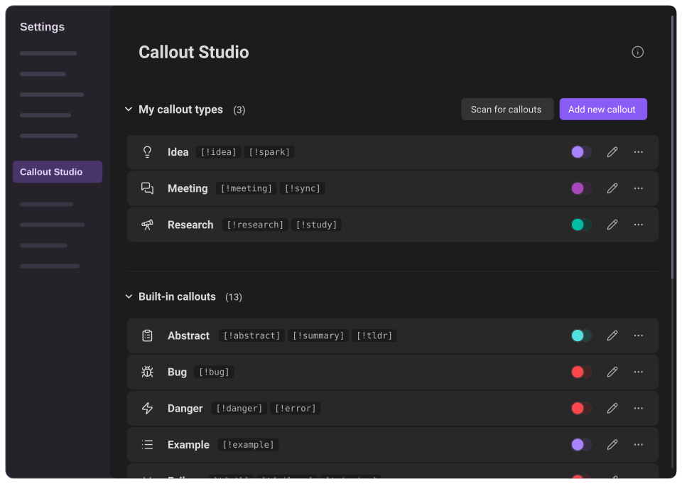
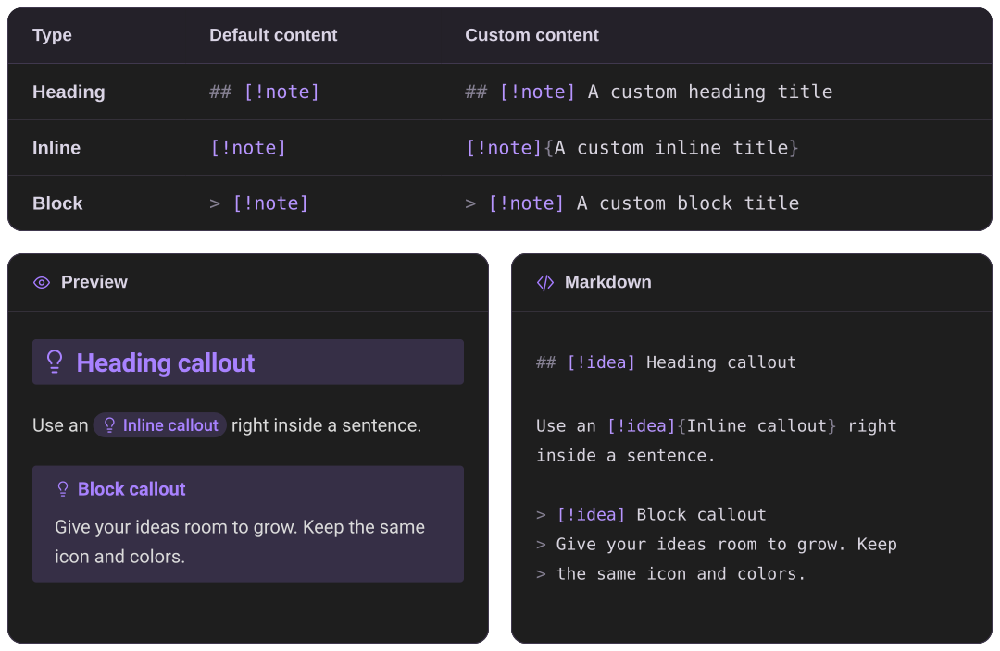

  

  
  
  

  An <a href="https://obsidian.md">Obsidian</a> plugin for creating and styling your own callouts. 
  Use them as blocks, headings, or right inside a sentence.

## The syntax

The same callout type can be written in three ways:

Callout Studio has much more to offer, including color palettes, icons, global styles, context menus, vault discovery, and theme compatibility. You are welcome to read more about it in the [User guide](docs/user-guide/README.md).

## Special Thanks

Thank you to everyone who reported bugs, tested fixes, and shared detailed feedback:

[brianjwalton](https://github.com/brianjwalton) · [astreloff](https://github.com/astreloff) · [rubcap](https://github.com/rubcap) · [Xto-tT0](https://github.com/Xto-tT0) · [Jarsgon](https://github.com/Jarsgon) · [Ravencaller213](https://github.com/Ravencaller213) · [frudolph77](https://github.com/frudolph77) · [DesertSnak3](https://github.com/DesertSnak3) · [alythobani](https://github.com/alythobani) · [dragonish](https://github.com/dragonish) · [Ana-Mendes123](https://github.com/Ana-Mendes123) · [EddyCurrrent](https://github.com/EddyCurrrent) · [Indra-Reaper](https://github.com/Indra-Reaper) · [hisbo](https://github.com/hisbo) · [engineeringbees](https://github.com/engineeringbees) · [matchalizard](https://github.com/matchalizard)

And thank you to everyone whose ideas and suggestions helped shape the plugin:

[ericxob77](https://github.com/ericxob77) · [TechnoMaverick](https://github.com/TechnoMaverick) · [epilo9er](https://github.com/epilo9er) · [Xto-tT0](https://github.com/Xto-tT0) · [TyceHerrman](https://github.com/TyceHerrman) · [eth-p](https://github.com/eth-p) · [kwhsiung](https://github.com/kwhsiung) · [archangelglass](https://github.com/archangelglass) · [quantumstargazer](https://github.com/quantumstargazer) · [BloatedBlowfish](https://github.com/BloatedBlowfish) · [Camouflagee](https://github.com/Camouflagee) · [maxnabokow](https://github.com/maxnabokow) · [rubcap](https://github.com/rubcap)

Thank you all for helping make Callout Studio better!

## Install

[Obsidian community directory](https://community.obsidian.md/plugins/callout-studio): Find Callout Studio's listing and add it to Obsidian. You can also open **Settings → Community plugins → Browse**, search for **Callout Studio**, and select **Install**, then **Enable**.

[Manual installation](docs/internals-docs/20-build-test-release.md#manual-installation-from-a-release): Instructions for downloading a release and installing its files in your vault.

## Developers

[Internals guide](docs/internals-docs/README.md): Architecture, source, build, and release details.

[Contributing](docs/CONTRIBUTING.md): The contribution process, from setting up the project to submitting a pull request.

[Public API](docs/API.md): How other plugins can read callout types and subscribe to changes.

## Privacy

[Settings sync and recovery](docs/internals-docs/08-settings-sync-and-recovery.md): How Callout Studio keeps a local recovery copy of its settings in case sync replaces `data.json` while the plugin is closed, merges valid concurrent edits and recognized conflict copies, and preserves damaged or unsupported data for recovery. For the safest sync setup, install the same up-to-date build on every device.

[Privacy & permissions](docs/internals-docs/25-privacy-and-permissions.md): A full explanation of every download and where data is stored. Callout Studio never sends your vault content anywhere and collects no telemetry or analytics. It only downloads icon artwork you choose and, when needed, a translation for the plugin interface.

[Convert to standard Markdown](docs/user-guide/14-danger-zone.md): A guide to converting heading and inline callouts. The action reads Markdown notes locally for a selectable preview and, after a separate irreversible-action confirmation, rewrites the callout syntax and updates links to changed headings. Back up your vault first.

## License & Third-Party Assets

[License](LICENSE): Callout Studio's code is available under a permissive license, with no attribution required. One informal request, which is not a license term: please do not repackage the code and publish it as a new plugin in Obsidian's Community Plugins directory. You are welcome to reuse it, learn from it, and build on it in other ways.

[Third-party notices](docs/THIRD-PARTY-NOTICES.md): Full license texts and credits for the icon libraries, which are separate works and retain their own licenses. You can also select **Icon licenses & credits** at the bottom of the plugin settings. Brand logos, from Simple Icons and Font Awesome Brands among others, remain trademarks of their owners, and some carry a license of their own; both are covered here.
