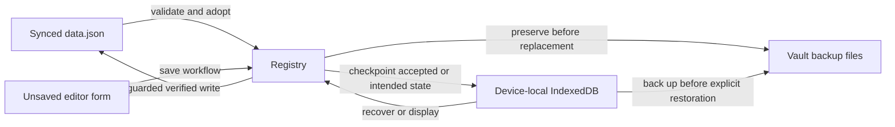

# Settings saving, synchronization, and recovery

**Documented: 2026-09-24.** This chapter describes the implementation after the
missing-file recovery investigation on that date. It is an implementation
reference, not a release announcement or a claim that every sync provider has
been tested on physical devices.

This is the authoritative chapter for settings-write authorization, external
adoption, merge history, checkpoints, recovery actions, and persistence failures.
[Persistence and caching](07-persistence-and-caching.md) describes what is stored
where; this chapter explains when those stores may change. Read it before changing
the settings writer, startup/reload paths, recovery UI, or sync protocol.

For operational instructions, see the user guide's
[Syncing and backups](../user-guide/17-syncing-and-backups.md). That guide is for
choosing actions in Obsidian; this chapter is for understanding and maintaining
the code behind those actions.

## The incident and the before-and-after behavior

The reported setup used one iCloud vault on a Mac and an iPhone. After removing
and reinstalling the plugin on the phone, previously configured callouts were
still visible, but saving was paused. Repeated Retry clicks did not resolve it.
The Mac, where the plugin had not been removed, subsequently reported
**Settings were not saved** and exposed only Retry.

Inspection of the Mac's plugin directory found the plugin's three installation
files but no `data.json`. That observation established local absence at the time
of inspection. It did not establish whether the cloud had permanently deleted
the file or whether the phone could currently read it. The most plausible
explanation was a propagated deletion after uninstall, but the code must handle
both actual deletion and temporary unavailability without guessing which occurred.

The visible old callouts did not prove that `data.json` still existed. A running
plugin can retain them in memory; a restarted plugin can display its independent
device checkpoint. Displayed settings, a verified primary file, and completed
cloud synchronization are three different facts.

| Area | Before this change | Current behavior and rationale |
| --- | --- | --- |
| Missing at startup | A prior-use marker or checkpoint froze the writer with reason `missing`. The settings banner offered **Create a new settings file**. | The same protection remains, with wording that distinguishes restoring the displayed setup from creating a file without a known previous setup. |
| Missing while running | The stale-write guard and external reader only set `status.failure = "missing"`. The writer remained unfrozen, so the banner omitted its missing-file creation action. | `protectMissingFile()` establishes the protected missing state on a previously used device. That device can recover without restarting or using a different device. |
| Recreating a previously loaded file | The old action thawed the writer and called its ordinary save. Its old disk baseline survived. Unchanged content could skip the physical write; changed content could be refused because the previously seen file was absent. | `restoreMissing()` uses a temporary absence-only baseline for one explicit attempt. It forces a physical write and retains the normal baseline until that write succeeds. |
| Meaning of Retry | It checked for returned settings; it did not create a lost file. The unchanged warning made successful checking look like an unresponsive button. | **Check again** states that the file is still missing when appropriate. Restoring is a separate confirmed action. |
| Reinstalled recovery snapshot | Displaying the checkpoint did not seed the writer's causal merge history for recreation. | A separate `seedRecovery()` preserves clocks and deletion tombstones without pretending that the checkpoint is a file currently on disk. |
| A resolved `saveData()` | Resolution was normally trusted; the generic writer checked read-back only after rejection. | The production host verifies the intended file after every call. Inspected Obsidian builds could swallow an adapter write error, so resolution alone was insufficient evidence of persistence. |
| Other failure transitions | A recovery-store failure followed by primary-file deletion, or a failed first-ever save, could leave Retry without a useful continuation. | The explicit paths re-evaluate these states while retaining the newer-format and unreadable-checkpoint protections described below. |

The repair deliberately does not make Retry silently write defaults. A deletion
and a slow download can present the same observable absence, and a local timer
cannot prove that a remote device has finished sending its settings.

## Safety rules and the different kinds of state

The following rules explain the checks that can otherwise look redundant:

1. **Absence is not permission to reset.** Prior-use evidence changes the meaning
   of an absent primary file. A genuinely fresh installation is a separate case.
2. **An unreadable file is not an absent file.** Read errors, malformed content,
   unknown sync metadata, and integrity mismatches do not authorize replacement.
3. **A settings mutation is not a completed save.** `save()` can resolve without
   writing when it is frozen, held, stale, destroyed, or unchanged. Callers that
   promise durability must check the accepted state, not just await a promise.
4. **A checkpoint is not the primary-file baseline.** It can recover data without
   proving what a provider currently exposes as `data.json`.
5. **Do not clear the normal baseline to force a save.** That removes the evidence
   used to reject stale writes and can create rewrite loops between devices.
6. **Preserve recoverable versions before replacement.** The backup predicate and
   its limits are described below; no path should silently treat a failed required
   backup as permission to continue.
7. **Async work must recheck ownership and freshness.** A file, editor, preview,
   registry snapshot, or plugin instance can change while an operation is awaiting
   storage. A check performed before that await is not sufficient afterward.
8. **Local verification is not a cloud acknowledgment.** Neither the Obsidian
   adapter nor this protocol supplies a cross-device compare-and-swap operation.

| State | Owner and lifetime | What it proves |
| --- | --- | --- |
| Current registry | `CalloutRegistry`, this plugin instance | The configuration currently displayed and used for rendering; it may include unsaved mutations. Preview slots are excluded/shadowed by `toSaveData()`. |
| Primary settings | `<manifest.dir>/data.json`, or the configured plugin directory fallback | The file visible to this device through Obsidian's adapter. A validated read can become the disk baseline. |
| Normal disk baseline | `SaveGuard` inside `SettingsWriter`, in memory | Canonical contents of the last accepted file/write. It is not a file-existence cache or a cross-device lock. |
| Committed merge state | `SettingsSync`, in memory and the persisted envelope | Causal history used to distinguish edits, deletions, and stale snapshots. It is not ordered by wall-clock time. |
| Recovery checkpoint | `CalloutStudioRecovery` IndexedDB database | One independent device-local snapshot, scoped by vault identity, configuration folder, and plugin id. It may survive plugin removal. |
| Recovery backups | `<plugin-dir>/backups/data-<timestamp>-<uuid>.json` | Preserved versions needed before particular replacements. These files are inside the vault and can be synced or deleted by a provider. |
| Prior-use/UI markers | `DeviceLocalStore`, vault-scoped `localStorage` | Evidence that absence should not be treated as a never-used installation; not a source of callout definitions. |
| Editor form | The open editor's own fields and save session | An unsaved draft. A checkpoint of the registry is not a backup of every form field. |

The source map is deliberately explicit:

| Responsibility | Source |
| --- | --- |
| Read classification and shape gate | [`settingsFile.ts`](../../src/manager/settingsFile.ts), [`settingsFileShape.ts`](../../src/manager/settingsFileShape.ts) |
| Settling reads and launch decisions | [`settingsSettledRead.ts`](../../src/manager/settingsSettledRead.ts), [`settingsBoot.ts`](../../src/manager/settingsBoot.ts), [`settingsLateArrival.ts`](../../src/manager/settingsLateArrival.ts) |
| Write serialization, no-op and stale guards | [`SettingsWriter.ts`](../../src/manager/SettingsWriter.ts), [`saveGuard.ts`](../../src/utils/saveGuard.ts), [`staleWriteGuard.ts`](../../src/manager/staleWriteGuard.ts) |
| Production adapter and verification | [`settingsWriterHost.ts`](../../src/manager/settingsWriterHost.ts) |
| Incoming-file scheduling and adoption | [`reloadQueue.ts`](../../src/manager/reloadQueue.ts), [`settingsAdopt.ts`](../../src/manager/settingsAdopt.ts), [`registryOwnership.ts`](../../src/manager/registryOwnership.ts) |
| Merge representation and integrity | [`settingsSync.ts`](../../src/manager/settingsSync.ts), [`syncTree.ts`](../../src/manager/syncTree.ts), [`syncFingerprint.ts`](../../src/manager/syncFingerprint.ts), [`foreignFields.ts`](../../src/manager/foreignFields.ts) |
| Checkpoints, backups and conflict copies | [`settingsCheckpoint.ts`](../../src/manager/settingsCheckpoint.ts), [`settingsRecovery.ts`](../../src/manager/settingsRecovery.ts), [`settingsBackup.ts`](../../src/manager/settingsBackup.ts), [`settingsConflictBackup.ts`](../../src/manager/settingsConflictBackup.ts), [`settingsConflictFiles.ts`](../../src/manager/settingsConflictFiles.ts) |
| Explicit recovery | [`settingsRecoveryActions.ts`](../../src/manager/settingsRecoveryActions.ts), [`missingSettingsRecovery.ts`](../../src/manager/missingSettingsRecovery.ts) |
| Status and user feedback | [`settingsSaveStatus.ts`](../../src/manager/settingsSaveStatus.ts), [`settingsSaveReporter.ts`](../../src/manager/settingsSaveReporter.ts), [`settingsSaveMessage.ts`](../../src/manager/settingsSaveMessage.ts), [`saveStatusBanner.ts`](../../src/settings/saveStatusBanner.ts), [`settingsNotices.ts`](../../src/manager/settingsNotices.ts) |

## Startup and file classification

### What a read actually establishes

`readSettingsFile()` calls `loadData()` first. It does not use modification time,
file size, or a preliminary existence check to declare a payload safe.

- A thrown read is `unreadable`.
- A non-null object, excluding arrays, must pass `hasSafeSettingsFileShape()`;
  otherwise it is `unreadable`.
- A valid object is returned as `loaded`, with both parsed data and a serialized
  copy of the exact observed object. Whitespace is not meaningful to its baseline.
- A parsed array or primitive is `unreadable`, even if the file disappears before
  another filesystem operation could inspect it.
- Only a nullish load result proceeds to `adapter.exists(dataPath)`. Existence
  means `unreadable`; a confirmed nonexistence means `absent`. An existence-check
  error means `unreadable`.

The shape gate validates the sync envelope, a finite numeric version when present,
callout rows, required/optional field types, aliases, metadata, gradient angles,
duplicate ids, settings shape, and both icon-cache formats. It does not silently
discard malformed rows to manufacture a smaller writable settings file. Partial
built-in overrides and unknown future fields remain supported. Canonical handling
preserves keys such as `__proto__` as data rather than allowing prototype mutation.

The data-format version and sync-envelope version are separate. The current data
format is **5**; a higher data version is handled as a newer-build read-only case.
Unsupported or malformed sync metadata fails the shape/integrity gate. A missing
legacy data version can still enter field-based migrations.

### Settling does not mean synchronization has finished

`readSettledSettingsFile()` starts with one read, or a supplied initial result,
then performs at most three more reads with a default 150 ms pause between them.
Two consecutive canonically equal loaded objects are stable enough to consider
for adoption. Two absent reads can establish stable local absence only if that
cycle has never observed a loaded or unreadable file.

Once a cycle has seen a file or an unreadable state, later absence cannot turn
that same cycle into a fresh-install decision. Repeated malformed data or a file
that keeps changing ends as `unreadable`. Cancellation is checked around awaits.
This is a bounded observation window, not proof of provider completion. A later
independent check can observe that a previously corrupt file really is absent;
explicit restoration still requires its own checks and confirmation.

### Launch decision table

`loadSettingsInto()` follows the classification rather than assuming that a
nullish `loadData()` result means a new user:

| Primary at launch | Additional evidence | Result |
| --- | --- | --- |
| Loaded, supported | Checkpoint/conflict copies available | Reconcile validated recovery data, rebuild the registry, establish the accepted baseline, and save only if migration or a real merge requires it. |
| Loaded, newer data format | Any | Freeze with `newer-version`; do not authorize edits or replacement by the older build. |
| Unreadable | Readable recovery copy | Freeze writes and use the recovery copy for display where possible. Display is not permission to replace the primary. |
| Unreadable | No usable recovery copy | Keep the primary untouched; built-ins may be displayed. The setup is not thereby a fresh writable installation. |
| Absent | Prior-use marker or readable checkpoint | Freeze with `missing` and display the checkpoint when available. A supported copy seeds merge history separately from the disk baseline. |
| Absent | Checkpoint read fails | Freeze with `recovery-read`, record the initial display, and keep recovery retryable without overwriting the checkpoint. |
| Absent | Checkpoint is from a newer build | Keep the newer-version protection; missing-file restoration cannot replace it. |
| Absent | No prior-use evidence and no checkpoint | Return a provisional fresh-install result. The layout-ready confirmation rechecks the primary before enabling ordinary edits. |

A supported checkpoint is cloned **before** `registry.load()` can mutate it during
migration. After a successful rebuild, `seedRecovery()` reads the intact clone's
sync history. It does not call `SaveGuard.adopt()` or assert that `data.json`
exists. This preserves deleted-row tombstones when a reinstalled device later
receives an older snapshot.

Fresh-install confirmation never creates a welcome-only settings file. The
welcome marker is device-local persisted UI state, not a write to `data.json`.
The first real settings mutation still passes the ordinary freshness guard.
A foreground check that finds no file on this untouched fresh installation does
not invent prior-use evidence and freeze it indefinitely.

Unknown/corrupt or unavailable `DeviceLocalStore` storage is handled conservatively
as prior-use evidence. A known legacy local-store blob is archived before cleanup;
its old discovery fields and startup CSS are not loaded as live definitions.
The separate [manual-discovery upgrade chapter](19-upgrading-manual-discovery.md)
owns that archive's migration details.

## Ordinary saving and verified persistence

### The normal writer pass

`SettingsWriter.save()` serializes work through `inFlight`, coalesces another
request into a follow-up, and tracks `holdDepth` while a registry is being rebuilt.
A hold only flushes its requested save if its body completed successfully; a
half-rebuilt registry must not be written after a thrown load.

An ordinary `runPass()` performs this sequence:

1. Capture the writer revision, clone `host.build()`, and prepare sync stamps on
   that isolated snapshot. Later registry mutations do not change the payload.
2. Ask `SaveGuard.prepare()` whether the canonical payload differs from its
   accepted baseline. Object-key ordering and insignificant JSON formatting do
   not count as edits.
3. If unchanged, do no file read or write. The special exception is retrying a
   previously failed final checkpoint; that failure must not disappear behind a
   no-op shortcut.
4. When a current-file reader is available, use `StaleWriteGuard.blocks()` to
   compare the current file with the baseline. An unreadable file, changed file,
   or absence of a previously seen file blocks the write.
5. Check frozen/destroyed/revision state, then persist the intended checkpoint.
6. Check those conditions again, reread disk freshness after checkpointing, and
   check cancellation again before entering the physical write.
7. Perform the production write and its read-back verification.
8. Only after success, commit the normal baseline and sync state, record the
   persisted content, and clear obsolete stale-write/status notifications.

`StaleWriteGuard` permits absence under the ordinary path only when there is no
disk baseline, as for the authorized first write of a fresh installation. It
does not infer authorization from how long a file has been missing. Its deferred
notification asks the ordinary external-reload path to inspect the changed state.

`protectMissingFile()` is the common transition for previously used devices.
An existing `newer-version` freeze is preserved. A `recovery-read` freeze keeps
its underlying reason so the checkpoint can be reread safely. Other applicable
states can enter `missing`; the registry itself is not emptied. A subsequent
failed backup/write can be the displayed failure while `missing` remains the
underlying freeze reason and restoration remains available.

### Why `saveData()` is followed by a read

The production host calls `owner.saveData(data)` and captures any thrown error.
It then uses the same validated settings-file reader to compare the file's full
canonical contents with the intended payload:

- Exact validated match: accept persistence, even if the call rejected after
  replacing the file, and mark the device initialized.
- Absent, unreadable, or different read-back: do not accept the new baseline.
  Preserve the original error when available, otherwise report an unverifiable
  write as a persistence error.

This is needed because the inspected Obsidian 1.13.7 and 1.9.12 implementations
could swallow an adapter error inside their settings-writing helper. That was an
implementation observation, not a public API guarantee about every release.
The plugin relies on the read-back invariant instead of on those internals.

Known error codes distinguish exhausted space/quota from denied permissions.
A swallowed error has no original code to classify, so it can only yield the
generic write diagnostic. The generic writer also has an error-after-write
read-back fallback; the production host is what adds verification after resolved
calls. Small injected test hosts are not automatically equivalent to that host.

Read-back verifies what this device can read at that moment. A provider can still
deliver a later overwrite or deletion. It also cannot prevent another process
writing in the interval between the final freshness check and the adapter write.

### Isolated commits and manual discovery

`commit(data, isCurrent, publish)` is for a staged candidate such as manual
discovery. It refuses to start while busy, held, frozen, or destroyed. When the
candidate differs from the accepted baseline, its storage preflight checkpoints
the **currently accepted registry**, not the uncommitted candidate. It checks
freshness and cancellation, writes the candidate, advances the baseline, and
only then publishes the candidate to the live registry.

A canonical no-op candidate still passes freshness/cancellation checks and can
be published, but skips both the primary write and the checkpoint stages.

The final candidate checkpoint follows publication. If it fails, the primary
file and published registry may already have changed: report that checkpoint
failure, and retry it even on an otherwise unchanged save. A crash between the
primary write and final checkpoint can leave that checkpoint one isolated commit
behind. Do not describe this as a transaction across both storage systems.

The manual scanner's token/id validation and staging algorithm remain in
[Vault discovery](11-vault-discovery.md); the save-before-publish contract belongs
here. Loading or syncing a settings file never starts a scan.

## Multi-device sync

### Scheduling and ownership

The real plugin routes external-settings events and document-foreground checks
through `ReloadQueue`. Obsidian's settings-change hook is a useful signal, not a
promise that every deletion, placeholder eviction, or conflict-sidecar arrival
will generate a notification. Pre-save reads remain necessary.

`registryIsOwned()` defers background adoption while a settings editor, a preview,
or an in-flight writer owns the registry. A request arriving during a read asks
for another pass rather than being dropped. A modal/preview/write release retains
the wakeup even if it arrives before the active operation marks itself pending.

Unavailable primary reads receive at most three scheduled retries, after **250,
750, and 2000 ms**. A new external or foreground event resets that budget. An
owner-held operation or failed required backup is deferred rather than put into
an endless automatic write/retry loop. Unload cancels the scheduled callbacks.
The queue is not a continuous polling service.

### Reading and adopting an incoming file

`tryAdoptExternalSettings()` first checks ownership, reads/classifies the primary,
and checks ownership again. On a used device, absence protects the displayed
state and makes same-device recovery available. An untouched fresh installation
remains distinct. An unreadable result reports a failure and leaves the registry
unchanged.

For a loaded primary, compatible conflict copies are examined. A canonical
primary echo with no relevant conflicts can take the no-rebuild fast path; a
returned identical file can clear its obsolete warning. Frozen sessions and
explicit forced retries do not use the shortcut that would skip needed recovery.
Changed files undergo settling reads before `reloadFrom()`.

`reloadFrom()` uses a per-host adoption guard as well as writer/editor ownership.
For a supported primary, the adoption algorithm is:

1. Read the device checkpoint; protect it if reading fails or its format is newer.
2. Capture the current registry snapshot and compute a merge from incoming data,
   committed history, unsaved registry changes, the checkpoint, and recognized
   conflict copies. A newer primary remains read-only instead of being merged as
   an ordinary supported edit.
3. Apply an optional editor `canApply` constraint, used to protect definitions
   required by unfinished note work.
4. Preserve versions for which the authored-data backup predicate requires it.
5. Check that ownership and the local registry snapshot still match.
6. Within the held rebuild, checkpoint previously accepted data as storage
   preflight. After that await, reread the primary and verify its contents,
   ownership, and the local snapshot before replacing the registry.
7. Rebuild the registry. Establish the actual incoming file as the disk baseline,
   while the merge becomes the logical sync state. Checkpoint accepted merged
   data, and use the ordinary writer if migration/merge requires a real write.
8. Refresh theme appearance, custom commands, rendered callouts and any open
   settings tab. Do not rediscover callouts from notes.

A newer primary takes a read-only path that skips checkpoint reading and writing.
On the supported path, a checkpoint preflight failure can still allow validated
incoming settings to be rebuilt for display, with saving frozen as
`recovery-write`. A final checkpoint failure can likewise freeze saving after
the rebuild. Checkpoint failure therefore does not always mean the displayed
registry stayed unchanged.

A failed rebuild freezes saving rather than establishing a baseline for a
partially loaded registry. An incoming merge that cannot be durably saved is not
reported to an editor as a completed save. Legacy recovery copies are joined as
older baselines; reversing that relationship could remove newly received rows.

### Causal merge history and integrity

`settingsSync.ts` adds the `calloutStudioSync` envelope when preparing a real edit.
It records Lamport counters and random actor ids on JSON paths. An actual change
advances the appropriate stamps; loading an unchanged snapshot is not an edit.
Clock exhaustion beyond safe integers is an error, not permission to wrap history.

`syncTree.ts` gives domain lists stable identities: callouts, palettes, user images,
custom commands, menu entries, and icon-cache entries are keyed lists. Objects
merge by field. Keyed representation requires supported, unique identity keys;
otherwise a list remains atomic. Ordinary arrays, including aliases, remain
atomic. A whole icon
identity is atomic too; independently combining its pack and name could create
an icon neither user chose. Legacy icon-subfield stamps are folded into the parent
identity stamp when read.

Ordering has a deterministic winner, and concurrent additions with distinct ids
can coexist. Deletions retain path tombstones. Deletion wins over a concurrent
edit inside the deleted row; a deliberate recreation after observing that deletion
uses a later counter. Tombstones are not pruned on a time-to-live assumption,
because an offline device may return much later.

Before either side has stamped history, local unsaved changes can merge relative
to the observed legacy baseline. Once stamped history exists, an unstamped older
snapshot cannot undo it. Consequently, edits from an older incompatible build may
need manual recovery from a preserved incoming version. Upgrade devices together;
a new format guard cannot control code in a released build that lacks the guard.

Envelope version **2** fingerprints the body and stamp map, excluding the
fingerprint field itself. This is a deterministic corruption checksum, not
authentication. It detects, among other things, a provider combining JSON content
from one version with metadata from another, or a manual edit that retains stale
metadata. Version 1 remains readable for migration but lacks that integrity check.
An unknown/malformed envelope or fingerprint mismatch is not silently restamped.

Canonical key ordering, stable icon-cache ordering, no-op suppression and echo
recognition prevent unchanged settings from bouncing between devices. Unknown
allowed fields are preserved by `foreignFields.ts` on settings-file load/save;
portable import validation is a different contract and does not inherit every
unknown field. Retired known fields are explicitly excluded by their migrations.

### Recognized conflict copies

`settingsConflictFiles.ts` only considers direct children of this plugin directory
whose names match the implemented patterns:

- `data.sync-conflict-YYYYMMDD-HHMMSS-<device>.json`
- `data (Conflicted copy <text> <12 digits>).json`

It requires two identical reads, safe shape, and a valid sync envelope. These two
reads are immediate; they do not use the primary file's 150 ms settling loop.
Duplicate canonical copies are merged once. Unstamped, damaged, inaccessible, or
unrecognized files are left untouched for manual inspection; the plugin never
deletes a conflict copy. A directory-listing failure propagates and defers the
attempt, while an individual unreadable candidate is logged and skipped.

Do not describe those patterns as support for every Dropbox, Syncthing, or other
provider naming convention. The exact recognizer is the contract. A primary-file
echo still checks for conflict files, but a sidecar alone may not trigger an event.

## Device checkpoints and vault backups

### Checkpoint transactions

`SettingsCheckpoint` uses IndexedDB database `CalloutStudioRecovery`, store
`settings`, with a key made from `[appId ?? vaultName, configDir, pluginId]`.
It does not write a checkpoint sidecar to the synchronized directory. Two
configuration profiles therefore do not share this recovery snapshot.

Read/write transactions request strict durability and wait for transaction
completion, not just successful request dispatch. An older browser that throws
`TypeError` for transaction options retries without those options; permissions
or storage errors do not activate that fallback. Opening is bounded at **5 s**,
transactions at **10 s**. A transaction timeout attempts to abort the transaction
and closes its connection. An open timeout rejects the operation; IndexedDB open
itself cannot be synchronously cancelled, so a late connection is closed and a
late upgrade transaction is aborted. Late successes cannot revive an operation
already reported as failed. Blocked opens, quota errors, aborts, and unavailable
IndexedDB propagate.

The checkpoint read uses the settings shape/integrity gate. Callers also enforce
the supported data-format bound. A failed read never becomes authority to replace
that unreadable checkpoint. The plugin does not erase this store on normal unload
or uninstall, but survival is contingent on the app/OS retaining its storage.
Clearing application data can remove it. An intentional plugin reset can replace
the checkpoint with the reset state; this is a recovery aid, not an immutable
archive of every configuration ever used.

### Backup predicate, verification, and retention

`backUpBeforeAdoption()` asks whether incoming state changes/removes a current
callout row, replaces normalized preferences (including palettes, commands and
user-image artwork), or changes preserved top-level foreign authored data.
Metadata-only or icon-cache-only differences are not, by themselves, the trigger.
For a merged adoption, the predicate is evaluated against the applicable local,
checkpoint, incoming, and conflict versions before replacing their authored data.

`writeSettingsBackup()` serializes the supplied object before its first awaited
adapter operation, creates the backup directory when needed, and writes a unique
timestamp-plus-UUID name. Pruning retains the newest five recognized generated
names while always protecting the file just written, even if another device's
clock is ahead. Unrecognized/user-created filenames are not pruned. Cleanup
failure is logged and does not invalidate an already written backup.

There is an important verification distinction:

- Ordinary adoption checks that the backup helper reported a successful adapter
  write. It does **not** separately read that backup back.
- Explicit missing-file restoration additionally reads the previous checkpoint's
  backup back and compares canonical content before permitting checkpoint
  replacement.

Do not turn the second guarantee into a claim about every backup caller. Backups
are also inside the plugin directory: provider deletion or a later uninstall can
remove them. A user-exported backup kept elsewhere serves a different purpose.

## Saving status and recovery actions

### Frozen reason versus last failure

`SettingsSaveStatus` keeps `frozenReason` and `failure` separately. The displayed
reason is `failure ?? frozenReason`; the banner title uses whether the session
is frozen. Thus a missing-file restoration that fails to write a backup remains
**Saving is paused**, with a backup error explaining its latest failed attempt.

| Reason | Meaning and intended response |
| --- | --- |
| `missing` | A used installation cannot currently see the primary. Check for returned settings or explicitly restore the reviewed displayed setup. |
| `unreadable` | Reads/validation cannot establish a safe primary. Resolve access/sync problems or restore a valid original file externally; do not overwrite it through missing-file restoration. |
| `newer-version` | A primary/checkpoint is from a newer data format. Update this build; missing primary data does not override the protection. |
| `recovery-read` | The independent checkpoint cannot be read. Retry the storage read before considering replacement. |
| `recovery-write` | Checkpointing failed. Resolve storage availability/quota and retry; the primary may or may not already be saved, depending on the transaction phase. |
| `backup` | A required recovery backup failed or, on explicit restoration, could not be verified. Preserve the current state and retry after resolving the failure. |
| `write`, `write-permission`, `write-space` | The primary write did not establish the intended verified file. Address the indicated storage problem, then retry the appropriate operation. |
| `changed` | Disk no longer matches the accepted baseline. Inspect/adopt/merge the new file before saving again. |
| `sync-conflict` | Incoming settings violate an editor's constraint for unfinished note work. Resolve that work while retaining its form and required definition. |

Status subscriptions update the banner slot without rebuilding the form or moving
settings scroll. Subscription exceptions cannot interrupt persistence. The shared
reporter deduplicates recent identical notices and clears them when the underlying
status recovers. Diagnostic failure prose comes from the canonical English table;
action labels, titles and confirmation text use `t()`. Raw adapter errors and
paths belong in the console rather than in the user-facing failure text.

### Retry and its first-install exception

`retrySettingsRecovery()` forces a current external read/adoption, bypassing the
ordinary echo shortcut. If a supported file is successfully applied and the
writer is not frozen, it saves the resulting registry and checks the accepted
content. That may merge pending registry changes; it is not just dismissing a
notice.

If the primary remains absent on a used device, Retry does not recreate it.
For a `recovery-read` freeze, `retryMissingSettingsRecovery()` can reread the
checkpoint and confirm absence. A now-readable checkpoint can move the session
to `missing`, even when the read failure originally happened with a primary
present. It only replaces the displayed registry automatically if that display
still equals the recorded initial empty missing-boot display. Later edits stay
visible; explicit restoration will preserve the older checkpoint in a backup.

The narrow first-install exception is a pending failed **first** write: the
writer is unfrozen, has no accepted/recovered state, the device is not initialized,
and the failure is `write`, `write-permission`, `write-space`, or `recovery-write`.
If the current read establishes absence, the explicit retry can use the ordinary
fresh-install save authority. It still passes the normal freshness checks. Merely
opening a new installation and clicking Retry cannot create defaults.

### Explicit restoration of the displayed settings

The internal entry point remains named `startFreshSettings()` for its existing
callers. Its current meaning is **save the displayed configuration into a missing
primary file**, not unconditionally reset to defaults.

The settings banner offers **Restore these settings** when
`writer.hasRecoveryState` identifies an accepted file or seeded recovery state;
otherwise it offers **Create settings file**. Both require confirmation describing
the displayed settings, backup, and possible propagation to other devices. The
restore action is not styled as a destructive reset. The missing-file checking
action is **Check again**, with a persistent still-missing result after an
unsuccessful check.

The restoration sequence is intentionally separate from `save()`:

1. Require frozen reason `missing`, no owning editor/preview/write, and a live
   instance. Capture the current serialized registry snapshot.
2. Perform settled reads while checking ownership/snapshot cancellation. If a
   valid file has already arrived, call ordinary recovery instead of replacing
   it. An unreadable result stops restoration.
3. Enter `writer.restoreMissing()`. This refuses concurrent work or a held
   rebuild, reserves writer serialization, and keeps the writer frozen.
4. Clone the candidate and prepare its sync history. Use a new temporary
   `SaveGuard` with **no disk baseline** for this attempt. This always produces
   a payload, even if it equals the old normal baseline. Its freshness checks
   accept only absence; even the identical old file returning stops this path.
5. Read the existing checkpoint. An unreadable or newer checkpoint blocks the
   attempt. Create only the plugin's own directory when it was removed; this
   does not reinstall missing `main.js`, `styles.css`, or `manifest.json`.
6. If a checkpoint exists, write and read-verify its vault backup before
   overwriting that checkpoint. Recheck the captured registry and ownership.
7. Checkpoint the restoration candidate. Recheck revision, destruction,
   ownership and snapshot, then verify absence again after checkpointing and
   immediately before entering the physical write.
8. Perform the production write/read-back. Only success advances the normal
   baseline and committed sync state, clears stale notifications, and thaws.
9. After releasing serialization, request an ordinary follow-up save. A user may
   have edited settings after the physical write began, when cancellation was
   no longer possible. Verify that the final accepted content matches the
   current registry before reporting completion.

A failure never leaves a persistent “allow missing writes” flag for a later
background save. The temporary absence baseline is discarded; the old normal
baseline remains until a successful physical replacement. Backup and checkpoint
operations can have produced recoverable files even when the primary write is
cancelled. The operation is not an all-or-nothing transaction across all stores.

If a file arrives during backup or checkpointing, restoration stops when the
freshness check observes it. A subsequent normal recovery attempt can adopt or
merge it. The UI must not claim that every aborted attempt immediately adopted
the remote file, nor that the unavoidable final check/write race is eliminated.

### Editors and unfinished note operations

An editor can explicitly retry adoption using `editor: true`, retaining its own
ownership while still respecting previews and in-flight writes. Its `canApply`
constraint can reject a merge that would invalidate pending rename/replacement
note work. The form is kept for review and another Save; that is not equivalent
to automatically committing the form after recovery.

Missing-file creation is offered in the settings page, not while the editor owns
the registry. The editor banner directs the user to recovery on the same device
and warns them to copy unsaved form edits before closing. Exporting the registry
does not capture every uncommitted editor field. The editor's own save pipeline
and note-side effects remain in [Callout editor](14-callout-editor.md#save-pipeline).

## Edge-case decisions

The tables group the cases by observable state. “Retry” below means the explicit
appropriate checking/recovery action, not an instruction to loop indefinitely.
They document current behavior and its boundaries; they are not a claim that
every combination of OS, provider and hardware has been exercised.

### Missing files, startup, and device history

| Case | What the implementation must do / how to proceed |
| --- | --- |
| First installation, no saved file | Confirm local absence before enabling edits; do not save merely for the welcome or a foreground event. |
| First actual write fails | Keep the intended registry/checkpoint when available. Explicit Retry may retry that first write; failed verification must not mark the device initialized. |
| Reinstall with old marker but no checkpoint | Protect absence. The settings page can explicitly create a file from what is displayed, after confirmation. The marker alone cannot recover deleted definitions. |
| Reinstall with valid checkpoint | Display it, retain its causal history, and offer restoration. Visibility does not mean the primary has been restored. |
| Other device removes the file while this instance runs | Retain current registry and normal baseline, enter `missing` when observed, and expose recovery on this device. |
| File disappears, then the identical file returns | Accept it through the appropriate recovery path; clear the obsolete warning without unnecessary rewriting. Preserve any genuine pending local changes. |
| File disappears again after successful restoration | Treat the new observation as another missing-file incident. A previous local success does not guarantee the provider will retain that file. |
| Entire plugin directory is missing | Explicit restoration can recreate its own directory and settings/backup files. It does not reinstall executable plugin assets or run after the plugin has unloaded. |
| Unknown/corrupt local marker storage | Do not conclude “new installation.” Require recovery or an explicit reviewed creation decision. |
| Different config folders | Primary paths and checkpoint keys follow the configured folder. This code does not copy one profile into another. |

### Readability, versions, and incoming changes

| Case | What the implementation must do / how to proceed |
| --- | --- |
| Cloud placeholder, offline read, permission error | Treat failed access as unreadable, not absent. Make the vault available locally or repair access, then retry. |
| Empty/truncated JSON, Git conflict markers, invalid rows | Preserve the file. A syntactically parsed object still must pass the shape/integrity checks. Repair/restore a valid original outside the missing-file action. |
| Malformed data later disappears | A later independent absent read can enter protected missing recovery. It must not retroactively classify the earlier malformed read as a new installation. |
| Same-size rewrite or misleading timestamp | Use content equality and causal stamps, not metadata age or file size. |
| Continuously changing file | Stop after the bounded settling reads; wait for another event or explicit check. Never choose an arbitrary intermediate baseline. |
| Newer data-format primary/checkpoint | Keep the newer-version freeze. Update the plugin instead of restoring over data this build cannot interpret. |
| Unknown envelope or checksum mismatch | Preserve it as unreadable. Do not restamp provider-combined or hand-edited metadata to make validation pass. |
| Valid remote settings plus unsaved registry changes | Merge against accepted causal history, preserve losing authored versions as required, and save through the normal guard. |
| Stale snapshot resurrects a deleted id | Retained tombstones block the stale recreation. A legitimate recreation after observing deletion is a new causal edit. |
| Incompatible old device writes an unstamped snapshot | Do not let it undo stamped history. Preserve relevant losing authored data; manual recovery may be required. |
| Recognized intact conflict copy | Validate and incorporate its stamped history without deleting the file. Unrecognized/unstamped copies remain manual recovery sources. |
| Notes sync but settings do not | Check provider configuration/profile inclusion. The plugin cannot infer that settings synchronization is enabled from note events. |

### Storage failures and async boundaries

| Case | What the implementation must do / how to proceed |
| --- | --- |
| IndexedDB read blocked/unavailable or timed out | Keep `recovery-read`, retain existing bytes, and allow an explicit reread. A missing primary cannot bypass this guard. |
| Checkpoint becomes readable while primary stays missing | Move to `missing`; only restore the untouched original empty boot display automatically. Keep later registry edits visible. |
| Checkpoint write fails before an ordinary/restore write | Do not proceed with that primary write. Resolve storage, then retry; do not suppress the failure because the file might already match an older baseline. |
| Final checkpoint fails after an isolated commit | Report the actual partial outcome: primary and publication succeeded, final checkpoint did not. Retry checkpointing without inventing another primary edit. |
| Backup write or explicit backup read-back fails | Do not replace the protected checkpoint/registry through that operation. The backup failure remains actionable. |
| Directory creation fails | Stop before checkpoint/primary replacement and retain missing-file protection, with storage/permission classification when available. |
| `saveData()` resolves but file is absent/different/corrupt | Reject success after validated read-back; do not advance the accepted baseline or initialize the device from that attempt. |
| `saveData()` rejects after writing the intended settings content | Accept only after validated canonical read-back; otherwise preserve/report the original failure. |
| Primary write fails after checkpoint succeeds | Keep the intended snapshot recoverable. A later ordinary save does not gain missing-file rewrite permission from the failed explicit restore. |
| Remote file arrives while confirmation is open | The action re-reads and uses ordinary recovery; it does not assume the dialog's earlier view is still current. |
| Remote file arrives during backup/checkpoint | Observe it in the before-write checks and stop the absence-only write. Use normal adoption on retry. |
| User edits, opens editor/preview, or unloads during preparation | Invalidate the captured snapshot/ownership/revision and stop before primary write. |
| User edits after the physical restore write starts | That write cannot be cancelled; flush the follow-up through the normal guard before declaring the current registry saved. |
| Multiple restore clicks or concurrent adoption | Serialize the writer and guard adoption ownership; do not launch competing checkpoint/primary replacements. |
| Unload after physical write starts | Do not promise cancellation of the adapter. Stop follow-ups/publication into the destroyed instance; a later launch must classify disk and checkpoint again. |
| Only a status observer throws | Log it without interrupting persistence or preventing other observers from receiving the change. |

## Provider behavior and the limits of the abstraction

The implementation operates on files exposed by Obsidian. It does not authenticate
to a provider, force a cloud download, inspect an upload queue, choose a cloud
version by timestamp, or repair a provider's account/quota configuration.
The provider research informed the failure model, not a collection of hidden
provider-specific network calls.

| Method | Relevant behavior and implication |
| --- | --- |
| iCloud | Real deletions propagate; a missing local download can also make content unavailable. A local absence cannot distinguish them. Keep the vault downloaded and use explicit reviewed restoration only when appropriate. |
| Obsidian Sync | Configuration syncing is separately selectable, and JSON conflict handling can combine keys. Shape and envelope fingerprint checks are necessary even for parseable JSON; a local write is not a Sync-server acknowledgment. |
| OneDrive / Google Drive | On-demand or streamed files may be unavailable offline. Existence alone does not establish readable content. Local availability/mirroring is a deployment concern, not something this plugin can force. |
| Dropbox / Syncthing | Concurrent work can produce conflict copies. Syncthing also uses temporary replacement files and delayed watcher processing. Only the actual filename recognizer is automatically supported; missing windows and late events remain ordinary states. |
| Git / Working Copy | An unresolved textual merge can leave non-JSON conflict markers. Preserve the file until the merge is resolved; never convert parse failure to a fresh settings file. |
| Remotely Save / LiveSync | Hidden/configuration-file synchronization is a separate feature/configuration concern. Running note sync does not establish that this plugin's settings are included or have arrived. |

The operational recommendations in the user guide follow Obsidian's requirements
for correct iCloud vault placement, keeping files available locally, and avoiding
multiple sync engines over the same vault. A plugin cannot compensate for an
excluded config folder, an unsupported mobile setup, or simultaneous transports
rewriting the same files.

Primary references consulted for this behavior model on 2026-09-24:

- [Obsidian: Sync your notes across devices](https://obsidian.md/help/sync-notes)
- [Obsidian: Configuration sync](https://obsidian.md/help/sync/settings) and
  [Sync troubleshooting/conflicts](https://obsidian.md/help/sync/troubleshoot)
- [Obsidian API: onExternalSettingsChange](https://docs.obsidian.md/Reference/TypeScript+API/Plugin/onExternalSettingsChange)
- [Apple: Manage iCloud files](https://support.apple.com/en-ca/104953) and
  [recover deleted files](https://support.apple.com/en-by/guide/icloud/mmae56ea1ca5/icloud)
- [Microsoft: OneDrive Files On-Demand](https://support.microsoft.com/en-US/onedrive/save-disk-space-with-onedrive-files-on-demand-for-windows)
- [Google: Stream and mirror files](https://support.google.com/drive/answer/13401938?hl=en)
- [Dropbox: Conflicted copies](https://help.dropbox.com/organize/conflicted-copy)
- [Syncthing: Synchronization behavior](https://docs.syncthing.net/users/syncing.html)
- [Git: How conflicts are presented](https://git-scm.com/docs/git-merge#_how_conflicts_are_presented)
- [Remotely Save configuration-file support](https://github.com/remotely-save/remotely-save#config-folder--files-and-bookmarks)
- [Self-hosted LiveSync](https://github.com/vrtmrz/obsidian-livesync)

## Verification and remaining boundaries

The repair added **31 persistence regressions** in
[`settingsMissingRuntime.test.ts`](../../tests/settingsMissingRuntime.test.ts)
and **7 UI regressions** in
[`settingsRecoveryBanner.test.ts`](../../tests/settingsRecoveryBanner.test.ts).
They cover the running-desktop/reinstalled-phone asymmetry, physical recreation
of unchanged settings, returned files, first-save retries, checkpoint failures,
backup verification, ownership/unload races, edits during a physical write,
newer formats, retained tombstones, silent writes and missing directories.

Related existing suites verify other layers:

| Layer | Tests |
| --- | --- |
| Read/shape/settling | [`settingsFileRead.test.ts`](../../tests/settingsFileRead.test.ts), [`settingsPayloadSafety.test.ts`](../../tests/settingsPayloadSafety.test.ts), [`settingsSettledRead.test.ts`](../../tests/settingsSettledRead.test.ts) |
| Writer and recovery boundaries | [`settingsWriter.test.ts`](../../tests/settingsWriter.test.ts), [`settingsRecoveryActions.test.ts`](../../tests/settingsRecoveryActions.test.ts), [`settingsRecoverySafety.test.ts`](../../tests/settingsRecoverySafety.test.ts), [`recoveryBoundaryEdges.test.ts`](../../tests/recoveryBoundaryEdges.test.ts) |
| Merge and restart scenarios | [`settingsSync.test.ts`](../../tests/settingsSync.test.ts), [`syncRecoveryScenarios.test.ts`](../../tests/syncRecoveryScenarios.test.ts), [`settingsConflictFiles.test.ts`](../../tests/settingsConflictFiles.test.ts) |
| Checkpoint and backups | [`settingsCheckpoint.test.ts`](../../tests/settingsCheckpoint.test.ts), [`settingsBackup.test.ts`](../../tests/settingsBackup.test.ts), [`settingsConflictBackup.test.ts`](../../tests/settingsConflictBackup.test.ts) |
| Editor promises | [`editorSaveRecovery.test.ts`](../../tests/editorSaveRecovery.test.ts), [`calloutDeleteRecovery.test.ts`](../../tests/calloutDeleteRecovery.test.ts) |

At completion of the code repair on 2026-09-24, **6,209 tests**, the production
build/typecheck, and lint passed. This is a dated validation record, not a fixed
expected suite size for future contributors. The tests use adapter/storage
stand-ins and simulated replica behavior; they do not constitute a live Mac/iPhone
iCloud test or certification of every provider. Existing multi-replica tests
exercise deterministic merging under reordered/duplicate deliveries, not a cloud
service's undocumented implementation.

Explicit remaining boundaries:

- The final freshness check and physical write are not atomic across devices.
  A late provider write can still win after local verification.
- A write already passed to the adapter cannot be cancelled. Primary files,
  IndexedDB, and backup files do not form one distributed transaction.
- Ordinary no-op saves do not poll for file existence. Detection relies on
  external events, foreground checks, explicit recovery, or a real subsequent edit.
- The checkpoint is one snapshot, not version history. Clearing app data or losing
  every independent copy is outside the recovery guarantee.
- Unknown provider sidecar names are not automatically discovered/merged. Notes,
  provider exclusions, account access, file-size limits and OS storage eviction
  remain outside this settings protocol.
- A user export is a portable backup of the displayed registry, not raw
  `data.json`: it omits internal sync history and icon-cache details. Ordinary
  Import does not bypass a paused writer. Do not recommend renaming an export
  file as a substitute for a deliberate import/recovery implementation.
- Registry recovery does not make unsaved editor-form fields durable, and it
  cannot run when the plugin itself is disabled, unloaded, or not installed.

When extending this subsystem, add a regression for the actual failure boundary,
state which store changed before failure, and require evidence for any stronger
durability claim. Do not remove an apparently redundant reread, backup, or
ownership check without accounting for the await it protects.

---
Previous chapter: [07-persistence-and-caching.md](07-persistence-and-caching.md)

Next chapter: [09-render-roles.md](09-render-roles.md)
