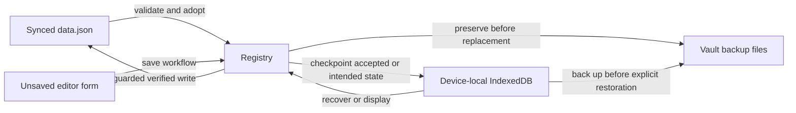

# Settings saving, synchronization, and recovery

**Documented: 2026-09-24; updated 2026-09-27.** This chapter describes the
implementation after the missing-file recovery investigation, and after the
data-safety review that followed it. The review added four things: a device's first
file stamps only real edits, a merge-time rescue of legacy values, envelope-free
backups, and guardrails on destructive actions. It is an implementation
reference, not a release announcement or a claim that every sync provider has
been tested on physical devices.

This is the authoritative chapter for settings-write authorization, external
adoption, merge history, checkpoints, recovery actions, and persistence failures.
[Persistence and caching](07-persistence-and-caching.md) describes what is stored
where; this chapter explains when those stores may change. Read it before changing
the settings writer, startup/reload paths, recovery UI, or sync protocol.

For operational instructions, see the user guide's
[Syncing and backups](../user-guide/13-syncing-and-backups.md). That guide is for
choosing actions in Obsidian; this chapter is for understanding and maintaining
the code behind those actions.

## The incident and the before-and-after behavior

The reported setup used one iCloud vault on a Mac and an iPhone. After removing
and reinstalling the plugin on the phone, previously configured callouts were
still visible, but saving was paused. Repeated Retry clicks did not resolve it.
The Mac, where the plugin had not been removed, subsequently reported
**Settings were not saved** and exposed only Retry.

Inspection of the Mac's plugin directory found the plugin's three installation
files but no `data.json`. That observation established local absence at the time
of inspection. It did not establish whether the cloud had permanently deleted
the file or whether the phone could currently read it. The most plausible
explanation was a propagated deletion after uninstall, but the code must handle
both actual deletion and temporary unavailability without guessing which occurred.

The visible old callouts did not prove that `data.json` still existed. A running
plugin can retain them in memory; a restarted plugin can display its independent
device checkpoint. Displayed settings, a verified primary file, and completed
cloud synchronization are three different facts.

| Area | Before this change | Current behavior and rationale |
| --- | --- | --- |
| Missing at startup | A prior-use marker or checkpoint froze the writer with reason `missing`. The settings banner offered **Create a new settings file**. | The same protection remains, with wording that distinguishes restoring the displayed setup from creating a file without a known previous setup. |
| Missing while running | The stale-write guard and external reader only set `status.failure = "missing"`. The writer remained unfrozen, so the banner omitted its missing-file creation action. | `protectMissingFile()` establishes the protected missing state on a previously used device. That device can recover without restarting or using a different device. |
| Recreating a previously loaded file | The old action thawed the writer and called its ordinary save. Its old disk baseline survived. Unchanged content could skip the physical write; changed content could be refused because the previously seen file was absent. | `restoreMissing()` uses a temporary absence-only baseline for one explicit attempt. It forces a physical write and retains the normal baseline until that write succeeds. |
| Meaning of Retry | It checked for returned settings; it did not create a lost file. The unchanged warning made successful checking look like an unresponsive button. | **Check again** states that the file is still missing when appropriate. Restoring is a separate confirmed action. |
| Reinstalled recovery snapshot | Displaying the checkpoint did not seed the writer's causal merge history for recreation. | A separate `seedRecovery()` preserves clocks and deletion tombstones without pretending that the checkpoint is a file currently on disk. |
| A resolved `saveData()` | Resolution was normally trusted; the generic writer checked read-back only after rejection. | The production host verifies the intended file after every call. Inspected Obsidian builds could swallow an adapter write error, so resolution alone was insufficient evidence of persistence. |
| Other failure transitions | A recovery-store failure followed by primary-file deletion, or a failed first-ever save, could leave Retry without a useful continuation. | The explicit paths re-evaluate these states while retaining the newer-format and unreadable-checkpoint protections described below. |

The repair deliberately does not make Retry silently write defaults. A deletion
and a slow download can present the same observable absence, and a local timer
cannot prove that a remote device has finished sending its settings.

## Safety rules and the different kinds of state

The following rules explain the checks that can otherwise look redundant:

1. **Absence is not permission to reset.** Prior-use evidence changes the meaning
   of an absent primary file. A genuinely fresh installation is a separate case.
2. **An unreadable file is not an absent file.** Read errors, malformed content,
   unknown sync metadata, and integrity mismatches do not authorize replacement.
3. **A settings mutation is not a completed save.** `save()` can resolve without
   writing when it is frozen, held, stale, destroyed, or unchanged. Callers that
   promise durability must check the accepted state, not just await a promise.
4. **A checkpoint is not the primary-file baseline.** It can recover data without
   proving what a provider currently exposes as `data.json`.
5. **Do not clear the normal baseline to force a save.** That removes the evidence
   used to reject stale writes and can create rewrite loops between devices.
6. **Preserve recoverable versions before replacement.** The backup predicate and
   its limits are described below; no path should silently treat a failed required
   backup as permission to continue.
7. **Async work must recheck ownership and freshness.** A file, editor, preview,
   registry snapshot, or plugin instance can change while an operation is awaiting
   storage. A check performed before that await is not sufficient afterward.
8. **Local verification is not a cloud acknowledgment.** Neither the Obsidian
   adapter nor this protocol supplies a cross-device compare-and-swap operation.

| State | Owner and lifetime | What it proves |
| --- | --- | --- |
| Current registry | `CalloutRegistry`, this plugin instance | The configuration currently displayed and used for rendering; it may include unsaved mutations. Preview slots are excluded/shadowed by `toSaveData()`. |
| Primary settings | `<manifest.dir>/data.json`, or the configured plugin directory fallback | The file visible to this device through Obsidian's adapter. A validated read can become the disk baseline. |
| Normal disk baseline | `SaveGuard` inside `SettingsWriter`, in memory | Canonical contents of the last accepted file/write. It is not a file-existence cache or a cross-device lock. |
| Committed merge state | `SettingsSync`, in memory and the persisted envelope | Causal history used to distinguish edits, deletions, and stale snapshots. It is not ordered by wall-clock time. |
| Recovery checkpoint | `CalloutStudioRecovery` IndexedDB database | One independent device-local snapshot, scoped by vault identity, configuration folder, and plugin id. It may survive plugin removal. |
| Device history | `CalloutStudioHistory` IndexedDB database | This device's ten newest accepted states within a size budget. Same scope as the checkpoint; never synced. |
| Recovery backups | `<plugin-dir>/backups/data-<timestamp>-<device>-<hash>.json` | Verified copies taken before particular replacements. These files are inside the vault and can be synced or deleted by a provider. |
| Prior-use/UI markers | `DeviceLocalStore`, vault-scoped `localStorage` | Evidence that absence should not be treated as a never-used installation; not a source of callout definitions. |
| Editor form | The open editor's own fields and save session | An unsaved draft. A checkpoint of the registry is not a backup of every form field. |

```mermaid
flowchart LR
    F[Synced data.json] -->|validate and adopt| R[Registry]
    R -->|guarded verified write| F
    R -->|checkpoint accepted or intended state| C[Device-local IndexedDB]
    C -->|recover or display| R
    R -->|preserve before replacement| B[Vault backup files]
    C -->|back up before explicit restoration| B
    E[Unsaved editor form] -->|save workflow| R
```

The source map is deliberately explicit:

| Responsibility | Source |
| --- | --- |
| Read classification and shape gate | [`settingsFile.ts`](../../src/manager/settingsFile.ts), [`settingsFileShape.ts`](../../src/manager/settingsFileShape.ts) |
| Settling reads and launch decisions | [`settingsSettledRead.ts`](../../src/manager/settingsSettledRead.ts), [`settingsBoot.ts`](../../src/manager/settingsBoot.ts), [`settingsLateArrival.ts`](../../src/manager/settingsLateArrival.ts) |
| Write serialization, no-op and stale guards | [`SettingsWriter.ts`](../../src/manager/SettingsWriter.ts), [`saveGuard.ts`](../../src/utils/saveGuard.ts), [`staleWriteGuard.ts`](../../src/manager/staleWriteGuard.ts) |
| Production adapter and verification | [`settingsWriterHost.ts`](../../src/manager/settingsWriterHost.ts) |
| Incoming-file scheduling and adoption | [`reloadQueue.ts`](../../src/manager/reloadQueue.ts), [`settingsAdopt.ts`](../../src/manager/settingsAdopt.ts), [`registryOwnership.ts`](../../src/manager/registryOwnership.ts) |
| Merge representation and integrity | [`settingsSync.ts`](../../src/manager/settingsSync.ts), [`settingsGenesis.ts`](../../src/manager/settingsGenesis.ts), [`syncTree.ts`](../../src/manager/syncTree.ts), [`syncFingerprint.ts`](../../src/manager/syncFingerprint.ts), [`foreignFields.ts`](../../src/manager/foreignFields.ts) |
| Checkpoints, history, backups and conflict copies | [`settingsCheckpoint.ts`](../../src/manager/settingsCheckpoint.ts), [`settingsHistory.ts`](../../src/manager/settingsHistory.ts), [`settingsRecovery.ts`](../../src/manager/settingsRecovery.ts), [`settingsBackup.ts`](../../src/manager/settingsBackup.ts), [`settingsConflictBackup.ts`](../../src/manager/settingsConflictBackup.ts), [`settingsConflictFiles.ts`](../../src/manager/settingsConflictFiles.ts) |
| Explicit recovery | [`settingsRecoveryActions.ts`](../../src/manager/settingsRecoveryActions.ts), [`missingSettingsRecovery.ts`](../../src/manager/missingSettingsRecovery.ts), [`settingsRecoveryService.ts`](../../src/manager/settingsRecoveryService.ts), [`settingsDiagnosis.ts`](../../src/manager/settingsDiagnosis.ts), [`SettingsRecoveryModal.ts`](../../src/settings/SettingsRecoveryModal.ts) |
| Version history | [`setupVersions.ts`](../../src/manager/setupVersions.ts), [`versionLabels.ts`](../../src/manager/versionLabels.ts), [`versionRow.ts`](../../src/settings/versionRow.ts) |
| Earlier-setup inspection | [`setupDetails.ts`](../../src/manager/setupDetails.ts), [`SettingsRecoveryDetailsModal.ts`](../../src/settings/SettingsRecoveryDetailsModal.ts), [`recoveryDetailsView.ts`](../../src/settings/recoveryDetailsView.ts), [`recoverySections.ts`](../../src/settings/recoverySections.ts), [`recoveryCollections.ts`](../../src/settings/recoveryCollections.ts), [`recoveryModel.ts`](../../src/settings/recoveryModel.ts), [`recoveryValues.ts`](../../src/settings/recoveryValues.ts), [`recoveryDetailFields.ts`](../../src/settings/recoveryDetailFields.ts), [`recoveryComparisonTable.ts`](../../src/settings/recoveryComparisonTable.ts), [`recoveryPreview.ts`](../../src/settings/recoveryPreview.ts), [`recoveryRolePreview.ts`](../../src/settings/recoveryRolePreview.ts) |
| Paused state | [`pausedRecheck.ts`](../../src/manager/pausedRecheck.ts), [`pausedIndicator.ts`](../../src/settings/pausedIndicator.ts), [`withTimeout.ts`](../../src/utils/withTimeout.ts) |
| Status and user feedback | [`settingsSaveStatus.ts`](../../src/manager/settingsSaveStatus.ts), [`settingsSaveReporter.ts`](../../src/manager/settingsSaveReporter.ts), [`settingsSaveMessage.ts`](../../src/manager/settingsSaveMessage.ts), [`saveStatusBanner.ts`](../../src/settings/saveStatusBanner.ts), [`saveStatusCopy.ts`](../../src/settings/saveStatusCopy.ts), [`settingsNotices.ts`](../../src/manager/settingsNotices.ts) |
| Destructive actions while paused | [`pausedGuard.ts`](../../src/settings/pausedGuard.ts), [`DataManagementSection.ts`](../../src/settings/sections/DataManagementSection.ts), [`PluginImportModal.ts`](../../src/settings/pluginImport/PluginImportModal.ts), [`calloutVaultActions.ts`](../../src/settings/sections/calloutVaultActions.ts) |

## Startup and file classification

### What a read actually establishes

`readSettingsFile()` calls `loadData()` first. It does not use modification time,
file size, or a preliminary existence check to declare a payload safe.

- A thrown read, or one that has not answered within **20 s**
  (`PRIMARY_IO_TIMEOUT_MS`, see `utils/withTimeout.ts`), is `unreadable`. A
  cloud placeholder can hang instead of failing, and a hung read used to keep
  the writer busy forever with every save queued behind it.
- A non-null object, excluding arrays, must pass `hasSafeSettingsFileShape()`;
  otherwise it is `unreadable`. A later build's file is asked first
  (`isNewerSettingsFormat()`: a data version above 5, or a sync envelope above
  version 2): if it fails this build's gate it is `unreadable` with
  `newer: true`, which callers turn into the `newer-version` freeze instead of
  treating it as damage.
- A valid object is returned as `loaded`, with both parsed data and a serialized
  copy of the exact observed object. Whitespace is not meaningful to its baseline.
- A parsed array or primitive is `unreadable`, even if the file disappears before
  another filesystem operation could inspect it.
- Only a nullish load result proceeds to `adapter.exists(dataPath)`. Existence
  means `unreadable`; a confirmed nonexistence means `absent`. An existence-check
  error means `unreadable`.

The shape gate validates the sync envelope, a finite numeric version when present,
callout rows, required/optional field types, aliases, metadata, gradient angles,
duplicate ids, settings shape, and both icon-cache formats. It does not silently
discard malformed rows to manufacture a smaller writable settings file. Partial
built-in overrides and unknown future fields remain supported. Canonical handling
preserves keys such as `__proto__` as data rather than allowing prototype mutation.

The data-format version and sync-envelope version are separate. The current data
format is **5**; a higher data version, or an envelope version above 2, is
handled as a newer-build read-only case, before the shape gate can call it
damage. Malformed sync metadata of a known version fails the shape/integrity
gate. A missing legacy data version can still enter field-based migrations. The
checkpoint store returns a later build's copy as it is rather than rejecting it
as invalid, and callers protect it; it is never displayed unless it also passes
this build's gate.

### Settling does not mean synchronization has finished

`readSettledSettingsFile()` starts with one read, or a supplied initial result,
then performs at most three more reads with a default 150 ms pause between them.
Two consecutive canonically equal loaded objects are stable enough to consider
for adoption. Two absent reads can establish stable local absence only if that
cycle has never observed a loaded or unreadable file.

Once a cycle has seen a file or an unreadable state, later absence cannot turn
that same cycle into a fresh-install decision. Repeated malformed data or a file
that keeps changing ends as `unreadable`. Cancellation is checked around awaits.
This is a bounded observation window, not proof of provider completion. A later
independent check can observe that a previously corrupt file really is absent;
explicit restoration still requires its own checks and confirmation.

### Launch decision table

`loadSettingsInto()` follows the classification rather than assuming that a
nullish `loadData()` result means a new user:

| Primary at launch | Additional evidence | Result |
| --- | --- | --- |
| Loaded, supported | Checkpoint/conflict copies available | Reconcile validated recovery data, rebuild the registry, establish the accepted baseline, and save only if migration or a real merge requires it. |
| Loaded, newer data format | Any | Freeze with `newer-version`; do not authorize edits or replacement by the older build. |
| Unreadable, but a later build's format | Any | The same `newer-version` freeze; the file is not called damaged and no replacement is offered. |
| Loading throws for any other reason | Any | `loadSettingsSafely()` freezes with `unreadable`, shows the built-ins and keeps watching. The error used to escape `onload`, and the plugin failed on every launch. |
| Unreadable | Readable recovery copy | Freeze writes and use the recovery copy for display where possible. Display is not permission to replace the primary. |
| Unreadable | No usable recovery copy | Keep the primary untouched; built-ins may be displayed. The setup is not thereby a fresh writable installation. |
| Absent | Prior-use marker or readable checkpoint | Freeze with `missing` and display the checkpoint when available. A supported copy seeds merge history separately from the disk baseline. |
| Absent | Checkpoint read fails | Freeze with `recovery-read`, record the initial display, and keep recovery retryable without overwriting the checkpoint. |
| Absent | Checkpoint is from a newer build | Keep the newer-version protection; missing-file restoration cannot replace it. |
| Absent | No prior-use evidence and no checkpoint | Return a provisional fresh-install result. The layout-ready confirmation rechecks the primary before enabling ordinary edits. |

A supported checkpoint is cloned **before** `registry.load()` can mutate it during
migration. After a successful rebuild, `seedRecovery()` reads the intact clone's
sync history. It does not call `SaveGuard.adopt()` or assert that `data.json`
exists. This preserves deleted-row tombstones when a reinstalled device later
receives an older snapshot.

Fresh-install confirmation never creates a settings file by itself. While the
writer has neither a disk baseline nor recovered state, `runPass()` treats a
payload that says nothing beyond the shipped defaults as a no-op
(`isUntouchedSettings()` in `settingsGenesis.ts`). That comparison ignores
onboarding markers (`welcomeSeen`, `tutorialWelcomeSeen`,
`competitorImportBannerHandled`), device UI
memory (`iconSources.lastCategory`, `iconSources.lastEmojiSkinTone`,
`quickInsertSource`) and `iconSvgCache`. So the welcome, a theme's appearance
sweep, fetched artwork or a dismissed import prompt cannot publish defaults over
a file that is still arriving. Before this gate, a callout-styling theme alone
created that file with no click at all. The prompt's dismissal is also kept in
`DeviceLocalStore`, so it survives until a file exists. The first real settings
change still creates the file, through the ordinary freshness guard. A
foreground check that finds no file on this untouched fresh installation does
not invent prior-use evidence and freeze it indefinitely.

The tutorial welcome has its own once-only marker, independent of the legacy
first-install welcome. Healthy existing installations are eligible on their
first upgrade to the tutorials; a completed fresh-install tutorial is not shown
again on upgrade. Routing checks both local and synced `tutorialWelcomeSeen`,
records completion locally before opening, and leaves the synced copy for a
later deliberate settings save. It never thaws a writer or requests a save.
Frozen recovery sessions and unsuccessful local marker persistence skip the
automatic popup. A healthy late-file adoption can change a provisional fresh
launch into an eligible upgrade without changing the settings file. Import
prompt eligibility still follows the separate first-install markers.

The provisional fresh-install freeze is silent (`freeze("missing", false)`): a
background save that meets it before layout-ready is not a lost user change, so
a first-time user never sees a missing-file notice.

Unknown/corrupt or unavailable `DeviceLocalStore` storage is handled conservatively
as prior-use evidence. A known legacy local-store blob is archived before cleanup;
its old discovery fields and startup CSS are not loaded as live definitions.
The separate [manual-discovery upgrade chapter](19-upgrading-manual-discovery.md)
owns that archive's migration details.

## Ordinary saving and verified persistence

### The normal writer pass

`SettingsWriter.save()` serializes work through `inFlight`, coalesces another
request into a follow-up, and tracks `holdDepth` while a registry is being rebuilt.
A hold only flushes its requested save if its body completed successfully; a
half-rebuilt registry must not be written after a thrown load.

An ordinary `runPass()` performs this sequence:

1. Capture the writer revision, clone `host.build()`, and prepare sync stamps on
   that isolated snapshot. Later registry mutations do not change the payload.
2. Ask `SaveGuard.prepare()` whether the canonical payload differs from its
   accepted baseline. Object-key ordering and insignificant JSON formatting do
   not count as edits.
3. If unchanged, do no file read or write. The special exception is a
   checkpoint that fell behind: an unchanged save retries it, so a recovered
   storage failure does not wait for the next real edit.
4. When a current-file reader is available, use `StaleWriteGuard.blocks()` to
   compare the current file with the baseline. An unreadable file, changed file,
   or absence of a previously seen file blocks the write.
5. Check frozen/destroyed/revision state, then bring the checkpoint up to the
   intended state if storage allows (`rememberIfPossible()`; see below).
6. Check those conditions again, reread disk freshness after checkpointing, and
   check cancellation again before entering the physical write.
7. Perform the production write and its read-back verification.
8. Only after success, commit the normal baseline and sync state, record the
   persisted content, clear obsolete stale-write/status notifications, and
   record the state in device history.

**A checkpoint failure does not stop the write.** In 2.14 and earlier, step 5 threw, and
any IndexedDB failure (common on iOS after the app returns from the background)
meant nothing reached `data.json`: every edit lived in memory until the next app
kill. The checkpoint is merged as one more replica, so a copy that lags only
offers older stamps, which lose. Now a failure is logged, reported once through
`onCheckpointStale` (the notice `notice.recoveryCopyStale`: settings were saved,
the recovery copy was not), and retried by every later save, including unchanged
ones, until it succeeds. `remember()` keeps the old throwing behavior for an
explicit caller that wants it.

`StaleWriteGuard` permits absence under the ordinary path only when there is no
disk baseline, as for the authorized first write of a fresh installation. It
does not infer authorization from how long a file has been missing. Its deferred
notification asks the ordinary external-reload path to inspect the changed state.

`protectMissingFile()` is the common transition for previously used devices.
An existing `newer-version` freeze is preserved. A `recovery-read` freeze keeps
its underlying reason so the checkpoint can be reread safely. Other applicable
states can enter `missing`; the registry itself is not emptied. A subsequent
failed backup/write can be the displayed failure while `missing` remains the
underlying freeze reason and restoration remains available.

### Why `saveData()` is followed by a read

The production host calls `owner.saveData(data)` and captures any thrown error.
It then uses the same validated settings-file reader to compare the file's full
canonical contents with the intended payload:

- Exact validated match: accept persistence, even if the call rejected after
  replacing the file, and mark the device initialized.
- Absent, unreadable, or different read-back: do not accept the new baseline.
  Preserve the original error when available, otherwise report an unverifiable
  write as a persistence error.

This is needed because the inspected Obsidian 1.13.7 and 1.9.12 implementations
could swallow an adapter error inside their settings-writing helper. That was an
implementation observation, not a public API guarantee about every release.
The plugin relies on the read-back invariant instead of on those internals.

Known error codes distinguish exhausted space/quota from denied permissions.
A swallowed error has no original code to classify, so it can only yield the
generic write diagnostic. The generic writer also has an error-after-write
read-back fallback; the production host is what adds verification after resolved
calls. Small injected test hosts are not automatically equivalent to that host.

Read-back verifies what this device can read at that moment. A provider can still
deliver a later overwrite or deletion. It also cannot prevent another process
writing in the interval between the final freshness check and the adapter write.

### Isolated commits and manual discovery

`commit(data, isCurrent, publish)` is for a staged candidate such as manual
discovery. It refuses to start while busy, held, frozen, or destroyed. When the
candidate differs from the accepted baseline, its storage preflight checkpoints
the **currently accepted registry**, not the uncommitted candidate. It checks
freshness and cancellation, writes the candidate, advances the baseline, and
only then publishes the candidate to the live registry.

A canonical no-op candidate still passes freshness/cancellation checks and can
be published, but skips both the primary write and the checkpoint stages.

The final candidate checkpoint follows publication. If it fails, the commit
still succeeds: the primary file and published registry hold the change, and
the checkpoint is marked behind and retried by later saves. A crash between the
primary write and final checkpoint can leave that checkpoint one isolated commit
behind. Do not describe this as a transaction across both storage systems.

The manual scanner's token/id validation and staging algorithm remain in
[Vault discovery](11-vault-discovery.md); the save-before-publish contract belongs
here. Loading or syncing a settings file never starts a scan.

## Multi-device sync

### Scheduling and ownership

The real plugin routes external-settings events and document-foreground checks
through `ReloadQueue`. Obsidian's settings-change hook is a useful signal, not a
promise that every deletion, placeholder eviction, or conflict-sidecar arrival
will generate a notification. Pre-save reads remain necessary.

`registryIsOwned()` defers background adoption while a settings editor, a preview,
or an in-flight writer owns the registry. A request arriving during a read asks
for another pass rather than being dropped. A modal/preview/write release retains
the wakeup even if it arrives before the active operation marks itself pending.

Unavailable primary reads receive at most three scheduled retries, after **250,
750, and 2000 ms**. A new external or foreground event resets that budget. An
owner-held operation or failed required backup is deferred rather than put into
an endless automatic write/retry loop. Unload cancels the scheduled callbacks.
The queue is not a continuous polling service.

Two things build on it. A primary that is unreadable on two reads in a row (the
retries make that quick) now freezes a running session as `unreadable`, where
it used to leave every save failing silently; that pause is what offers the way
out. A read that was loaded at some point in the cycle but kept changing is
`unsettled`, a sync in progress, and does not freeze. And while a session is
visibly paused for a missing or unreadable file, `pausedRecheck.ts` runs the
queue once a minute, only while the app is on screen. A phone left open on a
paused session used to wait for the user to leave and return.

### Reading and adopting an incoming file

`tryAdoptExternalSettings()` first checks ownership, reads/classifies the primary,
and checks ownership again. On a used device, absence protects the displayed
state and makes same-device recovery available. An untouched fresh installation
remains distinct. An unreadable result reports a failure and leaves the registry
unchanged.

For a loaded primary, compatible conflict copies are examined. A canonical
primary echo with no relevant conflicts can take the no-rebuild fast path; a
returned identical file can clear its obsolete warning. Frozen sessions and
explicit forced retries do not use the shortcut that would skip needed recovery.
Changed files undergo settling reads before `reloadFrom()`.

`reloadFrom()` uses a per-host adoption guard as well as writer/editor ownership.
For a supported primary, the adoption algorithm is:

1. Read the device checkpoint; protect it if reading fails or its format is newer.
2. Capture the current registry snapshot and compute a merge from incoming data,
   committed history, unsaved registry changes, the checkpoint, and recognized
   conflict copies. A newer primary remains read-only instead of being merged as
   an ordinary supported edit.
3. Apply an optional editor `canApply` constraint, used to protect definitions
   required by unfinished note work.
4. Preserve versions for which the authored-data backup predicate requires it.
5. Check that ownership and the local registry snapshot still match.
6. Within the held rebuild, checkpoint previously accepted data as storage
   preflight. After that await, reread the primary and verify its contents,
   ownership, and the local snapshot before replacing the registry.
7. Rebuild the registry. Establish the actual incoming file as the disk baseline,
   while the merge becomes the logical sync state. Checkpoint accepted merged
   data, and use the ordinary writer if migration/merge requires a real write.
8. Refresh theme appearance, custom commands, rendered callouts and any open
   settings tab. Do not rediscover callouts from notes.

A newer primary takes a read-only path that skips checkpoint reading and writing.
On the supported path, a checkpoint preflight or final checkpoint failure no
longer freezes saving: the adoption completes, and the checkpoint is marked
behind and retried like any other (see the normal writer pass).

A failed rebuild freezes saving rather than establishing a baseline for a
partially loaded registry. An incoming merge that cannot be durably saved is not
reported to an editor as a completed save. Legacy recovery copies are joined as
older baselines; reversing that relationship could remove newly received rows.

### Causal merge history and integrity

`settingsSync.ts` adds the `calloutStudioSync` envelope when preparing a real edit.
It records Lamport counters and random actor ids on JSON paths. An actual change
advances the appropriate stamps; loading an unchanged snapshot is not an edit.
Clock exhaustion beyond safe integers is an error, not permission to wrap history.

`syncTree.ts` gives domain lists stable identities: callouts, palettes, user images,
custom commands, menu entries, and icon-cache entries are keyed lists. Objects
merge by field. Keyed representation requires supported, unique identity keys;
otherwise a list remains atomic. Ordinary arrays, including aliases, remain
atomic. A whole icon
identity is atomic too; independently combining its pack and name could create
an icon neither user chose. Legacy icon-subfield stamps are folded into the parent
identity stamp when read.

Ordering has a deterministic winner, and concurrent additions with distinct ids
can coexist. Deletions retain path tombstones. Deletion wins over a concurrent
edit inside the deleted row; a deliberate recreation after observing that deletion
uses a later counter. Tombstones are not pruned on a time-to-live assumption,
because an offline device may return much later.

Every field of a deleted row keeps a tombstone of its own, and that is most of
the file: on a long-used vault measured on 2026-09-27, 8,559 of 9,058 stamps sat
under 769 deleted rows. They are not redundant. Suppose a row is deleted and
later re-created under the same id without some old field, and a device that
missed both still holds that field at its old stamp. With only the row
tombstoned, the field's stamps tie, and the tie-break favors a present value,
so the stale field reappears in the new row. The alternative, ignoring a field
older than its row, makes 2.13.1 - 2.14.1 and newer builds merge the same files
differently, so each would keep rewriting the other's result. Compaction needs
an envelope change the fleet cannot take yet (see the rules below).

Before either side has stamped history, local unsaved changes can merge relative
to the observed legacy baseline. Once stamped history exists, an unstamped older
snapshot cannot undo it, with one exception: a stamped *default* that no user
chose. The next section covers it. Otherwise, edits from an older incompatible
build may need manual recovery from a preserved incoming version. Upgrade devices
together; a new format guard cannot control code in a released build that lacks
the guard.

### A device's first file and the shipped defaults

Every field a user has not edited since 2.13.1 carries no stamp (`[0, ""]`). In
2.13.1 - 2.14.1, a device that had never adopted a file - a new phone, a reinstall
on iOS, cleared app data - ran `prepare()` against an empty base. It stamped
*every* key `[1, actor]`, the root `"[]"` included, although its user had
changed nothing. Once that file met the long-time file, the new device's defaults
beat every unstamped customization on every device. With a callout-styling theme,
that took no click (see the fresh-install gate above).

Two changes close it:

- **Genesis baseline.** With no adopted state, `prepare()` diffs against
  `settingsGenesis()`, a `new CalloutRegistry().load(null).toSaveData()`
  snapshot cached per build. Untouched defaults and the root get no stamp, so
  the first file says only what its user changed. The genesis tree is never
  *adopted* into `state`. `merge()` must still take an incoming file whole on a
  device that has not adopted one. Adopting genesis would also run the
  unstamped-snapshot path, which stamps a legacy file `[1, "legacy"]`, and that
  beats every real actor.
- **Merge-time rescue**, for files the released builds already wrote.
  `joined(a, b, genesis)` runs unchanged, then `rescued()` visits each key where
  both sides hold differing atoms and the winner equals the genesis value:
  - If the winner's stamp is `[0, ""]`, the loser's atom wins, stamped
    `[0, "~legacy"]`.
  - If the winner's stamp equals the root stamp `g0` (only an empty-base write
    stamps the root), the loser wins, stamped `[g0[0], g0[1] + "~"]`. That
    stamp beats `g0` and loses to everything that beats `g0`.

  The rescue applies to leaves and list-order atoms, never to row existence: a
  deletion is never undone. It is deterministic and never fires on its own
  output, so the fleet converges without ping-pong, and older builds simply honor
  the new stamps. A value a user deliberately set back to its default on a device
  that never saw a file is indistinguishable from an untouched one; the legacy
  value wins.

`tests/syncGenesis.test.ts` models released builds with frozen copies of the
2.14.1 merge core in `tests/fixtures/sync-2.14.1/`; do not update those copies.

### Rules for every future build

Released 2.13.1 - 2.14.1 gates are frozen in the field:

- **Add fields only; never retype one.** An older build's shape gate reads a
  retyped field as an unreadable file, not as "update needed".
- **Keep the envelope at version 2 with two-element stamps.**
- **Keep `CalloutStudioRecovery` at version 1.** An older build that opens a
  newer version fails, reports unreadable recovery storage and freezes saving in
  every vault on the device. New stores go in a database of their own, as
  `CalloutStudioHistory` does.
- **Never persist raw `toSaveData()` together with an envelope.** An envelope is
  valid only for the body `prepare()` stamped it with.

Envelope version **2** fingerprints the body and stamp map, excluding the
fingerprint field itself. This is a deterministic corruption checksum, not
authentication. It detects, among other things, a provider combining JSON content
from one version with metadata from another, or a manual edit that retains stale
metadata. Version 1 remains readable for migration but lacks that integrity check.
An unknown/malformed envelope or fingerprint mismatch is not silently restamped.

Canonical key ordering, stable icon-cache ordering, no-op suppression and echo
recognition prevent unchanged settings from bouncing between devices. Unknown
allowed fields are preserved by `foreignFields.ts` on settings-file load/save.
`calloutStudioSync` is a known key there, so `toSaveData()` never hands back the
envelope it loaded: re-emitted over a newer body, it made recovery copies fail
their own integrity check.
portable import validation is a different contract and does not inherit every
unknown field. Retired known fields are explicitly excluded by their migrations.

### Recognized conflict copies

`settingsConflictFiles.ts` only considers direct children of this plugin directory
whose names match the implemented patterns:

- `data.sync-conflict-YYYYMMDD-HHMMSS-<device>.json`
- `data (Conflicted copy <text> <12 digits>).json`

It requires two identical reads, safe shape, and a valid sync envelope. These two
reads are immediate; they do not use the primary file's 150 ms settling loop.
Duplicate canonical copies are merged once. Unstamped, damaged, inaccessible, or
unrecognized files are left untouched for manual inspection; the plugin never
deletes a conflict copy. A directory-listing failure propagates and defers the
attempt, while an individual unreadable candidate is logged and skipped.

Do not describe those patterns as support for every Dropbox, Syncthing, or other
provider naming convention. The exact recognizer is the contract. A primary-file
echo still checks for conflict files, but a sidecar alone may not trigger an event.

## Device checkpoints and vault backups

### Version history source comparison

**Version history** keeps two derived categories only to choose a fallback title
when no recognized reason is recorded: **Automatic backup** when any copy has
kind `history` or `backup`, and **Sync copy** when every copy has kind `copy`.
Automatic backup takes precedence for mixed versions. Category does not select
a timeline icon, tooltip, or details badge; the timeline uses identical decorative
dots and details begins with **What changed**. Storage, capture triggers,
retention, and synchronization remain independent of this naming fallback.

The table compares the three internal source kinds and their storage and retention
contracts; these are not three UI choices. Copies with identical normalized
settings become one timeline row through `mergeVersions()`, so these limits are
not a combined ten-version limit for the window.

| Parameter | Device history (`history`) | Vault backup (`backup`) | Settings-file copy (`copy`) |
| --- | --- | --- | --- |
| Purpose | Return to a previously accepted settings state. | Preserve settings before an operation replaces them. | Make an extra settings file left by a sync provider available for review and restoration. |
| Created by | Callout Studio, through `SettingsHistory`. | Callout Studio, through `writeSettingsBackup()`. | Usually the sync provider; the plugin lists matching sidecar files. |
| Capture trigger | Each verified primary-file write and each settings file adopted from disk. | Before import, reset, restoration, repair, or adoption that replaces authored settings. | Whenever a provider leaves an extra settings JSON file beside the primary file. |
| Storage location | Device-local IndexedDB database `CalloutStudioHistory`, outside the vault. | `<plugin-dir>/backups/`. | Beside `<plugin-dir>/data.json`. |
| Maximum count | The newest **10 distinct states**, subject to the size budget. | Normally **10 per device**; a protected operation batch can temporarily exceed this. Legacy names share a separate pool of 10. | No count limit enforced by the plugin. |
| Separate quota per device? | Yes, scoped by vault identity, configuration folder, and plugin id on this device. | Yes for current backup names; older names cannot identify their device. | No plugin-managed quota. |
| Size budget | **24 MiB**, estimated as `canonical(content).length * 2`; fewer than 10 may fit. The newest state always stays, even if it alone exceeds the budget. | No folder-wide byte budget. | No plugin-managed byte budget. |
| Automatically deleted? | Yes, when count or size retention no longer keeps an older state. | Yes, for recognized automatic backup names under the retention rules below. | Never automatically deleted by the plugin. |
| Cleanup timing | At startup and in the same transaction as every record or refresh. Listing does not prune. | At startup, after a new verified backup, and after reuse of an identical verified backup. | No automatic plugin cleanup. |
| Age expiry | None. | No fixed expiry for this device's retained copies. Another device can be reduced to its newest copy under the relative **90-day rule** below. | None enforced by the plugin. |
| Identical content | Refreshes the existing hash's timestamp rather than adding another state. | Reuses a matching verified content-hash backup; retention still runs with that copy protected. | Provider behavior determines file creation; the plugin combines identical normalized settings into one timeline row. |
| Additional daily or weekly copies | None. | None. | Provider-specific; the plugin creates none. |
| Available on other devices? | No; IndexedDB history is not synced. | Yes, if the provider syncs the plugin's backup directory. | Depends on the provider syncing that file. |
| Survives uninstall? | The plugin does not erase it on uninstall; survival depends on the app/OS retaining local storage. | Physical files are lost if uninstall removes the plugin directory. | Physical files are lost if uninstall removes the plugin directory. |
| Listed in Version history? | Yes, when the history store can be read. | Yes, for recognized current or legacy backup names. | Yes, for matching JSON sidecars found by `listSources()`; unreadable copies are also listed. |
| Restorable? | Yes, if readable, supported, and saving is active. | Yes, if readable, supported, and saving is active. | Yes, if readable, supported, and saving is active. |
| Manually deletable from Version history? | Yes; `deleteHistoryEntry()` removes the IndexedDB entry. | Yes; `adapter.remove()` deletes the physical file. | Yes; `adapter.remove()` deletes the physical file. |
| Does deletion affect other devices? | This source's removal is local only. | The file deletion can propagate through the sync provider. | The file deletion can propagate through the sync provider. |

The **90-day rule** compares the other device's newest backup timestamp with this
device's newest backup timestamp. If the gap is greater than 90 days, cleanup
keeps only the other device's newest backup, plus any copies protected by the
current operation. It does not use the current date or device activity; without
an own backup, this device does not thin other devices. The ten-backup quota is
shared by all backup reasons, not ten copies for each kind of operation. There
is no global file-count cap for the backup directory.

The separate recovery checkpoint holds **one snapshot per device scope**, not
ten history entries. Raw preservation files and archives retained while upgrading
legacy discovery or startup-snippet storage are outside these three Version
history source pools; they are not automatically pruned. A manually exported
setup is also separate.

**Delete** operates on a timeline version and removes every listed copy of it.
If one row is kept both locally and in the vault, deletion removes both sources,
and the file deletion can sync to other devices. Its confirmation adds that sync
warning only when the version includes files. Another device's private IndexedDB
history remains outside this operation; deletion is not a global erasure request.
The source comparison above describes each underlying removal separately.

### Checkpoint transactions

`SettingsCheckpoint` uses IndexedDB database `CalloutStudioRecovery`, store
`settings`, with a key made from `[appId ?? vaultName, configDir, pluginId]`.
It does not write a checkpoint sidecar to the synchronized directory. Two
configuration profiles therefore do not share this recovery snapshot.

Read/write transactions request strict durability and wait for transaction
completion, not just successful request dispatch. An older browser that throws
`TypeError` for transaction options retries without those options; permissions
or storage errors do not activate that fallback. Opening is bounded at **5 s**,
transactions at **10 s**. A transaction timeout attempts to abort the transaction
and closes its connection. An open timeout rejects the operation; IndexedDB open
itself cannot be synchronously cancelled, so a late connection is closed and a
late upgrade transaction is aborted. Late successes cannot revive an operation
already reported as failed. Blocked opens, quota errors, aborts, and unavailable
IndexedDB propagate.

The checkpoint read uses the settings shape/integrity gate. Callers also enforce
the supported data-format bound. A failed read never becomes authority to replace
that unreadable checkpoint. The plugin does not erase this store on normal unload
or uninstall, but survival is contingent on the app/OS retaining its storage.
Clearing application data can remove it. **Reset everything** replaces the
checkpoint with the reset state on its next save, which is why it first writes
and verifies a vault backup and refuses to run without one. The checkpoint is a
recovery aid, not an immutable archive of every configuration ever used.

The adoption preflight checkpoints the durable accepted file, or a freshly
stamped snapshot of the registry (`settingsWriter.stamped()`), never the raw
`toSaveData()` of the moment.

### Backup predicate, verification, and retention

`backUpBeforeAdoption()` asks whether incoming state changes/removes a current
callout row, replaces normalized preferences (including palettes, commands and
user-image artwork), or changes preserved top-level foreign authored data.
Metadata-only, icon-cache-only, onboarding-flag and picker-memory differences
(`withoutIncidental()` in `settingsGenesis.ts`) are not, by themselves, the
trigger. For a merged adoption, the predicate is evaluated against the
applicable local, checkpoint, incoming, and conflict versions before replacing
their authored data. One adoption passes a single `batch` to every copy it
takes, so tidying after the last copy never removes the first.

`writeSettingsBackup()` serializes the supplied object's *content* (the sync
envelope stripped) before its first awaited adapter operation, creates the backup
directory when needed, and names the copy
`data-<time>-<device>-<content hash>.json`. A copy is restored through Import,
which records its own history. An envelope from another moment would only make
the copy fail validation, and its stamp map, thousands of entries long, exceeds
Import's 1,000-key limit.

- **Every copy is verified.** The copy is read back and compared canonically
  before any caller is told it exists; `null` means no copy, and the caller
  refuses the destructive step. The callers are adoption, boot-time recovery,
  missing-file restoration, earlier-setup restoration, **Reset everything** and
  both imports.
- **Deduplicated by hash.** When a copy with the same content hash exists and
  reads back correctly, it is returned without rewriting it; retention still
  runs with that copy protected. Adoption used to back up every stale conflict copy
  again on each pass.
- **Retention is per device.** The device part is
  `DeviceLocalStore.deviceId`, eight random characters kept in local storage. A
  device keeps its newest 10 copies, without daily extras. The current
  operation's protected copies take slots first; a protected batch larger than
  10 temporarily exceeds the cap until later cleanup. Another device's
  copies are left alone until its newest backup is more than 90 days older than
  this device's newest backup; then all but its newest are removed. This uses
  backup timestamps, not a live-device heartbeat or the current wall clock; a
  device without any own backup does not thin other devices. Thus
  an active device that has needed no backup can qualify as idle. A reinstalled
  phone can get a new device name. A device whose local storage cannot be
  written uses the shared name `device00`. In 2.14 every device pruned every copy
  to one shared window of five, so a busy device evicted another's copies and
  sometimes its own earlier copy from the same adoption.
- **Only recognized automatic backup names are pruned.** Copies named by 2.14
  and earlier (`data-<timestamp>[-<uuid>].json`) share a separate newest-10 pool,
  since their names do not identify a device. Only direct children of the backup
  directory are eligible. Unrecognized user files are never touched. A pruning failure is logged and
  does not invalidate a copy that was already written and verified.
- **Reasons are recorded separately.** When `pruneSettingsBackups()` deletes this device's
  copies, it drops their reasons from this device's own labels file; another
  device's file is that device's to tidy. Each caller says why it takes the copy
  (`writeSettingsBackup(…, { reason })`: `before-sync` from adoption,
  `before-restore`, `before-reset`, `before-import` from both imports,
  `before-repair` from missing-file restoration), recorded for a new copy only and
  never able to fail the backup.

Pruning runs at startup before settings adoption, after a new backup has been
written and verified, and after an existing copy is reused. Startup also prunes
device history, including when the primary is missing or unreadable. This applies
the current limits to existing installations without a new save or backup.
`settingsBoot.ts` bounds maintenance by `PRIMARY_IO_TIMEOUT_MS`; cancellation
checks stop further backup removals after timeout or unload. An adapter removal
already in progress cannot be cancelled, so pending-removal paths cannot be
reused or overwritten by a later backup. A later startup/write retries cleanup.
Maintenance never writes the primary or checkpoint. Retention is not an age
expiry: copies within the newest-ten sets can remain indefinitely. Raw preservation
files (`unreadable-*.txt`, `recovery-copy-*.txt`) are outside this filename matcher
and are never pruned. The folder has no global file-count or byte budget: multiple
devices, legacy names, protected batches and preservation files make its total
size independent of the normal per-device retention window.

Backups are inside the plugin directory: provider deletion or a later uninstall
can remove them. A user-exported backup kept elsewhere serves a different purpose.

### Device history

`SettingsHistory` (`settingsHistory.ts`) records every state this device
accepts: each verified write of `data.json`, from ordinary saves, isolated
commits and restoration, and each file adopted from disk. It records content
only, deduplicated by hash (a state that returns is refreshed, not duplicated).
The writer never awaits it, and a failure never reaches a save.

It lives in its own IndexedDB database, `CalloutStudioHistory`, scoped like the
checkpoint. `historyToKeep()` keeps the last 10 distinct states, with no daily
or weekly extras and no age expiry. The 24 MiB budget is estimated from `canonical(content).length * 2`,
not measured IndexedDB disk usage; beyond it older retained states go first,
and the newest always stays even if it alone exceeds the budget.

Each entry also records why it was recorded (`HistoryReason`: `edit` for an
ordinary save, `load` for a file adopted from disk, `restore` for a commit made
by **Restore**, `repair` for a replaced missing or unreadable file), which
Version history uses as the version's automatic name. Every startup adopts the
file it reads, so a `load` of a hash the store already holds keeps that entry's
existing reason (or its absence) while its date still moves; any other reason
replaces it. The reason is an extra field on the stored value, not a new object
store: a build that predates it reads past it, and one that records the same hash
again writes the entry back without it.

Every record or refresh of an existing hash prunes the scope in the same
transaction. Startup calls the best-effort `prune()` through `SettingsWriter.pruneHistory()`;
it joins the same queue as recording and deletion and removes existing excess
without recording a new state. Listing history and the passage of time do not prune it. Writes
are issued from the read's success callback, because older WebKit committed a
transaction before a promise continuation could add to it. History remains
best effort if IndexedDB is unavailable or rejects a write.

`delete(hash)` forgets one entry on request, from Version history's own
**Delete**, and deliberately does not share `record()`'s never-rejects
contract: the user asked for that state to be gone, so a storage failure is
reported to the caller rather than logged and swallowed. It still runs behind
the same internal write queue as `record()`/`put()`, so the two cannot race each
other over the same hash, but the queue itself is forked - `this.queue` always
resolves, so one failed delete cannot poison a later `record()` - while the
promise handed back to the caller still rejects. `SettingsWriter.deleteHistoryEntry()`
is the one public entry point, mirroring `historyEntries()`'s own delegation to
`host.history`.

## Saving status and recovery actions

### Frozen reason versus last failure

`SettingsSaveStatus` keeps `frozenReason` and `failure` separately. The displayed
reason is `failure ?? frozenReason`; the banner title uses whether the session
is frozen. Thus a missing-file restoration that fails to write a backup remains
**Saving is paused**, with a backup error explaining its latest failed attempt.

| Reason | Meaning and intended response |
| --- | --- |
| `missing` | A used installation cannot currently see the primary. Check for returned settings or explicitly restore the reviewed displayed setup. |
| `unreadable` | Reads/validation cannot establish a safe primary. The banner names the cause; wait for access or sync, or use **Replace settings file**, which keeps an exact copy first. Missing-file restoration never overwrites it. |
| `newer-version` | A primary or checkpoint is from a newer data format or envelope. Update this build; a missing or unreadable primary does not override the protection. |
| `recovery-read` | The independent checkpoint cannot be read. Retry the storage read; if the copy itself is invalid, **Discard recovery copy** keeps an exact copy and replaces it. |
| `recovery-write` | An explicit `remember()` failed. Ordinary saves, commits, adoptions and restoration no longer report this: they write the primary anyway, and a lagging checkpoint is a one-time notice plus automatic retries. |
| `backup` | A required recovery backup failed or, on explicit restoration, could not be verified. Preserve the current state and retry after resolving the failure. |
| `write`, `write-permission`, `write-space` | The primary write did not establish the intended verified file. Address the indicated storage problem, then retry the appropriate operation. |
| `changed` | Disk no longer matches the accepted baseline. Inspect/adopt/merge the new file before saving again. |
| `sync-conflict` | Incoming settings violate an editor's constraint for unfinished note work. Resolve that work while retaining its form and required definition. |

Status subscriptions update the banner slot without rebuilding the form or moving
settings scroll. Subscription exceptions cannot interrupt persistence. The shared
reporter deduplicates recent identical notices and clears them when the underlying
status recovers. Notices and a one-off failure's message take their prose from
the canonical English table (`settingsSaveMessage()`). The paused banner's
calm/what-happened/what-to-do copy, action labels, titles and confirmation text
use `t()`, under keys of their own, so a stale translation of the older wording
never shows through; see
[What a paused banner says](16-settings-ui-and-modals.md#what-a-paused-banner-says).
Raw adapter errors and paths belong in the console rather than in the
user-facing failure text.

### Retry and its first-install exception

`retrySettingsRecovery()` forces a current external read/adoption, bypassing the
ordinary echo shortcut. If a supported file is successfully applied and the
writer is not frozen, it saves the resulting registry and checks the accepted
content. That may merge pending registry changes; it is not just dismissing a
notice.

If the primary remains absent on a used device, Retry does not recreate it.
For a `recovery-read` freeze, `retryMissingSettingsRecovery()` can reread the
checkpoint and confirm absence. A now-readable checkpoint can move the session
to `missing`, even when the read failure originally happened with a primary
present. It only replaces the displayed registry automatically if that display
still equals the recorded initial empty missing-boot display. Later edits stay
visible; explicit restoration will preserve the older checkpoint in a backup.

The narrow first-install exception is a pending failed **first** write: the
writer is unfrozen, has no accepted/recovered state, the device is not initialized,
and the failure is `write`, `write-permission`, `write-space`, or `recovery-write`.
If the current read establishes absence, the explicit retry can use the ordinary
fresh-install save authority. It still passes the normal freshness checks. Merely
opening a new installation and clicking Retry cannot create defaults.

### Explicit restoration of the displayed settings

The internal entry point remains named `startFreshSettings()` for its existing
callers. Its current meaning is **save the displayed configuration into a missing
primary file**, not unconditionally reset to defaults.

The settings banner offers **Restore these settings** when
`writer.hasRecoveryState` identifies an accepted file or seeded recovery state;
otherwise it offers **Create settings file**. Both require a plain-language
confirmation (`confirm.saveDisplayedSettings`) describing the displayed
settings, the backup of the recovery copy, possible propagation to other
devices, and the last check for a file that has come back. The restore action
is not styled as a destructive reset. The missing-file checking action is
**Check again**, with a persistent still-missing result after an unsuccessful
check. The order is guided: **Check again** is the main button until a manual
check comes back empty, then **Restore these settings** is; **Create settings
file** never is (see
[Guided order for a missing file](16-settings-ui-and-modals.md#guided-order-for-a-missing-file)).

The restoration sequence is intentionally separate from `save()`:

1. Require frozen reason `missing`, no owning editor/preview/write, and a live
   instance. Capture the current serialized registry snapshot.
2. Perform settled reads while checking ownership/snapshot cancellation. If a
   valid file has already arrived, call ordinary recovery instead of replacing
   it. An unreadable result stops restoration.
3. Enter `writer.restoreMissing()`. This refuses concurrent work or a held
   rebuild, reserves writer serialization, and keeps the writer frozen.
4. Clone the candidate and prepare its sync history. Use a new temporary
   `SaveGuard` with **no disk baseline** for this attempt. This always produces
   a payload, even if it equals the old normal baseline. Its freshness checks
   accept only absence; even the identical old file returning stops this path.
5. Read the existing checkpoint. An unreadable or newer checkpoint blocks the
   attempt. Create only the plugin's own directory when it was removed; this
   does not reinstall missing `main.js`, `styles.css`, or `manifest.json`.
6. If a checkpoint exists, write and read-verify its vault backup before
   overwriting that checkpoint. Recheck the captured registry and ownership.
7. Checkpoint the restoration candidate if storage allows; a failure does not
   stop the restoration, which exists to recreate the primary. Recheck revision,
   destruction, ownership and snapshot, then verify absence again after
   checkpointing and immediately before entering the physical write.
8. Perform the production write/read-back. Only success advances the normal
   baseline and committed sync state, clears stale notifications, and thaws.
9. After releasing serialization, request an ordinary follow-up save. A user may
   have edited settings after the physical write began, when cancellation was
   no longer possible. Verify that the final accepted content matches the
   current registry before reporting completion.

A failure never leaves a persistent “allow missing writes” flag for a later
background save. The temporary absence baseline is discarded; the old normal
baseline remains until a successful physical replacement. Backup and checkpoint
operations can have produced recoverable files even when the primary write is
cancelled. The operation is not an all-or-nothing transaction across all stores.

If a file arrives during backup or checkpointing, restoration stops when the
freshness check observes it. A subsequent normal recovery attempt can adopt or
merge it. The UI must not claim that every aborted attempt immediately adopted
the remote file, nor that the unavoidable final check/write race is eliminated.

### Destructive actions and paused saving

While the writer is frozen, a change lives only in memory, and closing Obsidian
(or iOS closing it in the background) discards it. That is tolerable for a color
tweak, but not for an action that also rewrites notes, empties the setup or
imports one: those would half-happen, or look done and vanish. `blockedWhilePaused()`
(`settings/pausedGuard.ts`) refuses them with a notice. Each checks again after
its dialog closes, because saving can pause while the dialog is open.

| Action | Paused check | Before it changes anything | Success notice |
| --- | --- | --- | --- |
| **Reset everything** | Before and after the confirmation | A verified vault backup; none, no reset | Only when `persists()` confirms the file holds the reset |
| Callout Studio JSON import | On the Import button, and before applying | Summary confirmation for a clean file, then a verified vault backup | Only when `persists()` confirms it |
| Foreign-plugin import | Before applying | A verified vault backup | Only when `persists()` confirms it |
| Delete a custom callout | Before the dialog, and before converting notes | Notes are converted first, the row removed after | Unchanged |
| Callout editor Save | Already refused while frozen | See [Callout editor](14-callout-editor.md#save-pipeline) | Unchanged |

**The settings page is read-only while paused.** `makePausedReadOnly()`
(`settings/sections/pausedReadOnly.ts`) marks everything that would change a
setting `inert`, and `SettingsTab` redraws whenever the writer freezes or thaws.
A change made while paused used to look applied and vanish on the next launch.
The title, the banner, folding the lists, and the rows marked `cs-paused-allowed`
(Export, Earlier versions, Review conversion) stay usable.

`SettingsWriter.persists(data)` answers whether the settings file now holds
`data`, by content. `save()` resolves in every case, including when nothing was
written, so a caller that announces success awaits `saveSettings()` and then
asks. Reset's confirmation is titled and labelled **Reset everything** rather
than **Delete**, lists what it removes from this vault as bullets with the count
first in each, and keeps its button locked until the **I have read and understood** box
is ticked. With nothing to reset it says so and asks nothing.

### Recovery without file surgery

Every other way out used to end in a hidden folder: copy a backup over
`data.json`, delete a conflict copy, restore from a provider's version history.
On a phone that folder is out of reach, and a file-level rollback does not even
stick, because running devices merge their newer stamps straight back over it.
`SettingsRecoveryService` (`settingsRecoveryService.ts`, the plugin's `recovery`)
offers diagnosis, replacement and discarding from the banner, and earlier
versions from **Settings → Version history → Earlier versions**, which the
banner's **Go to version history** scrolls to.

**Diagnosis.** `inspectSettingsFile()` (`settingsDiagnosis.ts`) reads the raw
bytes through the adapter, with the same timeout, and names the cause:
`unavailable` (the read failed), `empty`, `merge-markers` (Git's
`<<<<<<<`/`>>>>>>>` lines), `damaged` (not a settings object), `combined` (valid
settings inside sync metadata that no longer matches, the Obsidian Sync JSON
merge case), `invalid-entries` (e.g. a duplicate id), `newer`, or `readable`. It
changes nothing. The banner shows the cause under the general message and offers
**Replace settings file** only for the causes waiting cannot fix.
An unreadable primary does not override a `newer-version` or `recovery-read`
checkpoint freeze: resolve that checkpoint state before replacing the primary.

**Replace settings file** (`replaceUnreadable()`), after a confirmation - a
warning, except for `combined`, where the replacement keeps every setting and
the banner re-diagnoses the file after the yes:

1. Read the raw bytes twice. A read that fails or bytes that differ between the
   two reads stop the action. So does a later build's file.
2. For `combined`, merge the salvaged body (envelope stripped) into the display
   with `mergeExternal()`, as an unstamped incoming file: its rows join, stamped
   local history still wins, and nothing the file held is lost.
3. `writer.replaceUnreadable(isCurrent, preserve, unchanged)`, the same explicit
   pass as missing-file restoration (`replace()` in `SettingsWriter.ts`) with a
   different freshness check. `unchanged` compares the file's bytes with the
   captured ones before preserving and again before writing, so a file that
   changed since, even into a readable one, goes back to ordinary adoption.
4. `preserve` writes the raw bytes to `backups/unreadable-<time>-<hash>.txt` and
   verifies them byte for byte. The backup pruner does not match that name, so
   the copy is never removed.

**Discard recovery copy** (`discardRecoveryCopy()`) is the same idea for a
`recovery-read` freeze. `readRaw()` fetches the stored value unvalidated. A
store that does not answer stops the action with a notice, and a value that is
valid again just retries recovery. Otherwise the value is copied to
`backups/recovery-copy-<time>-<hash>.txt` (verified, never pruned), the
checkpoint is replaced with the stamped display, and recovery is retried. The
settings file is not touched.

**Version history** (`SettingsRecoveryModal`) lists every earlier setup from three
sources, as one timeline:

- device history (`historyEntries()`)
- vault backups, from this device, another device, or 2.14 (`listSettingsBackups()`)
- any other `data*.json` in the plugin folder, such as iCloud's `data 2.json` or a
  Dropbox conflicted copy, which nothing else would mention. A sync service names
  these but does not date them, so their time is the file's `mtime`
  (`adapter.stat()`), or null when the vault cannot say.

`listSources()` returns one `RecoverySource` per copy. `listVersions()` passes them
through `mergeVersions()` (`setupVersions.ts`): copies whose normalized `data` hash
to the same `canonical()` text are one `SetupVersion`, whose `copies` are newest
first; versions are newest first, a version with no time last, in a fixed order on
ties (history, then backups, then copies). The merge is by content and never by
time. The backup **Restore** takes of the setup it replaces is milliseconds from the
history entry of the setup it restores, and a time window would fold exactly the
two versions someone most needs told apart. A copy whose `data` is null is never
merged, not even with another unreadable copy: there is nothing to compare.

The timeline groups these versions by local calendar day. Each heading shows the
full localized date first, followed by its relative age in parentheses: **today**,
**yesterday**, or the number of days ago. Future dates show only the full date.
The age counts calendar days rather than elapsed hours, so daylight-saving changes
do not shift it. A continuous
vertical line connects one small decorative dot per version. Versions with no saved
date form a separate final group. This local display grouping does not change
stored timestamps or retention rules.

Each row has its automatic name and a summary of its differences from now. Its
short time is across the timeline from that content. All markers are small,
decorative dots, hidden from assistive technology, with no source icon or tooltip.
The list and details show no source badges, category explanation, or sync-copy
filenames. These presentation choices do not change content grouping or the
copies available to restoration and deletion. A version appearing in the list
does not establish that any file has uploaded or reached another device.
Names are plain text. The row controls are **View details**, **Delete** and, when
readable, **Restore**. There is no per-entry export button; the settings page's
ordinary export still exports the displayed setup.

#### Automatic names and reasons

A version is named by why it was kept: the reason of the newest copy that recorded
one (`SetupVersion.reason`), mapped through a literal key table in
`versionRow.ts`, with the **Automatic backup** or **Sync copy** category from
`versionCategory()` as the fallback when there is no recognized reason. Any
`history` or `backup` source makes the version automatic; only all-`copy`
versions use the sync-copy fallback. Known reason titles remain unchanged.
There is no custom-name field or
rename action. Reasons are kept in these places:

| Copy | Its reason |
| --- | --- |
| Device history | The entry's `reason` (see [Device history](#device-history)) |
| Vault backup | `labels-<device>.json` beside the backups, keyed by file name, written by the device that wrote the backup (`BackupReason`, passed as `writeSettingsBackup(…, { reason })` by each caller) |
| Sync copy | None; the version uses its derived category as the fallback title. |

The reason cannot live in the backup itself. Older builds parse a backup's file
name, so it cannot grow a part, and an extra top-level key in its content is a
foreign field the registry keeps, which would ride into every restore; inside the
`calloutStudioSync` envelope it would fail `validSyncEnvelope()` and make older
builds list the backup as unreadable. So `versionLabels.ts` keeps one small file
per device in the backups folder, for the same reason backups carry their device
in their names: a file two devices write is a file a sync service turns into a
conflict copy. A device writes only its own file (serialized per file, so two
changes in a row both land) and reads every device's. Parsing skips malformed
entries, including reason keys that are not a `data-….json` file name. A failed
write resolves to `false`; a read that fails aborts the write rather than replacing
an unavailable file with a near-empty one. A reused backup keeps the reason it was
first saved for: `writeSettingsBackup()` records a reason only for a copy it writes.

**Delete** (`SettingsRecoveryService.removeVersion()`) permanently deletes every
available copy of a version after a warning confirmation, regardless of
readability. The confirmation explains the removal once and adds a warning about
deletion syncing only if the version contains a backup or sync-copy file. Copies
in another device's private history may remain. It touches neither the settings
file nor the writer, so
 - unlike **Restore** - it stays available while saving is paused. Each copy goes
through `remove(source)`: a history entry through `SettingsWriter.deleteHistoryEntry()`
→ `SettingsHistoryStore.delete(hash)`, keyed by the `historyHash` a `RecoverySource`
carries for that kind only; a backup or stray copy through
`adapter.remove(source.path)`, the same primitive `settingsBackup.ts`'s automatic
pruning uses. A deleted backup's reason is dropped from this device's labels file.
It resolves to whether every copy went; the modal reloads the list either way, so
what is left shows.

Each `RecoverySource` still carries an `origin` (`"this-device"`, `"other-device"`,
`"older-version"`, or `null`) for backups and stray copies, but the modal never
displays it - which device a copy came from is not something restoring it
requires the user to know. The field stays on the type for the internal
bookkeeping that constructs it
(`settingsRecoveryService.ts`'s device comparison), not for display.

Each source's `data` is its restorable setup normalized through a scratch registry.
Malformed, unsupported or unreadable settings produce a null `data`; the list
keeps the entry but cannot offer restoration. The comparison does not retain or
display the original file text. `difference()` counts the callout rows and setting
groups that differ from now.

**View details** is available on every row, including unreadable entries, a version
identical to the current setup (which shows **Same as your current setup**),
and while saving is paused. `SettingsRecoveryService.details(source, version)` captures independent
clones of the selected source and currently displayed registry and builds the
report's changes through `setupDetails.ts`, using the same `differingEntries()`
callout-row and settings-group comparison as the list summary. Incidental
preferences, icon-cache changes and other top-level fields are not counted as
differences. This is a
point-in-time comparison when the details window opens, not a live preview or a
promise about changes that may arrive before a later restore. The modal keeps
that snapshot for its lifetime; reopening details captures the displayed setup
again.

`SetupChange.fields` contains the output of `setupFieldChanges(before, after)`:
`SetupFieldChange` entries with a relative `path`, `before`, and `after`. Objects
are compared recursively so unchanged fields do not fill the visible report.
Added or removed values remain whole at their path; a whole added or removed
callout uses `[]`. Arrays whose rows have unique string ids match by id, so adding
one palette, image, command or menu action does not make every later row look
changed. A changed order among shared ids uses a `$order` path with ordered id
arrays. Primitive lists and object lists without unique string ids are atomic
values. Incidental picker/onboarding fields are removed from field comparisons
even inside a group that otherwise changed; user-image SVG changes remain actual
differences. Field payloads and the complete source/current snapshots own cloned
JSON data, so later edits cannot change an open report.

`SetupDetails.callouts` compares effective definitions built from shipped defaults
overlaid with each side's saved rows, without constructing a live registry. A
missing custom definition can therefore be added or removed, while removing a
built-in override compares against the default rather than implying that the
built-in disappears. The visible comparison lists every callout type whose
definition differs - additions, removals and changes - and every one whose stored
artwork differs. `SetupCalloutComparison.artworkChanged` compares only the artwork
a visible icon draws, and only when both sides show an icon: uploaded
SVG/format/dimensions or matching cached variants for each render role. Unrelated
cached artwork, image names/revisions, and showing or hiding an icon (that is the
`hideIcon` field's change) do not count. Global styling is deliberately not part
of it: a style change restyles every callout at once, so it is reported once, in
the style section, instead of on every callout type. The renderer filters the
internal effective-definition union with `kind !== "unchanged" || artworkChanged`;
this does not alter the persisted-row/group count used by the earlier-setups list.
Unaffected callouts are omitted; there is no sample limit.

`SettingsRecoveryDetailsModal` (**Version details**) shows the source's saved date
and time in parentheses beside the window title, using smaller, muted text in
that same header. A missing time uses localized `recovery.details.unknownTime` there.
There is no separate version-name line, category row, storage card, or list of
sync-copy filenames. The report starts directly with a bordered **What changed**
panel, whose smaller, muted heading occupies its own row. The version's date,
content grouping, and automatic name still use the existing copy metadata;
removing source details from the display does not rewrite that metadata.
The difference total and its context, such as **24 differences from your current
setup**, and removed/changed/added pill badges share the row beneath where space allows.
It wraps as needed; the total is smaller and muted, and the pills retain their
red/yellow/green fills. An equal version
uses **Same as your current setup** with no counters; an unreadable
version uses **Comparison unavailable** with its explanation below. The report is
split into the settings page's sections, in its order (callout types, then custom
icons and icon-picker defaults, fallback, palettes, global style, context menu,
commands, language, then "Other settings" for groups this build does not know).
`recoverySections.ts` and `recoveryCollections.ts` turn `SetupDetails` into items -
one callout type, palette, custom icon, command, menu, built-in command or setting -
matched by id, each holding only its differing fields. The icon-picker defaults
section also carries an **Icon libraries** item: each library that ships with the
plugin shown or hidden, and the library order, compared as the Manage icon
libraries window shows them (`libraryOrder()`), so an empty order and the catalog order
written out in full are no difference. Which downloadable libraries a device
offers is not a setting, so it never appears. `recoveryComparisonTable.ts`
lays each section out as its own four-column table (**No.**, **Item**, **Current
setup**, **After restoring this version**) whose head, the folding section title
plus the column headings, pins as one sticky block. Each item is one numbered row
group; numbers run on across sections. `recoveryDetailFields.ts` labels known fields
through `t()` and leaves unknown names literal. The window has no full-setup,
provenance, retention or raw-JSON sections; an unreadable source shows that
comparison is unavailable.

`recoveryPreview.ts` renders representative regular blocks (and
`recoveryRolePreview.ts` heading bars and inline pills, for the style section) in the current light
or dark mode, using each side's snapshot colors, global frame/scales, icon
adjustments, visibility and folding. It does not replay historical theme CSS,
render a real note, mutate the registry, or install a `CSSInjector` stylesheet.
Lucide and emoji are local; downloadable pack icons resolve only from the matching
snapshot's saved cache (including legacy Material entries). Uploaded images are
resolved from that snapshot's `userImages`, sanitized again, and rendered in
isolated data images or stencil masks. Missing stored artwork gets a placeholder,
never a fetch or substitution from the live image pack.

Changed values are drawn by `recoveryValues.ts` - swatches, icons, gradients,
border frames, numbered orders, On/Off - and never shown as raw JSON or behind a
disclosure: text over 160 characters becomes an excerpt with its length, and an
unknown object becomes nested labelled lists (six levels, forty entries each, then
a count). Markup inside values remains text. Visual previews use sanitized artwork
separately and never execute stored markup or fetch assets. Comparisons use normalized settings and effective defaults, not a claim to
reconstruct the historical file or theme exactly.

Inspection has no write, backup, restore, network or clipboard side effects. Its
content includes user-authored setup data and is distinct from the content-free
diagnostics report below. The detail window offers no restore action; users return
to the earlier-setups list to confirm restoration. `restore()` runs only
while saving works:

1. Force a fresh adoption, so the decision is against the newest file.
2. Refuse anything that is not readable settings of this build's format.
3. Write a verified backup of the current setup.
4. Apply the source through `commit()`. `prepare()` then stamps every differing
   key above the history it has seen: changed values, deletions of rows added
   since, and recreations of rows deleted since.

That is why a restore sticks where a copied file did not, and why a concurrent
edit the restoring device never saw survives it. Inspection remains available
while saving is paused; restoring does not.

**Seeing a pause.** `pausedIndicator.ts` keeps a status bar item up on desktop,
and a notice that stays on mobile, while `writer.isVisiblyPaused`. That is every
freeze except the quiet provisional one of a new install (`freeze(reason, false)`).
A missing file at launch already has a notice that stays, so mobile does not
add a second one. That notice (`offerFreshStart()`) is one reassuring line and a
link to the settings, not a copy of the banner's explanation, and it hides
itself when the writer thaws: a file that syncs back in, or a restore, used to
leave it announcing a missing file that was there again. A change of reason
alone does not hide it, since saving is still paused.
`registerMissingSettingsNotice()` creates it after recovery and cached locale
selection, rather than during settings loading. Its text and settings link
follow later locale changes in place; dismissal is preserved and unload cleans
up the notice and subscription.

When a visible pause ends, `pausedIndicator.ts` adds a short notice that saving
is back on, which is the only confirmation a successful restore, replacement,
discard or late-arriving file gets. It is decided on a microtask, so a thaw the
same step undoes (an adoption whose rebuild fails and freezes again) is not a
resume, and such a pause keeps its original start. A pause shorter than
`RESUME_NOTICE_AFTER_MS` (5 s, longer than the reload queue's 250 + 750 + 2000 ms
retries) ended by itself and is not announced; nor is a new install's quiet
provisional pause, or anything once the writer is destroyed.

### Changes replaced by another device, and diagnostics

Merging is per field and deterministic. With Lamport stamps alone it cannot
tell a concurrent edit from a later one, so an overwritten value is not, by
itself, news. One case is exact, though: a change made on this device that
never reached the file (a failed or paused save), replaced when another
device's file is adopted. `applyExternalSettings` compares the registry
snapshot with `writer.lastSaved` (what the file held after this device's last
write or adoption). If `unsavedChangesReplaced()` (`setupDifference.ts`) counts
one or more callout types or setting groups that were changed here and then
replaced, a notice (`notice.unsavedChangesKept`) says so and points to
**Version history**. The adoption has already backed up that version, which the
list names *Before changes from another device*.

`recovery.diagnostics()` builds a plain-English report. It has no settings-page
entry point of its own anymore - the **Sync diagnostics** row and its **Copy
diagnostics** button were removed from `renderBackupSection`
(`settings/sections/DataManagementSection.ts`) - but the method itself is
unchanged and is meant for another caller to invoke and copy on the user's
behalf. The report:

- the version and platform
- whether saving works, and why not if it doesn't
- the settings file's diagnosis, size, envelope version and stamp count
- whether the recovery copy is readable
- the device name
- counts of history states, backups (by origin) and stray copies

It contains nothing of the setup itself.

### Editors and unfinished note operations

An editor can explicitly retry adoption using `editor: true`, retaining its own
ownership while still respecting previews and in-flight writes. Its `canApply`
constraint can reject a merge that would invalidate pending rename/replacement
note work. The form is kept for review and another Save; that is not equivalent
to automatically committing the form after recovery.

Missing-file creation is offered in the settings page, not while the editor owns
the registry. The editor banner directs the user to recovery on the same device
and warns them to copy unsaved form edits before closing. Exporting the registry
does not capture every uncommitted editor field. The editor's own save pipeline
and note-side effects remain in [Callout editor](14-callout-editor.md#save-pipeline).

## Edge-case decisions

The tables group the cases by observable state. “Retry” below means the explicit
appropriate checking/recovery action, not an instruction to loop indefinitely.
They document current behavior and its boundaries; they are not a claim that
every combination of OS, provider and hardware has been exercised.

### Missing files, startup, and device history

| Case | What the implementation must do / how to proceed |
| --- | --- |
| First installation, no saved file | Confirm local absence before enabling edits. Do not save for the welcome, a foreground event, a theme sweep, fetched artwork or a dismissed prompt. The first file stamps only what the user changed. |
| New or reinstalled device meets a long-time file | Untouched defaults carry no stamps, so the long-time values win. A default already stamped by a 2.13.1 - 2.14.1 genesis write is rescued at merge time. |
| First actual write fails | Keep the intended registry/checkpoint when available. Explicit Retry may retry that first write; failed verification must not mark the device initialized. |
| Reinstall with old marker but no checkpoint | Protect absence. The settings page can explicitly create a file from what is displayed, after confirmation. The marker alone cannot recover deleted definitions. |
| Reinstall with valid checkpoint | Display it, retain its causal history, and offer restoration. Visibility does not mean the primary has been restored. |
| Other device removes the file while this instance runs | Retain current registry and normal baseline, enter `missing` when observed, and expose recovery on this device. |
| File disappears, then the identical file returns | Accept it through the appropriate recovery path; clear the obsolete warning without unnecessary rewriting. Preserve any genuine pending local changes. |
| File disappears again after successful restoration | Treat the new observation as another missing-file incident. A previous local success does not guarantee the provider will retain that file. |
| Entire plugin directory is missing | Explicit restoration can recreate its own directory and settings/backup files. It does not reinstall executable plugin assets or run after the plugin has unloaded. |
| Unknown/corrupt local marker storage | Do not conclude “new installation.” Require recovery or an explicit reviewed creation decision. |
| Different config folders | Primary paths and checkpoint keys follow the configured folder. This code does not copy one profile into another. |

### Readability, versions, and incoming changes

| Case | What the implementation must do / how to proceed |
| --- | --- |
| Cloud placeholder, offline read, permission error, hung read | Treat failed or timed-out access as unreadable, not absent, and diagnose it as `unavailable`: no replacement is offered. Make the vault available locally or repair access; the paused recheck looks again every minute. |
| Empty/truncated JSON, Git conflict markers, invalid rows | Preserve the file. A syntactically parsed object still must pass the shape/integrity checks. **Replace settings file** keeps an exact copy, then writes the displayed setup. |
| Malformed data later disappears | A later independent absent read can enter protected missing recovery. It must not retroactively classify the earlier malformed read as a new installation. |
| Same-size rewrite or misleading timestamp | Use content equality and causal stamps, not metadata age or file size. |
| Continuously changing file | Stop after the bounded settling reads; wait for another event or explicit check. Never choose an arbitrary intermediate baseline. |
| Newer data-format primary/checkpoint | Keep the newer-version freeze, including for a file whose later shape this build's gate rejects. Update the plugin instead of restoring over data this build cannot interpret. |
| Unknown envelope or checksum mismatch | Preserve it as unreadable, and never restamp it silently. An envelope above version 2 is a later build's. A mismatched envelope of a known version is diagnosed `combined`: **Replace settings file** merges the intact settings into the display, then rewrites the file. |
| Valid remote settings plus unsaved registry changes | Merge against accepted causal history, preserve losing authored versions as required, and save through the normal guard. |
| Stale snapshot resurrects a deleted id | Retained tombstones block the stale recreation. A legitimate recreation after observing deletion is a new causal edit. |
| Incompatible old device writes an unstamped snapshot | Do not let it undo stamped history. Preserve relevant losing authored data; manual recovery may be required. |
| Recognized intact conflict copy | Validate and incorporate its stamped history without deleting the file. Unrecognized/unstamped copies are listed in **Version history** as sync copies, never merged automatically. |
| Notes sync but settings do not | Check provider configuration/profile inclusion. The plugin cannot infer that settings synchronization is enabled from note events. |

### Storage failures and async boundaries

| Case | What the implementation must do / how to proceed |
| --- | --- |
| IndexedDB read blocked/unavailable or timed out | Keep `recovery-read`, retain existing bytes, and allow an explicit reread. A missing primary cannot bypass this guard. |
| Checkpoint becomes readable while primary stays missing | Move to `missing`; only restore the untouched original empty boot display automatically. Keep later registry edits visible. |
| Checkpoint write fails before an ordinary/restore write | Write the primary anyway. Say once that the recovery copy is behind, and retry it with every later save until it succeeds. |
| Final checkpoint fails after an isolated commit | The commit succeeds; primary and publication hold the change. The checkpoint is retried by later saves without inventing another primary edit. |
| Backup write or explicit backup read-back fails | Do not replace the protected checkpoint/registry through that operation. The backup failure remains actionable. |
| Directory creation fails | Stop before checkpoint/primary replacement and retain missing-file protection, with storage/permission classification when available. |
| `saveData()` resolves but file is absent/different/corrupt | Reject success after validated read-back; do not advance the accepted baseline or initialize the device from that attempt. |
| `saveData()` rejects after writing the intended settings content | Accept only after validated canonical read-back; otherwise preserve/report the original failure. |
| Primary write fails after checkpoint succeeds | Keep the intended snapshot recoverable. A later ordinary save does not gain missing-file rewrite permission from the failed explicit restore. |
| Remote file arrives while confirmation is open | The action re-reads and uses ordinary recovery; it does not assume the dialog's earlier view is still current. |
| Remote file arrives during backup/checkpoint | Observe it in the before-write checks and stop the absence-only write. Use normal adoption on retry. |
| User edits, opens editor/preview, or unloads during preparation | Invalidate the captured snapshot/ownership/revision and stop before primary write. |
| User edits after the physical restore write starts | That write cannot be cancelled; flush the follow-up through the normal guard before declaring the current registry saved. |
| Multiple restore clicks or concurrent adoption | Serialize the writer and guard adoption ownership; do not launch competing checkpoint/primary replacements. |
| Unload after physical write starts | Do not promise cancellation of the adapter. Stop follow-ups/publication into the destroyed instance; a later launch must classify disk and checkpoint again. |
| Only a status observer throws | Log it without interrupting persistence or preventing other observers from receiving the change. |

## Provider behavior and the limits of the abstraction

The implementation operates on files exposed by Obsidian. It does not authenticate
to a provider, force a cloud download, inspect an upload queue, choose a cloud
version by timestamp, or repair a provider's account/quota configuration.
The provider research informed the failure model, not a collection of hidden
provider-specific network calls.

| Method | Relevant behavior and implication |
| --- | --- |
| iCloud | Real deletions propagate; a missing local download can also make content unavailable. A local absence cannot distinguish them. Keep the vault downloaded and use explicit reviewed restoration only when appropriate. |
| Obsidian Sync | Configuration syncing is separately selectable, and JSON conflict handling can combine keys. Shape and envelope fingerprint checks are necessary even for parseable JSON; a local write is not a Sync-server acknowledgment. |
| OneDrive / Google Drive | On-demand or streamed files may be unavailable offline. Existence alone does not establish readable content. Local availability/mirroring is a deployment concern, not something this plugin can force. |
| Dropbox / Syncthing | Concurrent work can produce conflict copies. Syncthing also uses temporary replacement files and delayed watcher processing. Only the actual filename recognizer is automatically supported; missing windows and late events remain ordinary states. |
| Git / Working Copy | An unresolved textual merge can leave non-JSON conflict markers. Preserve the file until the merge is resolved; never convert parse failure to a fresh settings file. |
| Remotely Save / LiveSync | Hidden/configuration-file synchronization is a separate feature/configuration concern. Running note sync does not establish that this plugin's settings are included or have arrived. |

The operational recommendations in the user guide follow Obsidian's requirements
for correct iCloud vault placement, keeping files available locally, and avoiding
multiple sync engines over the same vault. A plugin cannot compensate for an
excluded config folder, an unsupported mobile setup, or simultaneous transports
rewriting the same files.

Primary references consulted for this behavior model on 2026-09-24:

- [Obsidian: Sync your notes across devices](https://obsidian.md/help/sync-notes)
- [Obsidian: Configuration sync](https://obsidian.md/help/sync/settings) and
  [Sync troubleshooting/conflicts](https://obsidian.md/help/sync/troubleshoot)
- [Obsidian API: onExternalSettingsChange](https://docs.obsidian.md/Reference/TypeScript+API/Plugin/onExternalSettingsChange)
- [Apple: Manage iCloud files](https://support.apple.com/en-ca/104953) and
  [recover deleted files](https://support.apple.com/en-by/guide/icloud/mmae56ea1ca5/icloud)
- [Microsoft: OneDrive Files On-Demand](https://support.microsoft.com/en-US/onedrive/save-disk-space-with-onedrive-files-on-demand-for-windows)
- [Google: Stream and mirror files](https://support.google.com/drive/answer/13401938?hl=en)
- [Dropbox: Conflicted copies](https://help.dropbox.com/organize/conflicted-copy)
- [Syncthing: Synchronization behavior](https://docs.syncthing.net/users/syncing.html)
- [Git: How conflicts are presented](https://git-scm.com/docs/git-merge#_how_conflicts_are_presented)
- [Remotely Save configuration-file support](https://github.com/remotely-save/remotely-save#config-folder--files-and-bookmarks)
- [Self-hosted LiveSync](https://github.com/vrtmrz/obsidian-livesync)

## Verification and remaining boundaries

The repair added **31 persistence regressions** in
[`settingsMissingRuntime.test.ts`](../../tests/settingsMissingRuntime.test.ts)
and **7 UI regressions** in
[`settingsRecoveryBanner.test.ts`](../../tests/settingsRecoveryBanner.test.ts).
They cover the running-desktop/reinstalled-phone asymmetry, physical recreation
of unchanged settings, returned files, first-save retries, checkpoint failures,
backup verification, ownership/unload races, edits during a physical write,
newer formats, retained tombstones, silent writes and missing directories.

Related existing suites verify other layers:

| Layer | Tests |
| --- | --- |
| Read/shape/settling | [`settingsFileRead.test.ts`](../../tests/settingsFileRead.test.ts), [`settingsPayloadSafety.test.ts`](../../tests/settingsPayloadSafety.test.ts), [`settingsSettledRead.test.ts`](../../tests/settingsSettledRead.test.ts) |
| Writer and recovery boundaries | [`settingsWriter.test.ts`](../../tests/settingsWriter.test.ts), [`settingsRecoveryActions.test.ts`](../../tests/settingsRecoveryActions.test.ts), [`settingsRecoverySafety.test.ts`](../../tests/settingsRecoverySafety.test.ts), [`recoveryBoundaryEdges.test.ts`](../../tests/recoveryBoundaryEdges.test.ts) |
| Merge and restart scenarios | [`settingsSync.test.ts`](../../tests/settingsSync.test.ts), [`syncRecoveryScenarios.test.ts`](../../tests/syncRecoveryScenarios.test.ts), [`settingsConflictFiles.test.ts`](../../tests/settingsConflictFiles.test.ts) |
| Checkpoint and backups | [`settingsCheckpoint.test.ts`](../../tests/settingsCheckpoint.test.ts), [`settingsBackup.test.ts`](../../tests/settingsBackup.test.ts), [`settingsConflictBackup.test.ts`](../../tests/settingsConflictBackup.test.ts) |
| Editor promises | [`editorSaveRecovery.test.ts`](../../tests/editorSaveRecovery.test.ts), [`calloutDeleteRecovery.test.ts`](../../tests/calloutDeleteRecovery.test.ts) |
| First files, legacy rescue, backup integrity | [`syncGenesis.test.ts`](../../tests/syncGenesis.test.ts), [`syncBackupIntegrity.test.ts`](../../tests/syncBackupIntegrity.test.ts) |
| Backups, history, device memory | [`settingsBackup.test.ts`](../../tests/settingsBackup.test.ts), [`settingsConflictBackup.test.ts`](../../tests/settingsConflictBackup.test.ts), [`settingsHistory.test.ts`](../../tests/settingsHistory.test.ts), [`deviceMemory.test.ts`](../../tests/deviceMemory.test.ts) |
| Recovery without file surgery | [`settingsDiagnosis.test.ts`](../../tests/settingsDiagnosis.test.ts), [`settingsRecoveryService.test.ts`](../../tests/settingsRecoveryService.test.ts), [`settingsRecoveryModal.test.ts`](../../tests/settingsRecoveryModal.test.ts), [`setupVersions.test.ts`](../../tests/setupVersions.test.ts), [`versionLabels.test.ts`](../../tests/versionLabels.test.ts), [`settingsNewerFormat.test.ts`](../../tests/settingsNewerFormat.test.ts), [`pausedSaving.test.ts`](../../tests/pausedSaving.test.ts) |
| Earlier-setup comparison | [`setupDetails.test.ts`](../../tests/setupDetails.test.ts), [`settingsRecoveryService.test.ts`](../../tests/settingsRecoveryService.test.ts), [`settingsRecoveryDetails.test.ts`](../../tests/settingsRecoveryDetails.test.ts), [`recoveryPreview.test.ts`](../../tests/recoveryPreview.test.ts) |
| Paused page, unsaved changes, lifecycle, undo | [`pausedReadOnly.test.ts`](../../tests/pausedReadOnly.test.ts), [`unsavedChangesNotice.test.ts`](../../tests/unsavedChangesNotice.test.ts), [`writerLifecycle.test.ts`](../../tests/writerLifecycle.test.ts), [`noteRewriteUndo.test.ts`](../../tests/noteRewriteUndo.test.ts) |
| Destructive actions | [`resetSafety.test.ts`](../../tests/resetSafety.test.ts), [`importSafety.test.ts`](../../tests/importSafety.test.ts), [`deleteWhilePaused.test.ts`](../../tests/deleteWhilePaused.test.ts), [`replaceCalloutModal.test.ts`](../../tests/replaceCalloutModal.test.ts) |

The replica harness (`tests/support/syncReplicaHarness.ts`) follows Obsidian's
`loadData()`: `null` only for a missing file, `undefined` for any other failure.
It installs the foreground watcher, can fire retry timers and can make the
primary unavailable.

At completion of the code repair on 2026-09-24, **6,209 tests**, the production
build/typecheck, and lint passed. This is a dated validation record, not a fixed
expected suite size for future contributors. The tests use adapter/storage
stand-ins and simulated replica behavior; they do not constitute a live Mac/iPhone
iCloud test or certification of every provider. Existing multi-replica tests
exercise deterministic merging under reordered/duplicate deliveries, not a cloud
service's undocumented implementation.

Explicit remaining boundaries:

- The final freshness check and physical write are not atomic across devices.
  A late provider write can still win after local verification.
- A write already passed to the adapter cannot be cancelled. Primary files,
  IndexedDB, and backup files do not form one distributed transaction.
- Ordinary no-op saves do not poll for file existence. Detection relies on
  external events, foreground checks, explicit recovery, or a real subsequent edit.
- The checkpoint is one snapshot. Device history keeps more, but only on this
  device and only within its budget. Clearing app data or losing every
  independent copy is outside the recovery guarantee.
- Unknown provider sidecar names are listed for restoring, not merged. Notes,
  provider exclusions, account access, file-size limits and OS storage eviction
  remain outside this settings protocol.
- A user export is a portable backup of the displayed registry, not raw
  `data.json`: it omits internal sync history and icon-cache details. Import
  refuses to start while saving is paused. Do not recommend renaming an export
  file as a substitute for a deliberate import/recovery implementation.
- Registry recovery does not make unsaved editor-form fields durable, and it
  cannot run when the plugin itself is disabled, unloaded, or not installed.

When extending this subsystem, add a regression for the actual failure boundary,
state which store changed before failure, and require evidence for any stronger
durability claim. Do not remove an apparently redundant reread, backup, or
ownership check without accounting for the await it protects.

---
Previous chapter: [07-persistence-and-caching.md](07-persistence-and-caching.md)

Next chapter: [09-render-roles.md](09-render-roles.md)
