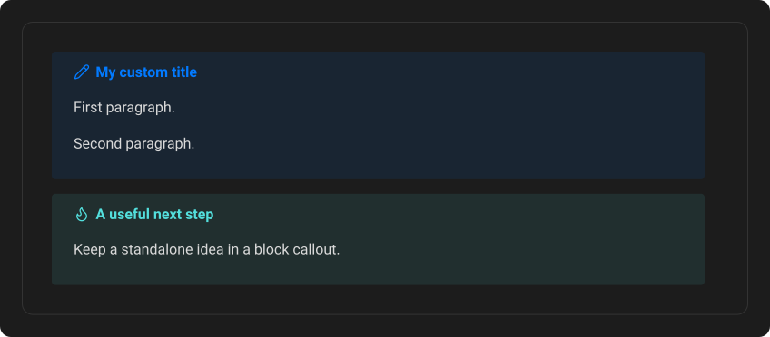
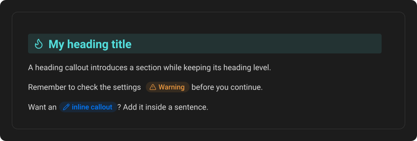
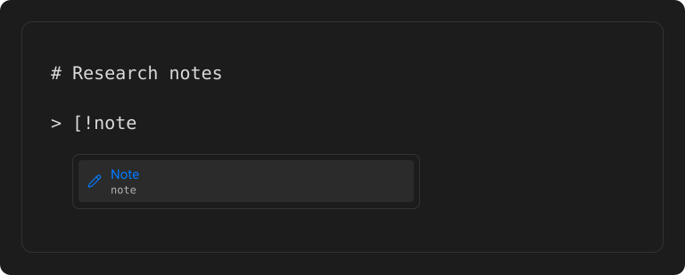

# The three callout types

Callout Studio includes Obsidian's thirteen built-in callouts. Open the plugin settings and look under **Built-in callouts** to browse them. Each row shows the callout's icon and name, its supported aliases, and its color.

Every built-in or custom callout can appear in three forms: Block, Heading, and Inline. One definition supplies the name, icon, and color for all three.

## Block callout

Use a block callout for a standalone box of information. Start the line with `>`, then place an exclamation mark and the callout ID inside square brackets:

```md
> [!note]
> Your content goes here.
```

Write a custom title immediately after the closing bracket. Start every additional content line with another `>`:

```md
> [!note] My custom title
> First paragraph.
>
> Second paragraph.
```



## Heading callout

Use a heading callout to make a section stand out while keeping it as a real heading. Type the usual heading marks, followed by the callout token and an optional custom title:

```md
## [!tip] My heading title
```

The heading becomes a colored bar but remains part of the document Outline and can still be linked like any other heading.

## Inline callout

Use an inline callout to highlight something without breaking the paragraph:

```md
Remember to check the settings [!warning] before you continue.
```

The token becomes a small colored pill. To put custom text inside the pill, add it in curly braces immediately after the token:

```md
Want an [!note]{inline callout}? Add [!type]{text} inside a sentence.
```

The `{` must touch the closing `]`.



## Picking from the autocomplete menu

Type `[!` in any of the three positions and a menu of your callouts opens. Choosing one with **Enter** or a click writes the callout, then leaves the cursor where you would type next:

- **Block:** on a new `> ` line under the header, ready for the content.
- **Heading:** on a new line under the heading.
- **Inline:** right after the pill, on the same line.



If you were only changing the type of a callout that already has a title, the cursor stays at the end of that line instead. This works the same for built-in callouts and for ones you created, whatever their ID.

## Metadata and callout IDs

Obsidian can attach metadata after a pipe, such as `[!note|purple]`. Callout Studio ignores that metadata when identifying the callout type, so `[!note]`, `[!note|purple]`, and `[!note|green]` all use the same **Note** definition. Heading, Inline, and Block callouts can all carry metadata.

All three formats render in Live Preview, Reading view, and PDF exports.

---
**Next:** [Create your first callout](02-create-your-first-callout.md)
