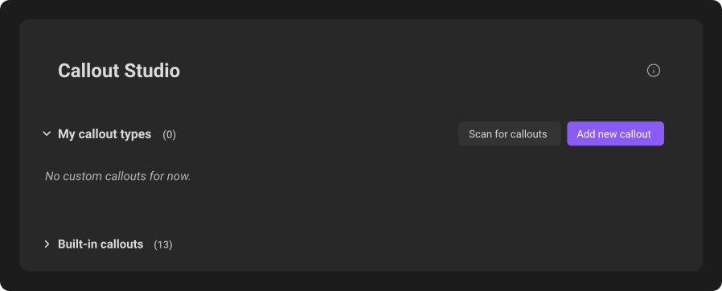
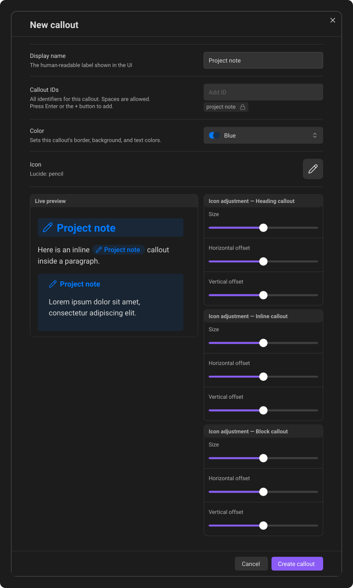
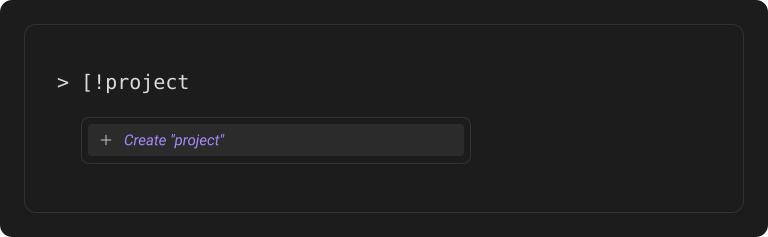

# Create your first callout

You can design a callout in the plugin settings or create one directly from autocomplete while writing.

## Create one in settings

Open **Settings → Callout Studio**, then click **Add new callout**.

*Dark-mode render of **My callout types**, with **Add new callout** beside the heading.*

1. Enter a **Display name**. This is the readable name in Callout Studio and the default title shown when the note does not provide one.
2. Review the **Callout IDs**. The first ID fills automatically from the display name and is the token you type in your notes. Add more IDs if you want aliases for the same callout.
3. Choose a color from Obsidian's standard colors, Callout Studio's extended presets, or one of your saved palettes.
4. Click the current icon, search for a replacement, and confirm it.
5. Check the live previews for the Heading, Inline, and Block forms.
6. Fine-tune the icon size, horizontal offset, and vertical offset for each form independently.
7. Click **Create callout**.

The saved callout is now available in all three formats.

*Dark-mode render of the editor for **Project note**, using `project note` as its ID and the same design in all three previews.*

Text fields and dropdown fields do not show tooltip bubbles on hover. Their
labels remain available to screen readers.

## Create one while typing

Type a block, heading, or inline token for a callout that does not exist yet. For example, typing `> [!project` offers **Create "project"** in autocomplete. Select it to open the editor with the name already filled in, ready for you to choose its color and icon.

*Dark-mode render of autocomplete for an unknown `project` type. Selecting **Create "project"** opens its editor.*

Autocomplete is a core editor feature and is always enabled; there is no
settings switch for it.

Nothing is saved until you click **Create callout**. If you close the editor, the unknown token remains in the note and uses the default fallback style.

---
**Next:** [Custom color palettes](03-custom-color-palettes.md)
