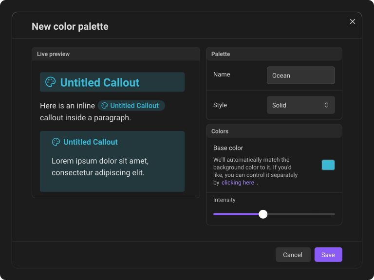
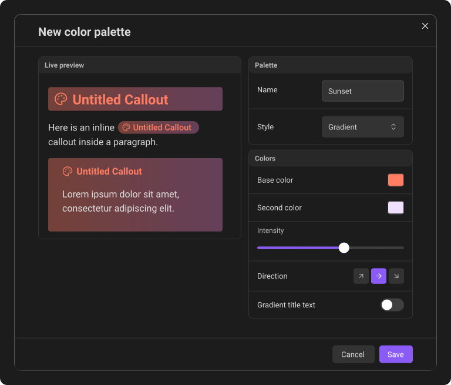

# Custom color palettes

Callout Studio includes Obsidian's native callout colors and its own built-in presets. To change a callout's color, open that callout for editing and use the color menu.

Hovering a colour temporarily previews it. Moving the pointer away from the
row restores the current colour; click a row or use the arrow keys and Enter
to choose it. If the pointer rests over one row while you use the arrow keys,
only the keyboard's row is highlighted. Move the pointer again to return the
highlight and preview to the row under it.
Group headings stay visible at the top of the color menu as you scroll.

## Create a saved palette

Open the main plugin settings, find **Saved color palettes**, and click **New palette**.

1. Give the palette a name.
2. Choose a **Base color**. The background initially follows that color automatically. A new palette starts on a default blue; if you already have a palette with exactly that look, it starts on a blue one shade off, so the window never opens on a "duplicate" message.
3. If you want a different background, open the separate background controls.
4. Review any contrast warning. It identifies combinations that may be difficult to read but does not prevent you from saving the design.
5. Click **Save**.

**Save** stays dimmed while the name is already used by another palette, or while the colors are identical to another palette's. Press it and a message says which.

Saved palettes appear at the top of every callout color menu under **Custom**.

## Background styles

The **Style** menu offers three choices:

- **Solid** uses a single background color.
- **Gradient** adds a second color and a direction control. You can also enable **Gradient title text**.
- **Transparent** removes the callout's background, including a tinted title bar or a content panel your theme would otherwise draw, while keeping the base color on the title and icon. The theme's borders and small decorations stay.

In the palette editor, **Name** and **Style** have the same rounded field shape
and hover and focus feedback as other text and selection fields. Open
**Style** to choose from the list; it does not accept typed text.

Some themes and Style Settings layouts keep a callout's body neutral and put its
color somewhere else - AnuPpuccin's Sleek, Vanilla Normal, and Vanilla Plus
layouts put it on a title bar. Block callouts follow the layout: the body keeps
the theme's neutral surface in light and dark mode, and the palette's
background, solid or gradient, fills the title bar instead. A transparent
palette leaves the title bar empty.

Layouts that give callouts no background at all, such as GitHub Theme's callout
style or Minimal's outlined callouts, show neither a solid nor a gradient
background; the palette's base color still colors the title, icon, and frame.

## Edit, delete, and restore palettes

Click the pencil beside a saved palette to edit it. When you save the changes, every callout linked to that palette updates across the vault.

Deleting a palette does not change the callouts that already use it. They keep their exact colors. The callout editor's **Color** row shows the color circles and the message “This callout's saved color was deleted.” Click **Restore** beside the message to open the palette save popup with those colors filled in.

Clicking the color field and then clicking away keeps **Deleted color**, the warning, and the color circles visible. When the color list opens, no saved color is highlighted until you point to one or move through the list with the keyboard. The deleted state also remains if you cancel the restore popup. Save a palette or choose another color to leave this state.

---
**Next:** [Custom icons & emojis](04-custom-icons-and-emojis.md)
