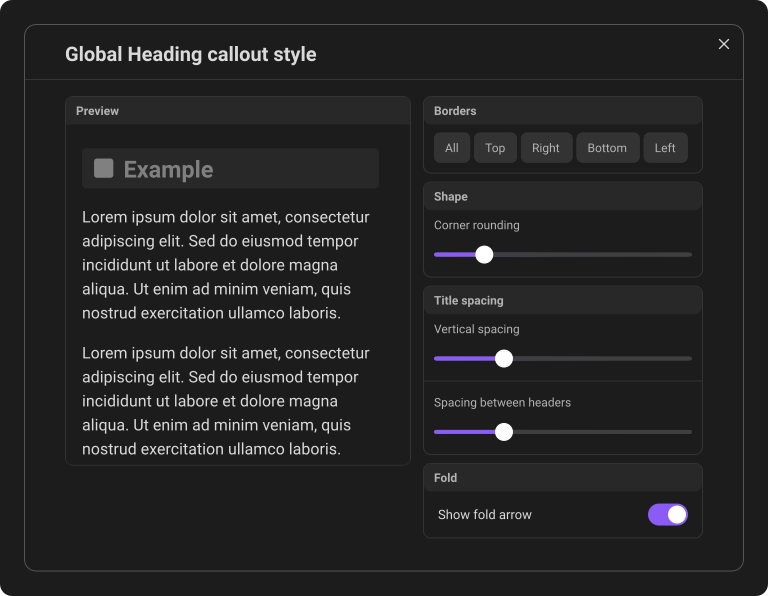
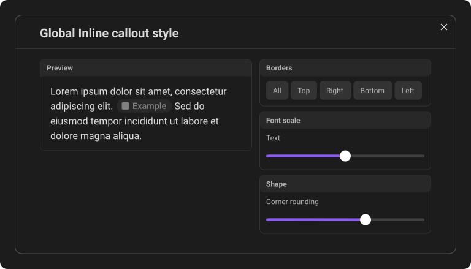
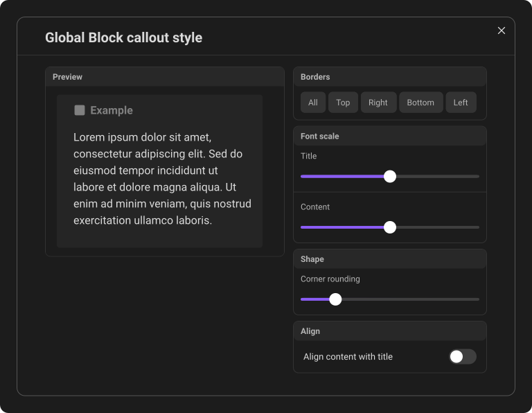

# Global styling

Global styling gives every Callout Studio callout a consistent shape and layout. Open the plugin settings and find **Global settings**. Changes apply immediately across the vault.

Each callout format has its own controls, so changing one format does not force the others to use the same geometry.

Each option box shows a **Reset to default** arrow in its header when its settings differ from the defaults. Click it to restore that box's settings immediately. Other boxes and callout formats keep their values.

## Heading callouts

For heading callouts, you can:

- Show borders on selected sides.
- Set the exact border thickness.
- Adjust vertical padding and the spacing between headings.
- Control corner rounding and related heading geometry.

## Inline callouts

For inline callouts, you can:

- Scale the pill text independently of the rest of the note.
- Adjust corner rounding up to 25px to keep the pill rounded at larger text sizes.
- Choose border sides and thickness.

The icon and spacing scale with the pill text. At every inline text scale, the
entire pill stays centered vertically in the surrounding line instead of
shrinking toward the text baseline.

The Inline preview shows a localized example pill between two sample
sentences. Click it to reveal its Markdown syntax in the preview editor, using
the translated label.

## Block callouts

Block callouts include the broadest set of controls:

- Border sides, thickness, and corner rounding.
- Separate title and content scale.
- **Align content with title**, which starts the content text at the same inline edge as the title text, in both left-to-right and right-to-left layouts. The spacing follows the icon's width, including wider images.

These settings shape callouts drawn by Callout Studio. If your active theme owns a callout, the theme keeps control of its appearance; see [Theme integration](17-theme-integration.md).

---
**Next:** [The right-click menu](08-the-right-click-menu.md)
