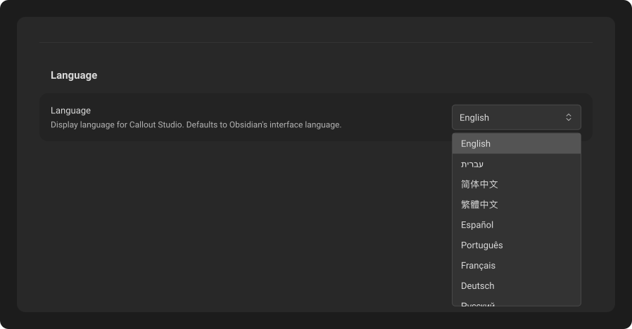
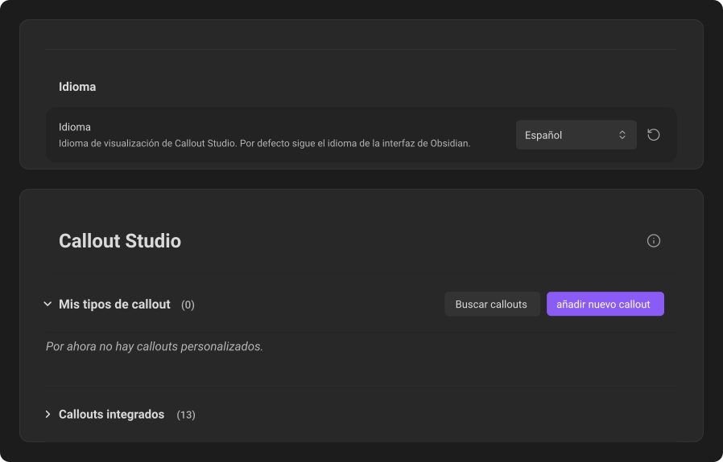

# Languages

Callout Studio supports more than thirty interface languages. By default, it follows the language already selected for Obsidian.

## Choose a language

Open **Settings → Callout Studio** and select a language from the dropdown. Each language is listed under its own name.

Until you choose a language, the dropdown shows the language Obsidian is using and keeps following it, even if you change Obsidian's language later. If Callout Studio has no translation for Obsidian's language, it shows English.

When you choose a language other than Obsidian's, a **Reset to default** arrow appears beside the dropdown. To follow Obsidian's language again, click the arrow or choose Obsidian's language from the list.

Obsidian's language is set separately on each device, but your choice here syncs with the rest of Callout Studio's settings. If you choose a language, every device uses it. If you follow Obsidian, each device uses its own Obsidian language.

Changing this option affects only Callout Studio's settings, buttons, and messages. Version history also uses your selected language for version names, deletion confirmations, and the **What changed** heading.

## Download once, use offline

The first time you select a language that is not already stored on the device, Callout Studio needs a brief internet connection to download it. After that, the translation is saved locally and works offline.

## Help improve a translation

Non-English translations were created with AI assistance, so an awkward phrase or small error may remain. Links at the bottom of the plugin settings let you:

- Open a GitHub issue for a correction or suggestion.
- Read the contribution guide before submitting a pull request.
- Send an email describing the language and the text that should change.

See [Privacy & permissions](../internals-docs/25-privacy-and-permissions.md) for how translation files are downloaded and stored.

---
**Next:** [Find callouts](12-find-callouts.md)
