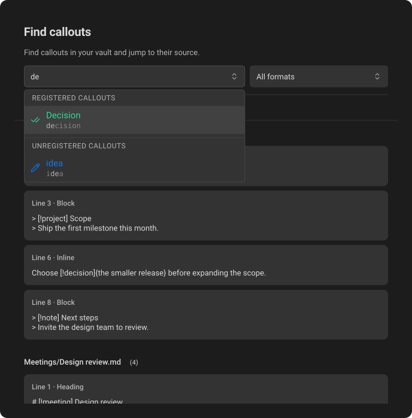
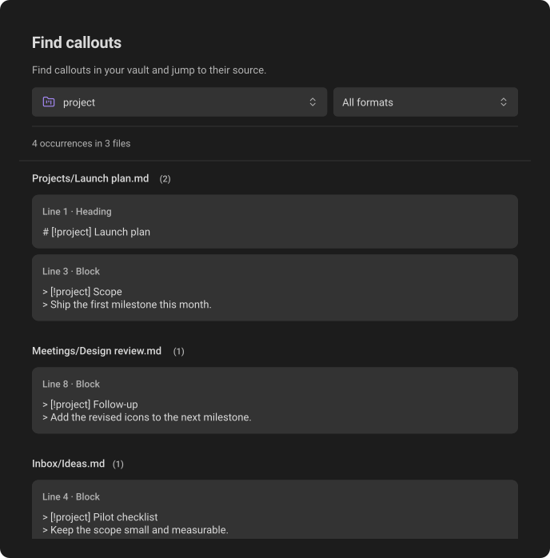

# Find callouts

**Find callouts** is a sidebar panel that answers "where did I use this
callout?" It lists every source reference to a callout across your Markdown
notes, lets you filter them by type and format, and jumps to the exact line.

## Open the sidebar

The **Find callouts** tab is added once to Obsidian's right sidebar when you
first install Callout Studio. Select it to open the panel; the sidebar does not
open automatically. If you close the tab, it stays closed on later launches.
Updating Callout Studio does not add it again.

You can reopen it with **Callout Studio: Find callouts** in the Command palette,
or **Find callouts** in a callout's three-dot menu. Obsidian then remembers its
presence and position as part of your workspace. Collapsing the sidebar or
selecting another tab does not close it, and loading a saved workspace that
contains the tab can restore it.

This is the only on-screen occurrences control; there is no separate ribbon
button or statistics window in Settings. The sidebar helps you filter callouts
and navigate to their Markdown source.

Opening **Callout Studio: Find callouts** from the Command palette starts
with **All types** and **All formats**. Opening **Find callouts** from a callout's
three-dot menu starts with that callout type and **All formats**, even if you
previously selected a different format in the sidebar.

The title and short subtitle stay visible above the type and format
pickers. The pickers sit side by side when the sidebar is wide and stack when it
is narrow. The header, pickers, and matching-result summary remain fixed while the
file groups below scroll. Several inline callouts on one line count as separate
occurrences. The former vault-wide statistics cards are no longer shown here.

*The type picker includes registered callouts and unregistered types found in notes. Here, a search for “de” shows choices from both groups.*

Use the searchable type picker to choose **All types**, a saved type,
or an unregistered type found in your notes. The iconless **All types** option
appears first under **Browse**. It shows every callout occurrence in the vault,
including unregistered types. **Registered callouts** follow, then
**Unregistered callouts**. **Browse** and the other group headings stay visible
while you scroll the picker. The type choices use the same group styling as the
color picker.
When you choose a single type, the picker shows its ID; saved types include
their aliases in the results. Equivalent source spellings share one
option, and a registered alias does not create a duplicate option. Unregistered
options update as notes change and are available **only in this sidebar**.
Selecting one never saves or registers it, or adds it to any other settings
picker. Use **My callout types → Scan for callouts** to register it.

Unregistered choices use the icon and color from **Default fallback callout**,
just as they would after **Scan for callouts**. If the active theme owns a type,
the picker shows its measured theme appearance instead. Changing the fallback
updates these choices without registering them or changing the selected type.

Built-ins and saved definitions are available even without occurrences. A type
provided only by a theme is offered here when it occurs in a note; an unsaved
editor preview alone does not add an option.

If the last occurrence of the selected type is removed, the sidebar keeps that
selection and shows zero matches. It does not switch to another type while you
are editing. Once you select a different type, an unused unregistered type drops
out of the picker.

## Navigate through occurrences

*Choose a type to see its source references, grouped by note. The results scroll below the fixed filters and summary.*

Results are grouped by note, with a bordered card for each occurrence. The file
heading includes the matching count in parentheses after the file name, including matches not yet
revealed by **Show more**. Each card shows its format, line number, and at most
two lines of raw Markdown, including syntax such as `> [!info]`. Block previews
include a line of body text when available. Choose **All formats**, **Block**,
**Heading**, or **Inline** to filter the selected type or all types. The format
picker opens a list of these four choices without a search field. It has the
same control shape and hover feedback as the type picker. A selected option remains
identifiable when you hover over it or move to it with the keyboard. With a mouse or
trackpad, hovering a result subtly brightens its border; keyboard focus keeps
its stronger outline.

A summary below the controls shows the matching occurrences and files, such as
**131 occurrences in 15 files**. It uses the same styling as the conversion
selection summary. Only the results scroll. Select a
card to navigate. As you scroll through a note's results, its file heading stays
below the fixed header until that note's results end; the next file heading
then takes its place. Clicking a result highlights that card and keeps it in the
same sidebar position. Clicking elsewhere in the editor or changing its text
selection returns that card to its normal appearance. Clicking the file heading
opens the note at its beginning. Switching to another note also clears the previous card's highlight;
the new note's heading identifies the current file. Updating the list keeps
keyboard focus on the same occurrence when its source is unchanged.
Ctrl-click (Command-click on macOS) opens a new tab. The list initially shows
up to 100 results; **Show more** reveals another page.

Widen the sidebar to arrange each file's cards in two columns, read left to right
and then onto the next row. File headings span both columns. Content has a maximum
width and stays centered when the pane grows further. The file groups and cards
use the same layout as **Review conversion**.

The current Markdown note's file heading is highlighted in the results. The
sidebar opens at the top with the filters visible, even if that note's section
is farther down the list. When you switch to another Markdown tab directly, the
sidebar scrolls to that note's section. It reveals more results first if the
section is beyond the initial page. If the current filters leave that note
with no matching occurrences, the list stays in place. Choosing a different
type or format keeps the sidebar near its current position in
the updated results.
If the filtered list is shorter, the scroll position settles at the nearest
available place. The highlighted note does not pull the list to its section
after a filter change.

Navigation opens the note in editing mode and selects the exact callout token.
If that note is already the most recent main-pane editor, navigation reuses it
even when duplicate tabs are open. Switching away, changing the filters, or closing the sidebar while a
result is still opening cancels its pending selection.
Locations are revalidated against the current editor. Missing or ambiguous
occurrences trigger an automatic update instead of selecting unrelated text.
On hosts where Settings cannot be dismissed automatically, close Settings to
reach the opened sidebar.

## Usage counts in menus

A callout's three-dot menu shows **Find callouts** with its total across all three
formats. Select it to open those results. Definition menus include the type's
aliases, so their occurrences contribute to the total.

When the count is already current, the menu opens immediately with the number.
Otherwise it waits up to 200 milliseconds for the shared scan. If the count is
ready within that time, the menu opens with it; if scanning takes longer, the
menu opens with **Find callouts**, and the number fades in when ready. Opening
another callout's menu reuses the same index rather than scanning the vault again.
Clicking elsewhere, scrolling the settings list, resizing the window, rotating
the device, or closing Settings cancels a pending menu opening. The same list
scroll and viewport changes close an already-open menu; scrolling inside the
menu itself stays available.
The fade respects your system's reduced-motion preference. Incomplete scans are
labelled rather than reported as zero. Actions that change notes check current
contents separately.

## Scanning behavior and exclusions

There is no automatic discovery or unconditional startup scan. Opening a usage
surface, including selecting **Find callouts** or restoring an already-open
sidebar, builds an in-memory index. Adding the inactive tab on first install
does not start a scan. Subsequent requests reuse the index, and saved-note
changes and edits in open Markdown editors are reflected automatically after a
short delay.
There is no manual Refresh button. Nothing is uploaded or written to plugin
settings by this index. Brief scans and updates stay quiet;
if one remains in progress for two seconds, its status appears above the results.

Fenced and indented code, inline code (including multiple-backtick and multiline
spans), YAML frontmatter, and Obsidian `%%` comments are excluded. Escaped tokens,
Markdown-link labels that match callout syntax, and wikilink references are not
usages. Whitespace and indentation are interpreted in their Markdown context.

Counts describe source references, not the number of visible widgets. Existing
incomplete inline content payloads and nested payload tokens remain source
references even when a renderer does not show a pill. Theme-owned heading/inline
syntax is also counted as source, regardless of whether that format is rendered.

Open editors contribute their current text, including changes not yet saved;
closed notes use saved Markdown. If files cannot be read, the sidebar labels
the available results as incomplete and lists the affected notes. Later source
changes or reopening the sidebar trigger another attempt; failures do not start
an endless retry loop.

---
**Next:** [Syncing & backups](13-syncing-and-backups.md)
