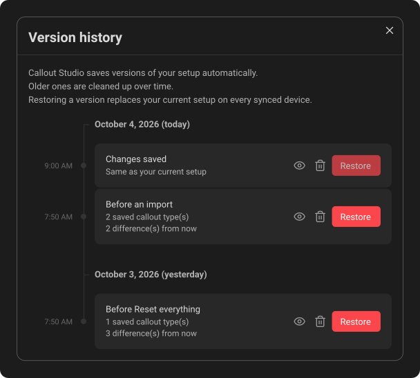
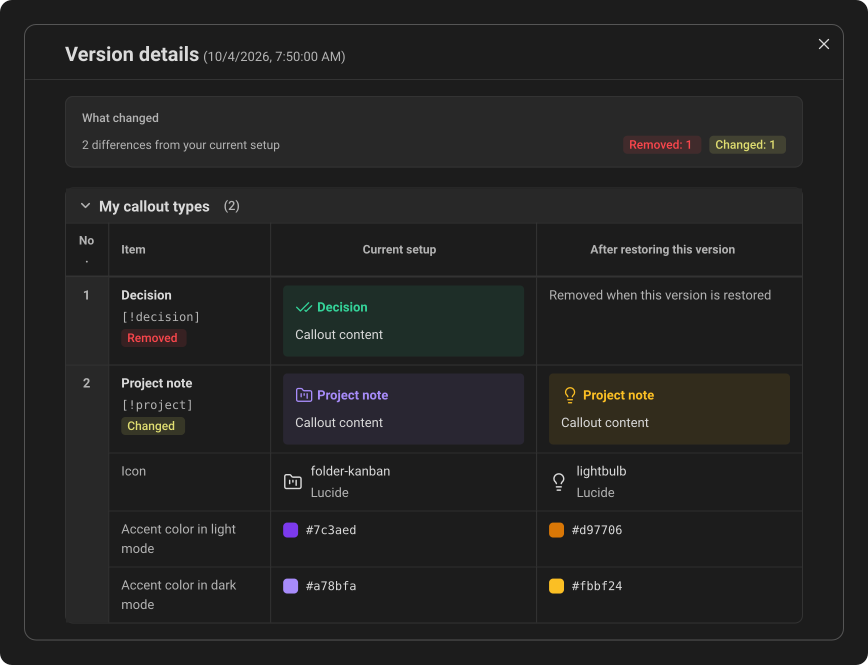
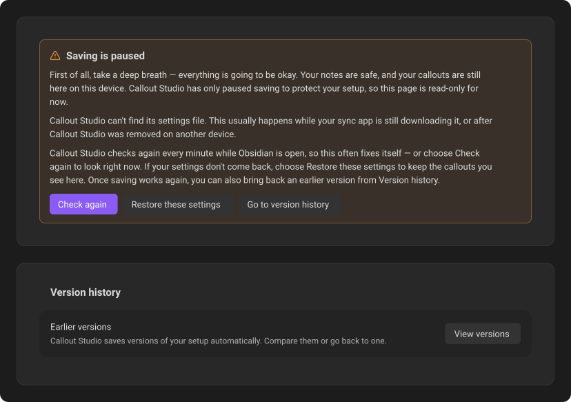

# Syncing & backups

Callout Studio stores its setup in Obsidian's plugin settings. A synced vault can move those settings between devices, but only if the sync service includes the vault's configuration folder and keeps the files available to Obsidian.

## Export a complete backup

Choose the Callout Studio backup format to save your full setup as JSON, including callout definitions, saved color palettes, and plugin settings. This is the recommended portable backup for restoring a setup through **Import** or transferring it to another vault where the plugin is installed.

The export captures the setup currently displayed, even when settings saving is paused. Keep it somewhere separate from the plugin folder. Its format differs from the plugin's internal `data.json`: do not rename an export to `data.json`.

Exporting does not add an entry to **Version history** or create an automatic backup in the vault. The exported file is a separate backup you keep yourself.

When importing a Callout Studio backup, matching entries are updated and valid saved palettes are merged into the destination setup without overwriting unrelated palettes. A palette with the same name as one you already have updates it. [Import a Callout Studio backup](10-import-export-and-sharing.md#import-a-callout-studio-backup) explains what the confirmation shows.

**Import**, **Reset everything** and deleting a custom callout are unavailable while saving is paused; resolve the saving problem first.

## Version history

***Version history** combines earlier setups into one timeline. Each row compares that setup with the one currently displayed.*

The **Earlier versions** description flows as one paragraph, wrapping to fit the available width.

Each date heading has space above and below it, with about twice as much above, so it clearly belongs to the versions beneath it. The first heading has only a small gap above it. A short horizontal line connects each heading to the timeline at the centre of the text.

Hover over a version's card, time or timeline dot to highlight the card background, time and dot together.

Open **Settings → Callout Studio**, and under **Version history** choose **View versions**. The window lists every earlier version of your setup that Callout Studio can find, newest first, along a vertical timeline with a small dot for each version. Versions are grouped by your local calendar day. Each heading starts with the full date, followed by **today**, **yesterday** or **N days ago** in parentheses, including for older versions: for example, **October 1, 2026 (3 days ago)**. Dates and relative wording follow the interface language. A future date appears without a relative label. Versions whose dates are unknown appear in a separate group at the end. Each row shows:

- **Its name,** based on why it was saved, such as *Changes saved*, *Before an import* or *Before changes from another device*. These names are automatic and cannot be edited.
- **The time it was saved,** in smaller, muted text on the opposite side of the timeline from the version's card. The day heading supplies the date, so each row only repeats the time.
- **How far it is from your current setup:** the number of callout types it holds and the number of callout types and setting groups that differ from now. These appear on separate lines when the buttons sit beside the text, and together on one line when the buttons move below it, wrapping if needed. A version identical to your setup or one that cannot be read shows that status instead.

### One list of versions

**Version history** brings the available copies together. You choose the setup you want to restore, without choosing a storage location.

When several copies would restore exactly the same settings, the list shows one version. Copies saved a moment apart but holding different settings stay separate rows: the copy **Restore** takes of the setup it replaces, and the setup it restores a moment later, are separate versions. Every version uses the same small timeline dot, matching the color of the timeline. The list and details focus on the saved setup and its differences, without source icons, storage badges or filenames.

Callout Studio keeps some automatic copies in this device's app storage and some in the vault's backups folder. It can also find extra settings files left by a sync service. Their independent limits still apply, so the window can show more than ten versions. Appearing in the list does not confirm that a file has uploaded or is available on another device. See [device history retention](#how-much-device-history-is-kept) and [backups in the vault](#automatic-backups).

Callout Studio does not automatically delete sync-copy files or impose a count, size, or age limit on them. Their availability on other devices depends on the sync service, and deleting the plugin folder can remove them. The separate device recovery copy, raw preservation files and upgrade archives are not listed in version history. A [manually exported backup](#export-a-complete-backup) is a separate file you keep yourself.

Each version supports **View details** and **Delete**. **Restore** requires readable, supported settings and active saving. Deletion removes the copies available to this device, with a warning when file deletion may sync; another device's private history can still retain the version.

### What the automatic names mean

| Name | What happened |
| --- | --- |
| Changes saved | A change made on this device was saved. |
| Loaded from the settings file | This device read settings it didn't have from the settings file, for example after they arrived through sync. Reading a setup this device already had, as happens each time Obsidian starts, keeps that version's name. |
| Restored from version history | You restored this version. |
| Settings file repaired | A missing or unreadable settings file was replaced. |
| Before changes from another device | Settings arriving from another device were about to replace or remove some of this device's. |
| Before restoring a version | You restored a different version; this was your setup until then. |
| Before Reset everything | You used **Reset everything**. |
| Before an import | You imported a Callout Studio file or another plugin's callouts. |
| Before the settings file was repaired | This device's recovery copy, kept before a missing settings file was created again. |
| Automatic backup | Callout Studio saved it without a recognized reason. |
| Sync copy | A sync service's copy with no automatic backup of the same setup and no recognized reason. |

The reason supplies the title when it is known. Otherwise, a version with any copy saved by Callout Studio is named **Automatic backup**; one found only in extra settings files is named **Sync copy**. These are fallback names, not separate views or visual categories.

### Restore a version

**Restore** asks first, saves your current setup as a version, then makes the chosen version your setup on every synced device. Changes made on another device that this device hadn't received yet are kept. Restoring is unavailable while saving is paused. **Restore** stays dimmed then, and for a version identical to your current setup; press it and a message says which. To export the setup currently displayed, use **Export → Callout Studio backup** in settings.

### Delete a version

Select the trash button, **Delete**, to permanently remove the available copies of a version after a warning confirmation. This includes this device's history entry and any listed backup or sync-copy files. When files are involved, the confirmation warns that their deletion may sync to other devices. Copies in another device's private history can remain. This cannot be undone, and it never changes your current setup or any other version. If a copy cannot be deleted, the list refreshes to show what remains. Unlike **Restore**, deleting works on a version that can't be read as settings and while saving is paused, because it never touches your settings file.

### View a version before restoring it

***View details** shows the changes restoring a version would make, including side-by-side callout previews. The comparison scrolls within the window.*

Select the eye button, **View details**, beside any version to open **Version details**. The saved date and time appear in parentheses beside the window title, in smaller, muted text; an unknown date is shown there as **Save time not recorded**. The report starts directly with **What changed**.

The compact **What changed** panel has a smaller, muted heading. The total (such as **24 differences from your current setup**) and the removed, changed and added pill labels share the row below the heading where space allows; they wrap on narrow screens. Changed items are marked in yellow, added in green and removed in red. A version identical to your setup shows **Same as your current setup** without counts. An unreadable version shows **Comparison unavailable**, with an explanation beneath. This is a read-only window: opening it does not restore the version, change your settings, create a backup, or contact a server. It remains available while saving is paused.

The window shows only what would change if you restored the selected version, compared with the setup currently displayed when you open it. It is split into the sections of the settings page, in the same order: **My callout types**, **Built-in callouts**, **Custom Icons** and **Icon picker defaults**, **Default fallback callout**, **Saved color palettes**, the global style options, **Context menu**, **Commands & Hotkeys** and **Language**. Anything saved by a newer version of Callout Studio appears last, under **Other settings**. Only sections with a difference appear.

Each section is a table with four columns: **No.**, **Item**, **Current setup** and **After restoring this version**. Select a section's title to fold the section or open it again. While you scroll through a section, its title and column headings stay pinned at the top of the window.

Every change has its own number, counted on across all sections. A change is one thing you would name, such as a callout type, palette, custom icon or command. It is matched between the two versions by its identifier, so everything that differs about it stays together in one numbered row: its name, a picture of it on each side where one can be drawn, then one line per changed setting with the setting's name in the **Item** column. A callout that would be added shows *Not present in the current setup* on the current side; one that would be removed shows *Removed when this version is restored* on the restored side. Resetting a customized built-in callout to its default is shown as a change, not a deletion.

Values are drawn rather than printed: colors as swatches with their hex codes, icons as the icon with its library and style, gradients as gradients, border choices as a small frame, orders as numbered lists, and switches as **On** or **Off**. Long text shows its beginning and its total length. The window never shows raw saved data.

A change to the global style options appears once, in its own section, with a sample callout drawn in each version's style. It is not repeated on every callout type it affects. A callout type is listed only when its own settings or its stored icon artwork differ. The comparison captures your displayed setup when the window opens; reopen the window to compare with later changes. A loading message appears if building the comparison takes a moment.

Callout previews show a regular block with sample content in the current light or dark mode, using that side's saved colors, styling, and artwork; the global style section also draws a heading callout and an inline callout. Previews do not recreate an older Obsidian theme or the contents of a note. Artwork missing from a version shows a placeholder; opening a preview does not download it or substitute an image from your current setup.

The comparison uses the setup as the current plugin understands it, including defaults and migrations. The list's difference count tracks callout types and setting groups, while the window numbers each changed item, so the window can show more changes than the list: one setting group, such as the global style, can hold several items. Picker memory, onboarding flags and other internal bookkeeping are not part of the comparison. An unreadable or unsupported version still has **View details**, but shows that a comparison is unavailable and cannot be restored.

Changed values can include your callout names, command settings, and uploaded artwork, so review the comparison before sharing it.

### How much device history is kept?

Device history keeps up to ten most recent distinct setups in Obsidian's app storage, outside the vault. A setup is recorded after a successful settings save or when this device accepts settings from the vault, including settings originally edited on another device. There are no additional daily or weekly copies. Returning to the same setup refreshes its date instead of adding a duplicate; the timeline uses the newest available copy's date.

History also has an estimated 24 MiB storage budget per vault, configuration folder, and plugin on this device. Older versions can be removed sooner to stay within that budget; the newest version is kept even if it alone exceeds the budget. Large uploaded images or stored icon artwork can reduce the number of older versions retained.

Cleanup happens when the plugin starts and whenever a setup is recorded. After an upgrade, older versions beyond the new limit are deleted automatically, even if you make no changes or saving is paused. Versions within the limit remain regardless of age unless the size budget removes older ones. Storage failures can delay cleanup or leave fewer versions available; cleanup is retried on the next startup or recording.

This app storage is not synced. The plugin does not delete it on uninstall, but clearing Obsidian's app data or the operating system removing app storage can erase it.

## Automatic backups

Callout Studio saves a copy of your setup to its `backups` folder before a change that could lose it:

- before settings arriving from another device remove or replace callouts or preferences on this one
- before **Restore these settings** replaces this device's recovery copy
- before restoring a version from **Version history**
- before **Reset everything**
- before any import

The folder is inside the plugin's folder, usually `.obsidian/plugins/callout-studio/backups/`. Each new copy is checked after it is saved. When a verified copy with identical content already exists, that copy is reused. Why each copy was taken is recorded beside it, in that device's `labels-….json` file, and is how **Version history** names it; the copies themselves are left exactly as older versions of Callout Studio expect them.

Each device keeps its ten newest backup copies, shared across all reasons, with no additional daily or weekly copies. Cleanup runs at startup, after writing and verifying a new backup, and when reusing an existing copy. Upgrading therefore removes existing excess backups without waiting for a new backup. Copies needed together for a recovery operation take priority within the ten slots; an operation needing more than ten temporarily exceeds the limit until the next cleanup.

Copies from other devices are left alone while those devices are still producing backups. When another device's newest backup is more than ninety days older than this device's newest backup, cleanup keeps only that other device's newest copy. An installation with no backups of its own does not thin other devices' copies. A device can still be in use without producing backups, so this is based on backup dates rather than device activity.

Backups written by Callout Studio 2.14 or earlier do not identify their device. They share a separate limit of ten newest copies, and excess copies are also deleted during startup cleanup.

These are limits per storage source and device, not a limit of ten rows in **Version history**. The list combines those sources and merges identical setups. There is no single file-count or size limit for the whole folder, and some files are never removed automatically:

- Exact copies of settings files or device recovery copies replaced because they could not be read are named `unreadable-….txt` and `recovery-copy-….txt`. These are preservation files, not versions listed in **Version history**.
- Files whose names are not recognized as current or legacy automatic backups are left alone, and so are the small `labels-….json` files that hold the reasons backups were saved.

To bring back a readable backup, use [Version history](#version-history). Routine backup copies are thinned automatically, but those exceptions mean the folder is not guaranteed to remain a fixed size.

The folder can sync if your provider includes it, and deleting the plugin folder removes it. A saved backup does not confirm that synchronization has completed. Keep an exported backup somewhere else as well.

## Recover paused saving

*When the settings file is missing, the banner starts with **Check again** and keeps the recovery and version-history actions available.*

Callout Studio pauses saving when it cannot safely use its settings file. Your displayed setup may still be available from memory or a recovery copy kept on this device. Uninstalling the plugin on a synced device can remove the shared settings file on other devices too. A temporarily unavailable cloud file can look similar, so the plugin does not assume that missing settings should be reset.

While saving is paused, desktop shows **Saving paused** in the status bar, and mobile shows a notice that stays until you dismiss it. When the settings file is missing at startup, a short notice says your notes are safe and that saving is paused; it stays until you dismiss it, and closes by itself once saving resumes. Select any of these to open Callout Studio settings, where a banner explains what is safe, what happened and what to do, in that order. While the app is open, Callout Studio also checks for the file again every minute, so a file that was still syncing is picked up without you doing anything. When saving resumes after a pause that lasted more than a few seconds, a short notice says saving is back on.

While saving is paused, the settings page can't be changed, so nothing you change there is lost when Obsidian closes. You can still look through your callouts, export your current setup, and browse, inspect and delete versions. Resume saving before restoring a version.

The startup notice uses Callout Studio's selected language when its translation is available. If that translation loads later, the notice text and settings link update automatically without reopening a notice you dismissed.

1. If your setup is still displayed, use **Export → Callout Studio backup** to keep a separate JSON copy.
2. Check that the vault is downloaded, the sync service is running, and the device has storage space and permission to write. Let pending synchronization finish, then select **Check again**. This checks for returned settings; it does not create a missing file. When the file is missing, **Check again** is the highlighted button until a check comes back empty; the banner then gives more specific advice and highlights **Restore these settings** instead.
3. Then choose the action the banner offers:
   - **The settings file is missing:** if the displayed setup is the one you want, select **Restore these settings** and review the confirmation, which says in plain words what is saved, what is backed up first, and what your sync service may send to your other devices. This creates a settings file from that setup and resumes saving after a successful local write. If no previous setup is available, the action says **Create settings file**.
   - **The settings file can't be read:** the banner says why. If the file is still downloading, or this device can't open it, wait for sync and select **Try again**. If the file is empty, damaged, has Git merge conflict markers, or was combined from two versions by a sync service, select **Replace settings file**. Callout Studio saves an exact copy of the current file in the backups folder, then writes a readable settings file. If the settings inside the file were intact - a sync service combined two versions of it - they are kept, and the button is shown as the recommended step instead of in red.
   - **This device's recovery copy can't be read:** select **Discard recovery copy**. An exact copy is saved in the backups folder first, and your settings file isn't changed.
   - **The settings file or recovery copy is from a newer version of Callout Studio:** update the plugin on this device. Neither is replaced, even if the settings file is missing or damaged.
4. To go back to an earlier version, select **Go to version history** in the banner. It scrolls down to **Version history → Earlier versions**, highlights it and moves keyboard focus there. With reduced motion turned on in your system settings, the page jumps instead of scrolling. You can browse and compare versions there right away with **View versions**; once saving resumes, restore one from the same window.

These actions work the same on desktop and mobile, including when the problem starts while Obsidian is open, and you don't need to recover from a particular device. Each one checks the file again before writing, and stops if it changed in the meantime. A failed write leaves saving paused so you can retry. A successful local save does not mean cloud synchronization has finished; let it finish before editing the setup on another device.

If changes you made on this device couldn't be saved, and newer settings from another device then replace them, a notice tells you. Your version is saved in the backups folder, and **Version history** lists it as *Before changes from another device*.

Don't copy files into the plugin folder by hand to recover. Other devices merge their newer settings back over a file copied in from an old backup, so the rollback wouldn't stick. Restoring from **Version history** makes the old version an ordinary change that every device accepts.

The device recovery copy can survive plugin removal, but clearing Obsidian's app data can remove it. It is not a substitute for a separate backup. If this device can't update its recovery copy, for example because its storage is full, Callout Studio still saves your settings. It tells you once, and tries again with each later change.

## Use a synced vault

When you add Callout Studio to a new device, or reinstall it, let your sync service finish before you change anything. Your callouts and settings appear once they arrive. Until you change a setting yourself, the new device doesn't save a settings file, so its defaults can't replace your setup on other devices.

Use one sync service for the vault, and check that it includes your configuration folder and plugin settings. Syncing notes alone does not guarantee that settings sync. Different configuration folders can intentionally keep devices' settings separate. Follow [Obsidian's sync guidance](https://obsidian.md/help/sync-notes).

| Method | What to check |
| --- | --- |
| iCloud | On iPhone/iPad, the vault must be inside **iCloud Drive → Obsidian**. On macOS 15 and later, select **Keep Downloaded** for the Obsidian folder; on macOS 14 and earlier, Obsidian recommends disabling **Optimize Mac Storage**, which affects all iCloud storage. Deleting a file propagates to other devices; removing its download is different. [Obsidian](https://obsidian.md/help/sync-notes), [Apple](https://support.apple.com/en-ca/104953). |
| Obsidian Sync | Check vault configuration sync on each device. Plugin settings have their own sync behavior, including JSON conflict merging. [Sync settings](https://obsidian.md/help/sync/settings), [conflicts](https://obsidian.md/help/sync/troubleshoot). |
| OneDrive, Google Drive, Dropbox | Keep the whole vault available locally: **Always keep on this device** in OneDrive, **Available offline** or mirroring in Drive, and **Make available offline** in Dropbox. Cloud placeholders may be inaccessible while offline. [OneDrive](https://support.microsoft.com/en-US/onedrive/save-disk-space-with-onedrive-files-on-demand-for-windows), [Drive](https://support.google.com/drive/answer/13401938?hl=en), [Dropbox](https://help.dropbox.com/sync/access-files-offline). |
| Syncthing, Git / Working Copy | Allow devices to finish exchanging changes. Syncthing can create separate conflict copies; Git conflicts can leave markers in JSON that must be resolved. [Syncthing](https://docs.syncthing.net/users/syncing.html), [Git](https://git-scm.com/docs/git-merge#_how_conflicts_are_presented). |
| Remotely Save, LiveSync | Verify configuration-folder syncing separately. Remotely Save excludes it by default and syncs while Obsidian is open; LiveSync has customization/hidden-file options. Do not combine these with another vault sync service. [Remotely Save](https://github.com/remotely-save/remotely-save#config-folder--files-and-bookmarks), [LiveSync](https://github.com/vrtmrz/obsidian-livesync). |

These recovery safeguards work with the files visible to Obsidian; they cannot control a provider's exclusions, connectivity, delayed deletions or conflict policy. They are not a guarantee of compatibility with every service or mobile setup.

---
**Next:** [Danger zone](14-danger-zone.md)
