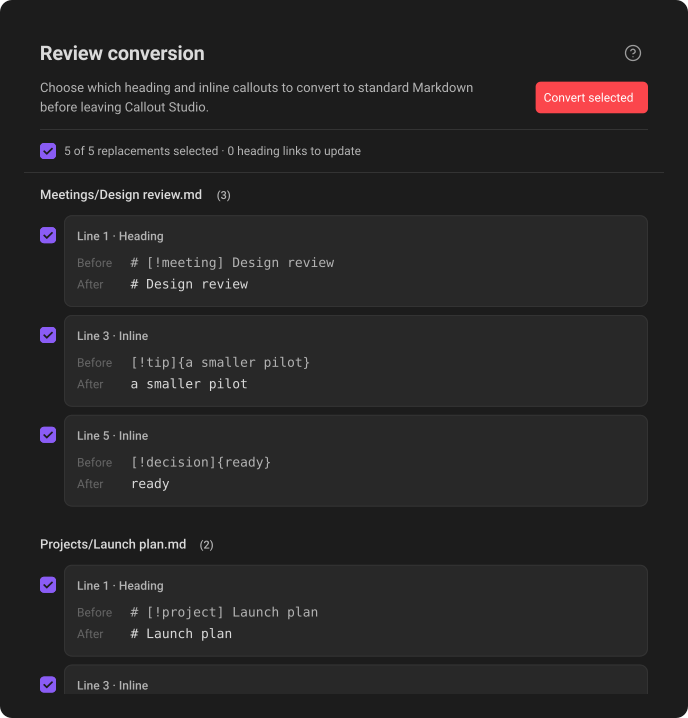
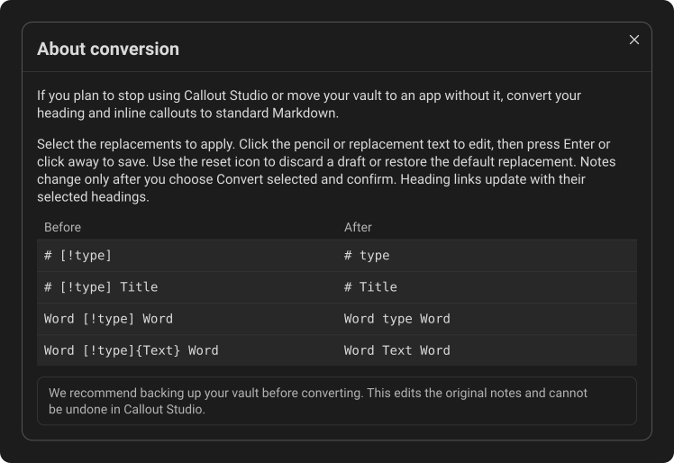
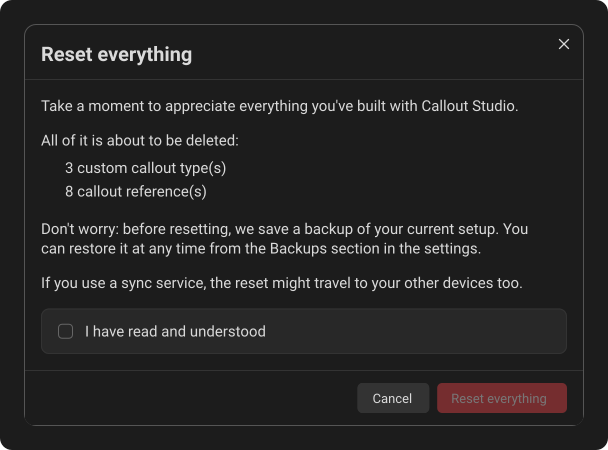

# Danger zone

Open **Settings → Callout Studio** and scroll to **Danger zone**. It contains
two separate actions: **Convert to standard Markdown** first, then **Reset
everything**. Both ask for confirmation because they can make lasting changes.

## Convert to standard Markdown

Use this when moving notes to an app without Callout Studio, or when you want
to stop using the plugin's heading and inline formats. Choose **Review
conversion** to close settings and open the review directly in the right
sidebar; this does not edit notes. The question-mark icon at the opposite end
of the title row opens **About conversion**, with a single **Before**/**After**
example table and backup advice. This tab appears when you open the review,
rather than at startup. If it was left open in an earlier session, Callout
Studio closes it on the next launch; use **Review conversion** to open a new review.

### What gets converted

| Before | After |
| --- | --- |
| `# [!type]` | `# type` |
| `# [!type] Title` | `# Title` |
| `Word [!type] word` | `Word type word` |
| `Word [!type]{Text} word` | `Word Text word` |

The rules apply to every type, including unknown types and aliases. A bare
token keeps the type written in the note; it does not look up a configured
display name. Inline content and its Markdown formatting stay. Icons, colors,
and metadata are removed. Empty `{}` becomes empty text. Where needed, special
characters are escaped so the replacement does not create new Markdown
structure.

Native block callout headers such as `> [!note]` stay as written. Inline
callouts inside their bodies can still be converted. This operation does not
reset settings, remove callout definitions, or uninstall Callout Studio. It
removes the plugin's additional syntax; other Obsidian-specific features in
your vault may remain.

### What is left for review

Code blocks, inline code, frontmatter, comments, math, raw HTML, and callout-like
text inside link syntax are protected. If removing a token would expose a raw
HTML block, that occurrence stays unchanged. Incomplete or unsupported nested
inline syntax is also left unchanged; for example, `[!note]{unfinished` has no
closing brace, and `[!note]{outer [!tip]{inner}}` nests one payload inside
another. The converter cannot safely infer the intended text in those cases.

A heading needs a space after its `#` marks; `#Title` is not repaired. Literal
`+` and `-` in heading text stay. Braces immediately after a leading heading
type count as heading text, not as an inline payload.

### Review the proposed changes

*Review each proposed replacement before converting. The selected-change summary stays visible while the file groups scroll below it.*

The sidebar groups results by file and shows the number of changes beside each
file name. Select a file to open its note. Each card shows the format and line
number, followed by **Before** and **After** with the original text and proposed
replacement. Heading cards show the complete heading. Each inline callout gets
a separate card showing its `[!type]` token and optional `{content}` payload,
even when several are on one line. Long text wraps in full.

Select a card's format label or **Before** text to open and select its exact
source in the editor. Its highlight lasts while that source remains selected.
Only the card's checkbox includes or excludes that replacement. The summary
checkbox selects all changes, clears them all, or shows a dash when only some
are selected. **Show more** reveals additional results; switching notes scrolls
to that file's results.

To change a proposed replacement, click its **After** text or the pencil in the
card's upper corner. The pencil fades in when you hover over the card or focus
its controls, and stays visible on touch devices. Right-clicking the card and
choosing **Custom replacement** opens the same inline editor. The **After**
text becomes an editable field while **Before** stays visible. All editable
text is selected so typing replaces it immediately. The card gains a purple
highlight while the note stays in place; any previous card highlight clears.
Editing does not change the card's
checkbox. To see the source in the note, click **Before** or the format and line
label.
The field contains only the replacement; surrounding words from the note are
not shown. For headings, the heading-level `#` marks stay read-only.

Press Enter or click outside the field to save your replacement and return to
the preview. Press Escape to discard the active draft. The return-arrow icon
appears only when the current text differs from the automatic replacement; it
disappears immediately if you type the automatic text again. It discards an
unfinished change and returns to the last saved replacement. If the text has
not changed since you opened the editor, the arrow restores the automatic
replacement instead. Finishing an unchanged edit simply closes the editor.
Conversion is unavailable until you finish or
discard the active edit; pressing the dimmed **Convert selected** meanwhile
reminds you to press Enter or Escape, and leaves your draft open. Custom replacements must fit on one line;
multiline pastes are blocked. A heading title can be renamed, but not removed,
moved to another level, or changed to introduce another heading or protected
syntax. Saving changes the preview only; you still need to select and confirm
the conversion. If a replacement is unsafe or conflicts with a link, it is
rejected or deselected for review. An invalid draft is discarded with a notice
if you click away. When the card is not being edited, click the
return arrow beside the pencil to restore its default replacement. You can
also right-click the card and choose **Restore default replacement**.

An unfinished draft survives interface-language redraws, but is discarded if
the review becomes stale or closes. Saved custom
text stays available while the sidebar is open as you edit other parts of a
note. If its source changes, disappears, or becomes ambiguous, that
customization is discarded and the affected change is cleared for review.

### Links to changed headings

Links and embeds that point to a changed heading are updated, including wiki
links and internal Markdown links. This also covers same-note links, relative
paths, parent or child headings, custom heading titles, and reference-style
Markdown links. Link labels and optional titles stay the same. The sidebar
shows these as **Heading link** cards, and updates them automatically when you
change a heading replacement.

If a heading change would make an existing reference ambiguous, that change is
excluded and the review explains why. Incomplete links, missing targets, and
unrecognized syntax stay as written; the converter does not guess. External
web links and block references are not rewritten.

The preview refreshes after note edits. New or changed proposals are deselected
until reviewed, and conversion is unavailable while the preview is stale or an
editor has unsaved changes.

**Convert selected** stays dimmed whenever it cannot act, and pressing it
tells you why: the review is still updating, an open note has unsaved changes,
a replacement is still being edited, nothing is selected, nothing was found to
convert, or a conversion is already running.

### Apply the conversion

*The question-mark button opens the conversion rules and backup reminder without changing notes.*

**Back up the entire vault first.** A Callout Studio settings export does not
back up notes. Conversion edits the original Markdown files directly. It has
no automatic backup and no undo in Callout Studio.

Save open notes, then pause editing and sync until conversion finishes. Choose
**Convert selected** in the sidebar, review the separate irreversible-action
warning, and choose **Convert permanently**. Cancelling before that
confirmation leaves notes unchanged. Closing the sidebar after conversion
starts does not stop it.

Before writing, the converter checks that the vault still matches the preview.
Changed, moved, deleted, or unreadable notes, and unsaved editor text, prevent
conversion. If a problem occurs after some notes have been written, conversion
stops and reports what was completed. The sidebar keeps the remaining changes
as a pending plan and offers **Finish conversion**. The finish step checks the
expected content again and will not overwrite later edits. Finish it before
restarting or disabling the plugin; the plan is kept in memory, not saved as a
recovery file.

## Reset everything

*The confirmation lists what your setup would lose. **Reset everything** stays locked until **I have read and understood** is ticked.*

Use **Reset everything** to return Callout Studio to a clean state. It removes
or restores:

- Every custom callout you created.
- Pictures you uploaded and custom commands you built.
- Customizations to Obsidian's built-in callouts.
- Global styles, including borders, font scale, shape, spacing, and alignment.
- Heading and inline callout settings, and the fallback style.
- Saved color palettes.
- Right-click menu customization.
- The order of the icon libraries in the icon picker, and any you hid there.
- Downloaded Material Symbols artwork and other resettable cached data.

Callouts supplied by the active theme are not deleted from the theme. They
remain available while that theme is active. Icon libraries you downloaded stay
on the device; delete them from **Manage icon libraries** in the icon picker if you no
longer want them - the reset arrow there removes them all at once.

Before the reset runs, Callout Studio shows a confirmation. It opens with a
reminder that everything you built is about to be deleted, then lists, as a
plain bulleted list, how many custom callout types, uploaded pictures, custom
commands and saved color palettes go. If notes in your vault use the custom
callout types that would be deleted, the last bullet says how many callout
references those are. A second list shows how many built-in callouts you
changed and which settings go back to their defaults. Anything you have none of
is left off the list.

The **Reset everything** button in that window stays disabled until you tick
**I have read and understood**, in a box on the last line of the window. If the
list is long enough to scroll, pressing the button early scrolls all the way
down to the box, which shakes and turns red, tick square included, for a
moment before fading back.

If everything is already at its defaults, for example right after a reset, no
window opens and a message says there is nothing to reset.

Callout Studio then saves a copy of your
current setup to the plugin's [backups folder](13-syncing-and-backups.md#automatic-backups)
and checks that the copy can be read. If no copy can be saved, nothing is
reset. While saving is paused, **Reset everything** is unavailable; resolve the
saving problem first. If the reset is displayed but could not be saved, a
message says so instead of reporting success.

**There is no undo button.** To bring the previous setup back, open
[Version history](13-syncing-and-backups.md#version-history) and restore the
version named *Before Reset everything*, saved just before the reset. A synced vault can send the
reset to your other devices, and the backups folder lives in the synced plugin
folder. Export a [complete backup](13-syncing-and-backups.md) and keep it
somewhere else if you may want your setup later.

To undo just one icon or color, use the return arrow in the callout editor. To
restore one customized built-in callout, choose **Reset to default** from its
three-dot menu.

---
**Next:** [Quick insert](15-quick-insert.md)
