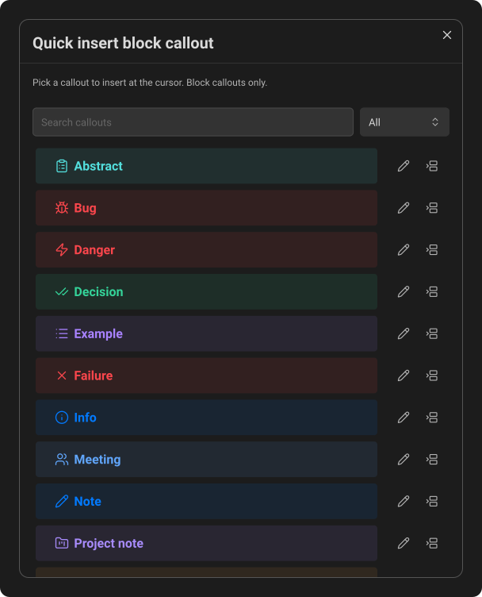
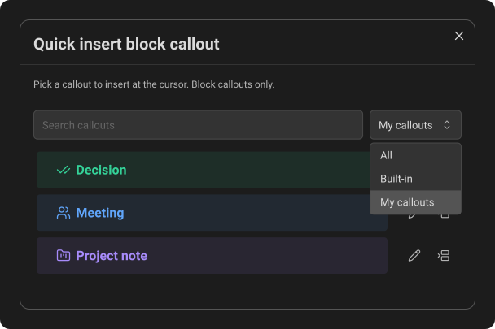

# Quick insert

Quick Insert lets you choose and insert a callout with the mouse instead of typing its Markdown.

## Open Quick Insert

Place the cursor in a note, then click the paintbrush icon with a plain plus at its lower right in Obsidian's left ribbon. You can also run **Callout Studio: Quick insert block callout** from the Command Palette.

The window shows rendered previews of the available callouts. Search by name or filter the list by source, then click a preview or its insert button. Callout Studio writes the selected callout at the cursor. On an empty line, you get an empty callout. Otherwise it wraps your selection, or the paragraph under the cursor, following the same rules as **Wrap in callout** (see [Commands & hotkeys](09-commands-and-hotkeys.md#what-gets-wrapped)).
On desktop, the search field is ready for typing when the window opens. On a phone or tablet, the keyboard stays closed until you tap the field.

Quick Insert creates **Block callouts only**. Use autocomplete or a custom command for Heading and Inline callouts.

*Search and choose from rendered block-callout previews. Each row offers an edit action and an insert action.*

## Filter by source

*Select **My callouts** to narrow the list to your own types. The source choice is remembered on this device.*

The first time you open Quick Insert, it starts with **All** selected. After you change the source, Callout Studio remembers your latest choice for the next opening, including after restarting Obsidian. Each device remembers its own choice. The available source choices are shown in this order:

- **All** - every available block callout.
- **Built-in** - Obsidian's built-in callouts that the active theme does not currently control.
- **The active theme's name** - shown only when the active theme supplies or restyles at least one callout. It includes any built-in or saved callout the theme currently controls. When Obsidian cannot provide a theme name, this option is labelled **Theme callouts**.
- **My callouts** - your Callout Studio-managed callouts, including ones you created, imported, or deliberately discovered. A callout moves to the theme filter for as long as the active theme controls it.

When the active theme owns no available callouts, Quick Insert omits its option entirely. If the theme filter was your remembered choice, the window temporarily shows **All** until a theme-owned callout becomes available. Selecting another empty source explains which category has no callouts. If you have typed a search, an empty result instead means that no callout in the selected source matches the search. When you have no custom callouts, the **My callouts** empty state points to **Callout Studio: Create new callout type** in the Command Palette. If you do have custom callouts but the active theme currently controls all of them, the message instead directs you to the theme filter.

## Edit from the same window

Click the pencil beside a callout to open its editor. When you finish, Quick Insert refreshes the preview, so you can insert the updated callout without going through the main settings.

Quick Insert stays attached to the note from which you opened it. If that note closes, changes panes, or leaves editing mode, reopen Quick Insert from the note you want to edit.

## Move or hide the ribbon icon

Drag the icon in Obsidian's ribbon to change its position.

To hide it, use Obsidian's own ribbon customization settings, not Callout Studio's plugin settings. The Command Palette action remains available even when the ribbon icon is hidden.

---
**Next:** [Advanced heading callouts](16-advanced-heading-callouts.md)
