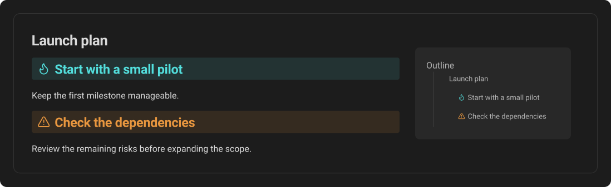
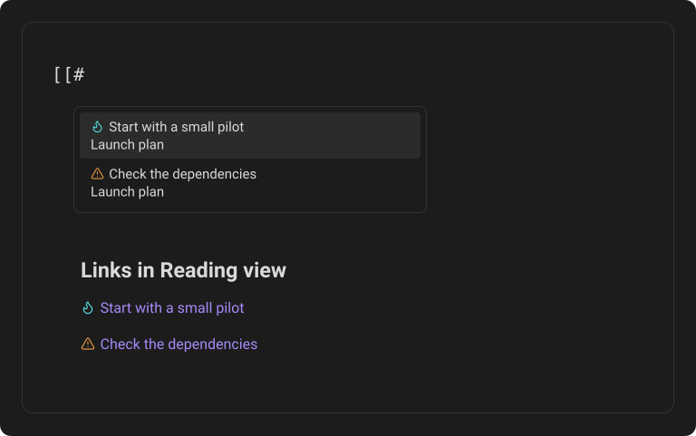

# Advanced heading callouts

A heading callout remains a real Obsidian heading. Callout Studio integrates it with the Outline, internal links, and table-of-contents plugins.

## Outline

Open Obsidian's Outline view. The heading appears at its normal level, but Callout Studio hides the raw `[!type]` token. The clean title keeps the callout's icon and color, making the section easy to recognize.

*The Tip and Warning headings appear with clean titles in both the note and its Outline.*

## Internal links

Type `[[#` and start searching for the heading. Link suggestions show the clean title instead of the raw callout syntax.

After you insert the link, it behaves like a normal heading link and renders with the callout's icon and color.

*Heading suggestions and links in Reading view use the same callout icons and clean titles.*

## Tables of contents

Heading callouts are compatible with the community plugins **Table of Contents** and **Automatic Table Of Contents**. Links generated by either plugin point to the heading callout just like links to ordinary headings.

A normal Markdown link at the start of a heading, such as `# [some link](https://example.com)`, is not a callout token and is left unchanged.

---
**Next:** [Theme integration](17-theme-integration.md)
