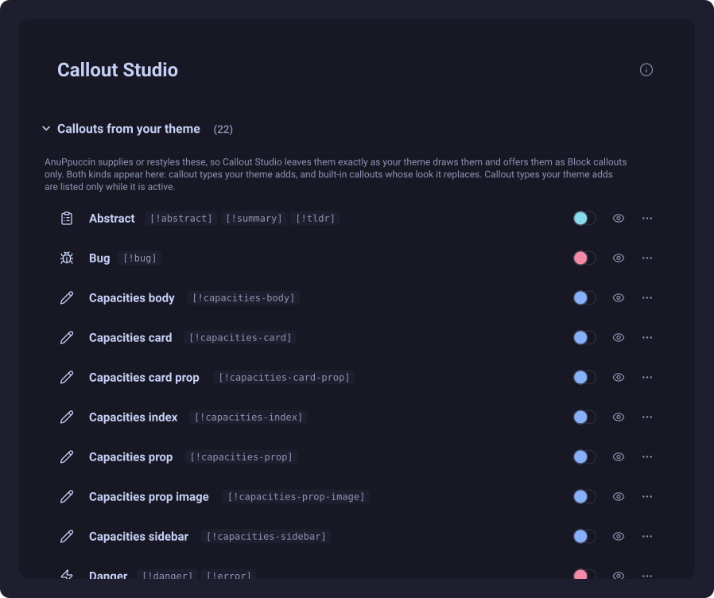
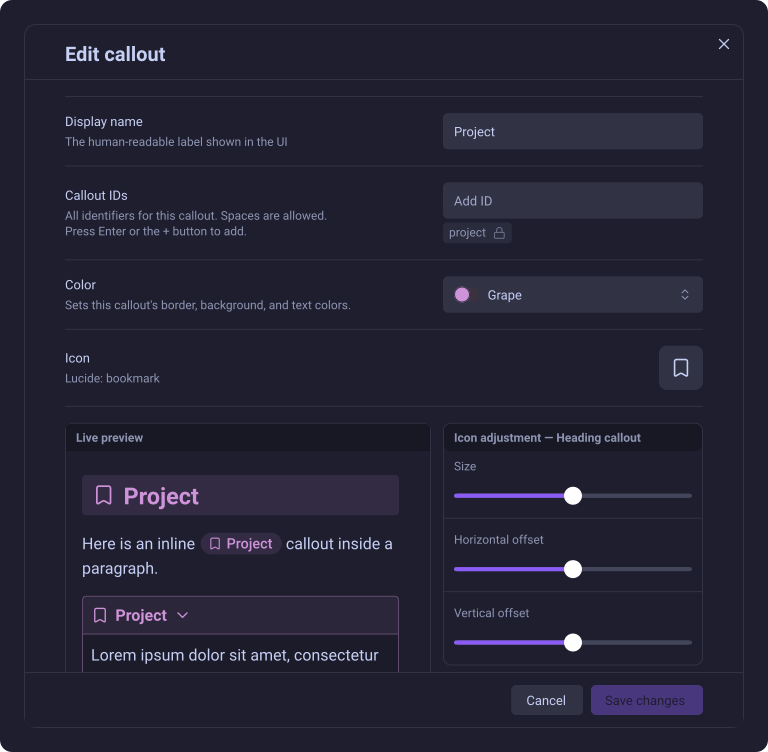
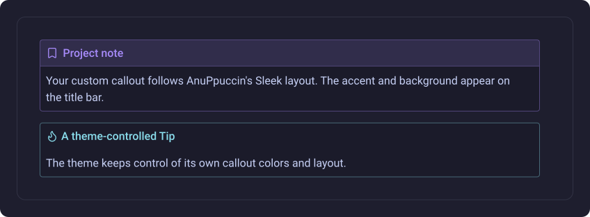

# Theme integration

Callout Studio is designed to work with the active Obsidian theme without fighting its styles.

## Callouts from your theme

Some themes define their own callout types or restyle Obsidian's built-in types. Callout Studio detects them automatically and lists them under **Callouts from your theme**.

Quick Insert gives the same rows their own source filter, labelled with the active theme's name (or **Theme callouts** when no name is available). This includes built-in and saved callouts that the theme restyles, not only new types invented by the theme. The filter is omitted when the active theme owns no available callouts.

If the theme styles a callout, the theme stays in complete control. Callout Studio does not override the theme's intended color, icon, border, or layout.



*The theme's callout rows are detected from its stylesheet. This example uses AnuPpuccin in dark Mocha mode.*

Older versions included a setting that let an individual callout yield to external CSS. That option has been removed: theme and snippet CSS already participate in Obsidian's normal cascade, and keeping a separate Callout Studio setting for the same job proved redundant and not useful in practice.

## Callout Studio's own windows

In light mode with Obsidian's **Default** theme, Callout Studio's windows - its settings, the callout editor, the pickers and the other dialogs - use their own light colors: white text boxes, dropdowns and lists with a soft outline that darkens when you point at or click one, white buttons, and a pale tint of your accent color on the chosen row. The colors are the same on macOS, Windows, Linux and phones. (Without this, macOS paints Obsidian's light-mode controls as flat grey slabs.)

If you choose a community theme under **Settings → Appearance → Themes**, the theme takes command instead: the windows follow its own button, text-box and border colors, just as they did before. Dark mode is not affected either way. Switching theme or color scheme updates open windows immediately; nothing needs to be reloaded.



*The editor follows AnuPpuccin's dark controls inside a window with a scrolling body.*

## Your callouts in a theme's callout layout

Callouts you create in Callout Studio follow the layout your theme gives callouts in general. When a theme or one of its **Style Settings** options draws callouts with a neutral body and the color on a title bar (for example AnuPpuccin's **Sleek** callout style), your callout's background - solid or gradient - moves to that title bar too, and a transparent callout shows no background anywhere. Switching the option in Style Settings updates open notes immediately; nothing needs to be reloaded. See [Background styles](03-custom-color-palettes.md#background-styles).



*Sleek places the custom callout's background on its title bar and keeps a neutral body.*

## Read-only theme callouts

Because the theme draws these callouts, their rows are read-only in Callout Studio. Click the eye icon to preview one; vault actions remain available from its three-dot menu, but you will not see Callout Studio's normal color picker or customization controls.

If the theme restyles a custom callout you saved in Callout Studio, its menu also offers **Duplicate**. This copies your saved style under a new ID; its appearance may differ from the theme's styling of the original ID. Callouts supplied only by the theme cannot be duplicated.

To change a theme-owned callout, use the community **Style Settings** plugin if the theme author provides a setting for it. Otherwise, the theme's CSS must be changed.

## Default fallback

A callout type that exists only in the active theme cannot be selected as the **Default fallback callout**. Use a built-in type or create a Callout Studio callout with an ID the theme does not define if you need a fallback that remains available after switching themes.

## Block format only

Theme-controlled callouts support the standard Block format:

```md
> [!theme-callout]
> Content
```

Heading and Inline callouts are Callout Studio features, so they are unavailable for a type that exists only in the theme. Create a callout with a different ID if you want your own design in all three formats.

Switching themes updates the **Callouts from your theme** list and makes Quick Insert's theme filter appear, disappear, or change its label as needed, without changing note content.

---
**Next:** [Back to the guide overview](README.md)
